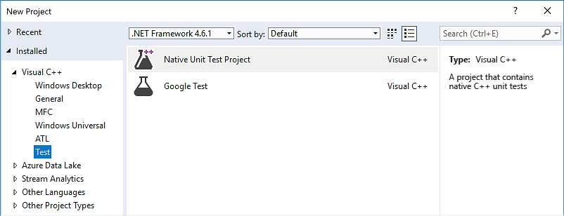
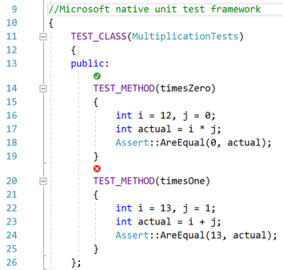
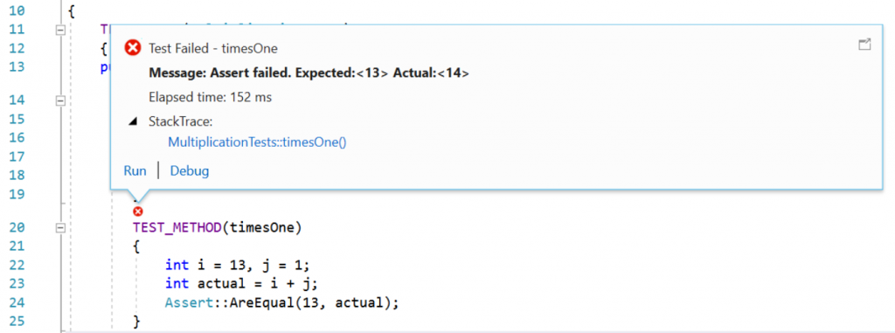

# Write unit tests for C/C++ in Visual Studio

You can write and run your C++ unit tests by using  the **Test Explorer** window, just like for other languages. For more information about using **Test Explorer**, see [Run unit tests with Test Explorer](run-unit-tests-with-test-explorer.md).

> [!NOTE]
> Some features such as Live Unit Testing, Coded UI Tests and IntelliTest are not supported for C++.

Visual Studio includes these C++ test frameworks with no additional downloads required:

- Microsoft Unit Testing Framework for C++
- Google Test
- Boost.Test
- CTest

In addition to the installed frameworks, you can write your own test adapter for whatever framework you would like to use within Visual Studio. A test adapter can integrate unit tests with the **Test Explorer** window. Several third-party adapters are available on the [Visual Studio Marketplace](https://marketplace.visualstudio.com). For more information, see [Install third-party unit test frameworks](install-third-party-unit-test-frameworks.md).

**Visual Studio 2017 version 15.7 (Professional and Enterprise)**
C++ Unit Test projects support [CodeLens](../ide/find-code-changes-and-other-history-with-codelens.md).

**Visual Studio 2017 version 15.5**

- **Google Test Adapter** is included as a default component of the **Desktop development with C++** workload. It has a project template that you can add to a solution via the  **Add New Project** context menu on the solution node in **Solution Explorer**, and options you can configure via **Tools** > **Options**. For more information, see [How to: use Google Test in Visual Studio](how-to-use-google-test-for-cpp.md).

- **Boost.Test** is included as a default component of the **Desktop development with C++** workload. It is integrated with **Test Explorer** but currently does not have project template, therefore it must be manually configured. For more information, see [How to: use Boost.Test in Visual Studio](how-to-use-boost-test-for-cpp.md).

- **CTest** support is included with the [CMake Tools for Visual Studio](/cpp/ide/cmake-tools-for-visual-cpp) component which is part of the **Desktop development with C++** workload. However, CTest is not yet fully integrated with **Test Explorer**. For more information, see [How to: use CTest in Visual Studio](how-to-use-ctest-for-cpp.md).

**Visual Studio 2015 and earlier**

You can download the Google Test adapter and Boost.Test Adapter extensions on the Visual Studio Marketplace at [Test adapter for Boost.Test](https://marketplace.visualstudio.com/items?itemName=VisualCPPTeam.TestAdapterforBoostTest) and [Test adapter for Google Test](https://marketplace.visualstudio.com/items?itemName=VisualCPPTeam.TestAdapterforGoogleTest).

## Basic test workflow

The following sections show the basic steps to get you started with C++ unit testing. The basic configuration is very similar for the Microsoft and Google Test frameworks. Boost.Test requires that you manually create a test project.

### Create a test project

You define and run tests inside one or more test projects that are in the same solution as the code you want to test. To add a new test project to an existing solution, right-click on the Solution node in **Solution Explorer** and choose **Add** > **New Project**. Then in the left pane choose **Visual C++ Test** and choose one of the project types from the center pane. The following illustration shows the test projects that are available when the **Desktop Development with C++** workload is installed:



### Create references to other projects in the solution

To enable your test code to access the functions in the project to be tested, add a reference to the project in your test project. Right-click on the test project node in **Solution Explorer** and choose **Add** > **Reference**. Then in the dialog choose the project(s) you want to test.


### Add #include directives for header files

Next, in your unit test *.cpp* file, add an `#include` directive for any header files that declare the types and functions you want to test. Type `#include "` and then IntelliSense will activate to help you choose. Repeat for any additional headers.


### Write test methods

> [!NOTE]
> This section shows syntax for the Microsoft Unit Testing Framework for C/C++. It is documented here: [Microsoft.VisualStudio.TestTools.CppUnitTestFramework API reference](microsoft-visualstudio-testtools-cppunittestframework-api-reference.md). For Google Test documentation, see [Google Test primer](https://github.com/google/googletest/blob/master/googletest/docs/primer.md). For Boost.Test, see [Boost Test library: The unit test framework](http://www.boost.org/doc/libs/1_46_0/libs/test/doc/html/utf.html).

The *.cpp* file in your test project has a stub class and method defined for you as an example of how to write test code. Note that the signatures use the TEST_CLASS and TEST_METHOD macros, which make the methods discoverable from the **Test Explorer** window.


TEST_CLASS and TEST_METHOD are part of the [Microsoft Native Test Framework](microsoft-visualstudio-testtools-cppunittestframework-api-reference.md). **Test Explorer** discovers test methods in other supported frameworks in a similar way.

A TEST_METHOD returns void. To produce a test result, use the static methods in the `Assert` class to test actual results against what is expected. In the following example, assume `MyClass` has a constructor that takes a `std::string`. We can test that the constructor initializes the class as expected like so:

```cpp
        TEST_METHOD(TestClassInit)
		{
			std::string name = "Bill";
			MyClass mc(name);
			Assert::AreEqual(name, mc.GetName());
		}
```
In the previous example, the result of the `Assert::AreEqual` call determines whether the test passes or fails. The Assert class contains many other methods for comparing expected vs. actual results.

You can add *traits* to test methods to specify test owners, priority and other information. You can then use these values to sort and group tests in **Test Explorer**. For more information, see [Run unit tests with Test Explorer](run-unit-tests-with-test-explorer.md).

### Run the tests

1. On the **Test** menu, choose **Windows** > **Test Explorer**. The following illustration shows a test project whose tests have not yet run.

   

   > [!NOTE]
   > CTest integration with **Test Explorer** is not yet available. Run CTest tests from the CMake main menu.

1. If all your tests are not visible in the window, build the test project by right-clicking its node in **Solution Explorer** and choosing **Build** or **Rebuild**.

1. In **Test Explorer**, choose **Run All**, or select the specific tests you want to run. Right-click on a test for other options, including running it in debug mode with breakpoints enabled. After running all the tests, the window shows which tests passed and which ones failed:


For failed tests, the message offers details that help to diagnose the cause. You can right-click on the failing test and choose **Debug Selected Tests** to step through the function where the failure occurred.

For more information about using **Test Explorer**, see [Run unit tests with Test Explorer](run-unit-tests-with-test-explorer.md).

For best practices related to unit testing, see [Unit test basics](unit-test-basics.md)

## Use CodeLens

**Visual Studio 2017 version 15.7 Professional and Enterprise Editions only**: 
[CodeLens](../ide/find-code-changes-and-other-history-with-codelens.md) enables you to quickly see the status of a unit test without leaving the code editor. You can initialize CodeLens for a C++ unit test project in any of these ways:

- Edit and Build your test project or solution.
- Rebuild your project or solution.
- Run test(s) from the **Test Explorer** window.

After **CodeLens** is initialized, you can see test status icons above each unit test.



 Click on the icon for more information, or to run or debug the unit test:

 


 
## See also

[Unit test your code](unit-test-your-code.md)
