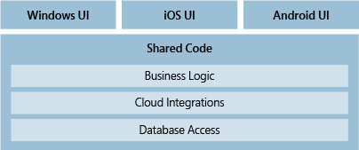
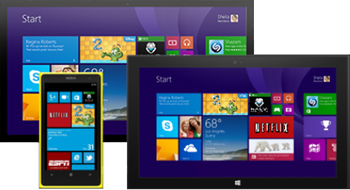
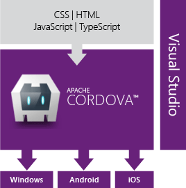
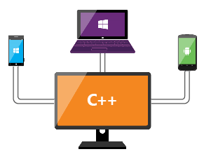
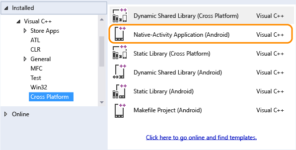
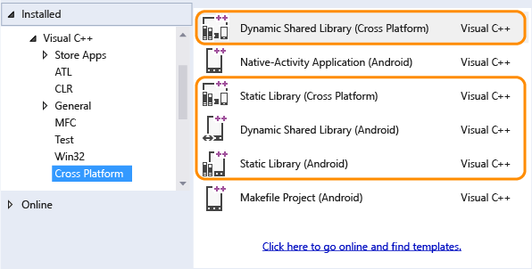

# Cross-Platform Mobile Development in Visual Studio
[!INCLUDE[vs2017banner](../includes/vs2017banner.md)]

  
  
You can build apps for Android, iOS, and Windows devices by using Visual Studio.  As you design your app, use tools in Visual Studio to easily add connected services such as Office 365, Azure App Service, and Application Insights.  
  
 Build your apps by using C# and the .NET Framework, HTML and JavaScript, or C++. Share code, strings, images, and in some cases even the user interface.  
  
 If you want to build a game or immersive graphical app, install Visual Studio tools for Unity and enjoy all of the powerful productivity features of Visual Studio with Unity, the popular cross-platform game/graphics engine and development environment for apps that run on iOS, Android, Windows, and other platforms.  
  
 **In this article:**  
  
-   [Build an app for Android, iOS, and Windows (.NET Framework)](#NET)  
  
    -   [Target Android, iOS, and Windows from a single code base](../cross-platform/cross-platform-mobile-development-in-visual-studio.md#AndroidHTML)  
  
    -   [Target Windows 10 devices](../cross-platform/cross-platform-mobile-development-in-visual-studio.md#WindowsHTML)  
  
-   [Build an app for Android, iOS, and Windows (HTML/JavaScript)](#HTML)  
  
-   [Build an app for Android and Windows (C++)](#CPP)  
  
-   [Build a cross-platform game for Android, iOS, and Windows by using Visual Studio tools for Unity](#Unity)  
  
##   Build an app for Android, iOS, and Windows (.NET Framework)  
   
  
 With Xamarin, you can target Android, iOS, and Windows in the same solution, sharing code and even UI.  
  
|**Learn more**|  
|--------------------|  
|[Install Visual Studio](http://www.visualstudio.com/products/visual-studio-community-vs) (VisualStudio.com)|  
|[Learn about Xamarin in Visual Studio](http://www.visualstudio.com/explore/xamarin-vs) (VisualStudio.com)|  
|[Visual Studio and Xamarin](../cross-platform/visual-studio-and-xamarin.md) (MSDN Library)|  
|[Application Lifecycle Management (ALM) with Xamarin apps](../cross-platform/application-lifecycle-management-alm-with-xamarin-apps.md) (MSDN Library)|  
|[Learn about universal Windows apps in Visual Studio](https://www.visualstudio.com/vs/universal-windows-platform/) (VisualStudio.com)|  
|[Learn about the similarities between Swift and C#](http://aka.ms/scposter) (download.microsoft.com)|  
|[Learn about the Visual Studio Emulator for Android](http://www.visualstudio.com/explore/msft-android-emulator-vs) (VisualStudio.com)|  
  
###   Target Android, iOS, and Windows from a single code base  
 You can build native apps for Android,  iOS, and Windows by using C# or F# (Visual Basic is not supported at this time).  To get started, install Visual Studio 2015, select the **Custom** option in the installer, and check the box under **Cross Platform Mobile Development > C#/.NET (Xamarin)**. You can also start with the [Xamarin Installer](https://www.xamarin.com/download), which is required to install Xamarin for Visual Studio 2013.  
  
 If you already have Visual Studio 2015 installed, run the installer from **Control Panel > Programs and Features** and select the same **Custom** option for Xamarin as above.  
  
 When you’re done, project templates appear in the **New Project** dialog box. The easiest way to find Xamarin templates is to just search on "Xamarin."  
  
 Xamarin exposes the native functionality of Android, iOS, and Windows as .NET objects. Thus your apps have full access to native APIs and native user controls, and they’re just as responsive as apps written in the native platform languages.  
  
 After you create a project, you’ll leverage all of the productivity features of Visual Studio. For example, you’ll use a designer to create your pages, and use IntelliSense to explore the native API’s of the mobile platforms. When you’re ready to run your app and see how it looks, you can use the Visual Studio Emulator for Android or the Android SDK emulator, run Windows apps natively, or run Windows apps on the Windows Phone emulator. You can also use tethered Android and Windows devices directly. For iOS projects, connect to a networked Mac and start the Mac emulator from Visual Studio, or connect to a tethered device.  
  
#### Design one set of pages that render across all devices by using Xamarin.Forms  
 Depending on the complexity of your apps design, you might consider building it by using *Xamarin.Forms* templates in the **Mobile Apps** group of project templates. Xamarin.Forms is a UI toolkit that lets you create a single interface that you can share across Android, iOS, and Windows.  When you compile a Xamarin.Forms solution, you’ll get an Android app, an iOS app, and a Windows app. For more details, see [Learn about mobile development with Xamarin](../cross-platform/learn-about-mobile-development-with-xamarin.md).  
  
####   Share code between Android, iOS, and Windows apps  
 If you’re not using Xamarin.Forms and choose to design for each platform individually, you can share most of your non-UI code between platform projects (Android, iOS, and Windows). This includes any business logic, cloud integration, database access, or any other code that targets the .NET Framework. The only code that you can’t share is code that targets a specific platform.  
  
   
  
 You can share your code by using a shared project, a Portable Class Library project, or both. You might find that some code fits best in a shared project, and some code makes more sense inside a Portable Class Library project.  
  
|**Learn more**|  
|--------------------|  
|Choose whether to share your code by using shared projects, Portable Class Library projects, or both.   [Sharing code across platforms](http://blogs.msdn.com/b/dotnet/archive/2014/04/21/sharing-code-across-platforms.aspx) (.NET Framework blog)   [Sharing Code Options](http://developer.xamarin.com/guides/cross-platform/application_fundamentals/building_cross_platform_applications/sharing_code_options/) (Xamarin)   [Code sharing options with the .NET Framework](http://msdn.microsoft.com/library/dn720832.aspx) (MSDN Library)|  
  
###   Target Windows 10 devices  
   
  
 If you want to create a single app that targets the full breadth of Windows 10 devices, create a universal Windows app. You’ll design the app by using a single project and your pages will render properly no matter what device is used to view them.  
  
 Start with a universal Windows app project template. Design your pages visually, and then open them in a preview window to see how they appear for various types of devices. If you don’t like how a page appears on a device, you can optimize the page to better fit the screen size, resolution, or various orientations such as landscape or portrait mode. You can do all of that by using intuitive tool windows and easily accessible menu options in Visual Studio. When you’re ready to run your app and step through your code, you’ll find all of the device emulators and simulators for different types of devices together in one drop-down list that is located on the **Standard** toolbar.  
  
 Windows 10 is fairly new, so you’ll also find project templates that target Windows 8.1. You can use those project templates if you want and your app will run on Windows 10 phones, tablets, and PCs. However, all devices that run Windows 8.1 will receive an automatic upgrade to Windows 10, so unless you have specific reasons why you’d rather target Windows 8.1, we recommend that you use the project templates that target Windows 10.  
  
|**Learn more**|  
|--------------------|  
|[Learn about universal Windows apps](https://msdn.microsoft.com/library/windows/apps/dn894631.aspx) (Windows Dev Center)|  
|[Build your first one](http://msdn.microsoft.com/library/windows/apps/dn609832.aspx) (Windows Dev Center)|  
|[Develop apps for the Universal Windows Platform (UWP)](../cross-platform/develop-apps-for-the-universal-windows-platform-uwp.md)|  
|[Migrate apps to the Universal Windows Platform (UWP)](../misc/migrate-apps-to-the-universal-windows-platform-uwp.md)|  
  
##   Build an app for Android, iOS, and Windows (HTML/JavaScript)  
   
  
 If you’re a web developer, and you’re familiar with HTML and JavaScript, you can target Windows, Android, and iOS by using Visual Studio Tools for Apache Cordova. These apps can target all three platforms and you can build them by using the skills and processes that you’re most familiar with.  
  
 Apache Cordova is a framework that includes a plug-in model. This plug-in model provides a single JavaScript API that you can use to access the native device capabilities of all three platforms (Android, iOS, and Windows).  
  
 Because these APIs are cross-platform, you can share most of what you write between all three platforms. This reduces your development and maintenance costs. Also, there’s no need to start from scratch. If you’ve created other types of web applications, you can share those files with your Cordova app without having to modify or redesign them in any way.  
  
   
  
 To get started, install Visual Studio 2015 and choose the **HTML/JavaScript (Apache Cordova)** feature during setup. If you’re using Visual Studio 2013, install the Visual Studio Tools for Apache Cordova extension. Either way, the Cordova tools automatically install all third-party software that’s required to build your multi-platform app.  
  
 After you’ve installed the extension, open Visual Studio and create a **Blank App (Apache Cordova)** project. Then, you can develop your app by using JavaScript or Typescript. You can also add plug-ins to extend the functionality of your app, and APIs from plug-ins appear in IntelliSense as you write code.  
  
 When you’re ready to run your app and step through your code, choose an emulator, such as the Apache Ripple emulator or Visual Studio Emulator (Android or Windows Phone), a browser, or a device that you’ve connected directly to your computer. Then, start your app. If you’re developing your app on a Windows PC, you can even run it on that. All of these options are built into Visual Studio as part of the Visual Studio Tools for Apache Cordova.  
  
 Project templates for creating universal Windows apps are still available in Visual Studio so feel free to use them if you plan to target only Windows devices. If you decide to target Android and iOS later, you can always port your code to a Cordova project. There are open-source versions of the WinJS APIs, so you can reuse any code that consumes those APIs. That said, if you plan to target other platforms in the future, we recommend that you start with the Visual Studio Tools for Apache Cordova.  
  
|**Learn more**|  
|--------------------|  
|[Install Visual Studio](http://www.visualstudio.com/products/visual-studio-community-vs) (VisualStudio.com)|  
|[Get started with Visual Studio Tools for Apache Cordova](http://taco.visualstudio.com/en-us/docs/get-started-vs-tools-apache-cordova/) (taco.visualstudio.com)|  
|[Learn about the Visual Studio Emulator for Android](http://www.visualstudio.com/explore/msft-android-emulator-vs) (VisualStudio.com)|  
  
##   Build an app for Android and Windows (C++)  
   
  
 First, install Visual Studio 2015 and the Visual C++ for Cross Platform Mobile Development tools. Then, you can build a native activity application for Android or an app that targets Windows. C++ templates that target iOS are not yet available. You can target Android and Windows in the same solution if you want, and then share code between them by using a cross-platform static or dynamic shared library.  
  
 If you need to build an app for Android that requires any sort of advanced graphics manipulation, such as a game, you can use C++ to do it. Start with the **Native-Activity Application (Android)** project. This project has full support for the Clang toolchain.  
  
   
  
 When you’re ready to run your app and see how it looks, use the Visual Studio Emulator for Android. It’s fast, reliable, and easy to install and configure.  
  
 You can also build an app that targets the full breadth of Windows 10 devices by using C++ and a universal Windows app project template. Read more about this in the [Target Windows 10 devices](#WindowsHTML) section that appears earlier in this topic.  
  
 You can share C++ code between Android and Windows by creating a static or dynamic shared library.  
  
   
  
 You can consume that library in a Windows or Android project, like the ones described earlier in this section. You can also consume it in an app that you build by using Xamarin, Java, or any language that lets you invoke functions in an unmanaged DLL.  
  
 As you write code in these libraries, you can use IntelliSense to explore the native APIs of the Android and Windows platforms. These library projects are fully integrated with the Visual Studio debugger so you can set breakpoints, step through code, and find and fix issues by using all of the advanced features of the debugger.  
  
|**Learn more**|  
|--------------------|  
|[Download Visual Studio.](http://www.visualstudio.com/products/visual-studio-community-vs) (VisualStudio.com)|  
|[Install the Visual C++ for Cross-Platform Mobile Development tools.](https://msdn.microsoft.com/library/dn872463\(v=vs.140\).aspx) (MSDN Library)|  
|[Learn more about using C++ to target multiple platforms.](https://www.visualstudio.com/vs/cplusplus-mdd/) (VisualStudio.com)|  
|[Install what you need, and then create a native activity application for Android](https://msdn.microsoft.com/library/dn872463\(v=vs.140\).aspx) (MSDN Library)|  
|[Learn about the Visual Studio Emulator for Android](http://www.visualstudio.com/explore/msft-android-emulator-vs) (VisualStudio.com)|  
|[Learn more about sharing C++ code with Android and Windows apps](http://www.visualstudio.com/explore/cplusplus-mdd-vs.aspx) (VisualStudio.com)|  
|[Cross-platform mobile development examples for C++](https://msdn.microsoft.com/library/dn707596.aspx) (MSDN Library)|  
|[Additional cross-platform mobile development examples for C++](https://code.msdn.microsoft.com/site/search?f%5B0%5D.Type=SearchText&f%5B0%5D.Value=android&f%5B1%5D.Type=ProgrammingLanguage&f%5B1%5D.Value=C%2B%2B&f%5B1%5D.Text=C%2B%2B) (code.msdn)|  
  
##   Build a cross-platform game for Android, iOS, and Windows by using Visual Studio tools for Unity  
 Visual Studio Tools for Unity is a free extension for Visual Studio that integrates Visual Studio’s powerful code editing, productivity, and debugging tools with *Unity*, the popular cross-platform gaming/graphics engine and development environment for immersive apps that target Windows, iOS, Android, and other platforms including the web.  
  
   
  
 With Visual Studio Tools for Unity (VSTU), you can use Visual Studio to write game and editor scripts in C# and then use its powerful debugger to find and fix errors. The latest release of VSTU brings support for Unity 5 and includes syntax coloring for Unity's ShaderLab shader language, better synchronization with Unity, richer debugging, and improved code generation for the MonoBehavior wizard. VSTU also brings your Unity project files, console messages, and the ability to start your game into Visual Studio so you can spend less time switching to and from the Unity Editor while writing code.  
  
 Start building your game with Unity and Visual Studio Tools for Unity today.  
  
|**Learn more**|  
|--------------------|  
|[Learn more about building Unity games with Visual Studio](https://www.visualstudio.com/en-us/features/unitytools-vs.aspx)|  
|[Read more about Visual Studio Tools for Unity](../cross-platform/visual-studio-tools-for-unity.md) (MSDN Library)|  
|[Start using Visual Studio Tools for Unity](../cross-platform/getting-started-with-visual-studio-tools-for-unity.md) (MSDN Library)|  
|[Read about the latest enhancements to the Visual Studio Tools for Unity 2.0 Preview](http://blogs.msdn.com/b/visualstudio/archive/2014/12/03/visual-studio-tools-for-unity-2-0-preview.aspx) (Visual Studio blog)|  
|[Watch a video introduction to the Visual Studio Tools for Unity 2.0 Preview](http://www.bing.com/videos/search?q=visual+studio+tools+for+unity&qs=n&form=QBVLPG&pq=visual+studio+tools+for+unity&sc=6-29&sp=-1&sk=#view=detail&mid=0A13177F0BC7463A24080A13177F0BC7463A2408) (Video)|  
|[Learn about Unity](http://unity3d.com/) (Unity website)|  
  
## See Also  
 [Add Office 365 API’s to a Visual Studio project](http://msdn.microsoft.com/library/office/dn605899\(v=office.15\).aspx)   
 [Azure Mobile Services](http://msdn.microsoft.com/library/dn720832\(v=vs.110\).aspx)   
 [Application Insights](../misc/application-insights-for-visual-studio-online.md)

