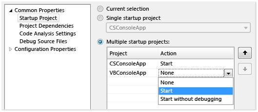
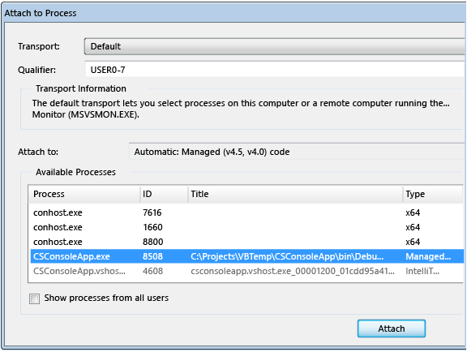
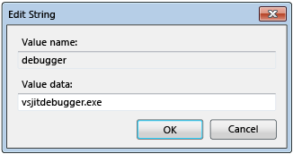
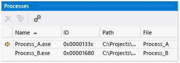

# Debug Multiple Processes
[!INCLUDE[vs2017banner](../includes/vs2017banner.md)]

The latest version of this topic can be found at [Debug Multiple Processes](https://docs.microsoft.com/visualstudio/debugger/debug-multiple-processes).  
  
Here’s how to start debugging processes, switch between processes, break and continue execution, step through source, stop debugging, and terminate or detach from processes.  
  
##   Contents  
 [Configure the execution behavior of multiple processes](#BKMK_Configure_the_execution_behavior_of_multiple_processes)  
  
 [Find the source and symbol (.pdb) files](#BKMK_Find_the_source_and_symbol___pdb__files)  
  
 [Start multiple processes in a VS solution, attach to a process, automatically start a process in the debugger](#BKMK_Start_multiple_processes_in_a_VS_solution__attach_to_a_process__automatically_start_a_process_in_the_debugger)  
  
 [Switch processes, break and continue execution, step through source](#BKMK_Switch_processes__break_and_continue_execution__step_through_source)  
  
 [Stop debugging, terminate or detach from processes](#BKMK_Stop_debugging__terminate_or_detach_from_processes)  
  
##   Configure the execution behavior of multiple processes  
 By default, when multiple processes are running in the debugger, the breaking, stepping, and stopping debugger commands usually affect all the processes. For example, when one process is suspended at a breakpoint, the execution of all other processes is also suspended. You can change this default behavior to gain more control over the targets of execution commands.  
  
1.  On the **Debug** menu, choose **Options and Settings**.  
  
2.  On the **Debugging**, **General** page, clear the **Break all processes when one process breaks** check box.  
  
  [Contents](#BKMK_Contents)  
  
##   Find the source and symbol (.pdb) files  
 To navigate the source code of a process, the debugger needs access to the source files and symbol files of the process. See [Specify Symbol (.pdb) and Source Files](../debugger/specify-symbol-dot-pdb-and-source-files-in-the-visual-studio-debugger.md).  
  
 If you can’t access the files for a process, you can navigate by using the Disassemby window. See [How to: Use the Disassembly Window](../debugger/how-to-use-the-disassembly-window.md)  
  
  [Contents](#BKMK_Contents)  
  
##   Start multiple processes in a VS solution, attach to a process, automatically start a process in the debugger  
  
-   [Start debugging multiple processes in a Visual Studio solution](#BKMK_Start_debugging_multiple_processes_in_a_Visual_Studio_solution) • [Change the startup project](#BKMK_Change_the_startup_project) • [Start a specific project in a solution](#BKMK_Start_a_specific_project_in_a_solution) • [Start multiple projects in a solution](#BKMK_Start_multiple_projects_in_a_solution) • [Attach to a process](#BKMK_Attach_to_a_process) • [Automatically start a process in the debugger](#BKMK_Automatically_start_an_process_in_the_debugger)  
  
> [!NOTE]
>  The debugger does not automatically attach to a child process that is started by a debugged process, even if the child project is in the same solution. To debug a child process:  
>   
>  -   Attach to the child process after it has been started.  
>   
>      -or-  
> -   Configure Windows to automatically start the child process in a new instance of the debugger.  
  
###   Start debugging multiple processes in a Visual Studio solution  
 When you have more than one project in a Visual Studio solution that can run independently (projects that run in separate processes), you can select which projects the debugger starts.  
  
   
  
####   Change the startup project  
 To change the startup project for a solution, select the project in Solution Explorer and then choose **Set as Startup Project** from the context menu.  
  
####   Start a specific project in a solution  
 To start a project for a solution without changing the default startup project, select the project in Solution Explorer and then choose **Debug** from the context menu. You can then choose **Start new instance** or **Step Into new instance**.  
  
  [Start multiple processes in a VS solution, attach to a process, automatically start a process in the debugger](../debugger/debug-multiple-processes.md#BKMK_Start_multiple_processes_in_a_VS_solution__attach_to_a_process__automatically_start_a_process_in_the_debugger)  
  
  [Contents](#BKMK_Contents)  
  
####   Start multiple projects in a solution  
  
1.  Select the solution in Solution Explorer and then choose **Properties** on the context menu.  
  
2.  Select **Common Properties**, **Startup Project** on the **Properties** dialog box.  
  
3.  For each project that you want to change, choose either **Start**, **Start without debugging**, or **None**.  
  
  [Start multiple processes in a VS solution, attach to a process, automatically start a process in the debugger](../debugger/debug-multiple-processes.md#BKMK_Start_multiple_processes_in_a_VS_solution__attach_to_a_process__automatically_start_a_process_in_the_debugger)  
  
  [Contents](#BKMK_Contents)  
  
###   Attach to a process  
 The debugger can also to *attach* to programs that are running in processes outside of Visual Studio, including programs that are running on a remote device. After you attach to a program, you can use debugger execution commands, inspect the program state, and so on. Your ability to inspect the program might be limited, depending on whether the program was built with debug information and whether you have access to the program's source code, and whether the common language runtime JIT compiler is tracking debug information.  
  
 See [Attach to Running Processes](../debugger/attach-to-running-processes-with-the-visual-studio-debugger.md) for more information.  
  
 **Attach to a process that is running on your local machine**  
  
 Choose **Debug**, **Attach to Process**. On the **Attach to Process** dialog box, select the process from the **Available Processes** list, and then choose **Attach**.  
  
   
  
  [Contents](#BKMK_Contents)  
  
###   Automatically start a process in the debugger  
 Sometimes, you might need to debug the startup code for a program that is launched by another process. Examples include services and custom setup actions. In these scenarios, you can have the debugger launch and automatically attach when your application starts.  
  
1.  Start the Registry Editor (**regedit.exe**).  
  
2.  Navigate to the **HKEY_LOCAL_MACHINE\Software\Microsoft\Windows NT\CurrentVersion\Image File Execution Options** folder.  
  
3.  Select the folder of the app that you want to start in the debugger.  
  
     If the name of the app is not listed as a child folder, select **Image File Execution Options** and then choose **New**, **Key** on the context menu. Select the new key, choose **Rename** on the shortcut menu, and then enter the name of the app.  
  
4.  On the context menu of the app folder, choose **New**, **String Value**.  
  
5.  Change the name of the new value from **New Value** to `debugger`.  
  
6.  On the context menu of the debugger entry, choose **Modify**.  
  
7.  On the Edit String dialog box, type `vsjitdebugger.exe` in the **Value data** box.  
  
       
  
   
  
  [Contents](#BKMK_Contents)  
  
##   Switch processes, break and continue execution, step through source  
  
-   [Switch between processes](#BKMK_Switch_between_processes) • [Break, step, and continue commands](#BKMK_Break__step__and_continue_commands)  
  
###   Switch between processes  
 You can attach to multiple processes when you are debugging, but only one process is active in the debugger at any given time. You can set the active or *current* process in the Debug Location toolbar or in the **Processes** window. To switch between processes, both processes must be in break mode.  
  
 **To set the current process**  
  
-   On the Debug Location toolbar, choose **Process** to view the **Process** list box. Select the process that you want to designate as current process.  
  
       
  
     If the **Debug Location** toolbar is not visible, choose **Tools**, **Customize**. On the **Toolbars** tab, choose **Debug Location**.  
  
-   Open the **Processes** window (shortcut **Ctrl+Alt+Z**), find the process that you want to set as the current process, and double-click it.  
  
       
  
     The current process is marked by a yellow arrow.  
  
 Switching to a project sets it the current process for debugging purposes. Any debugger window that you view will show the state for the current process, and all stepping commands affect only the current process.  
  
  [Switch processes, break and continue execution, step through source](../debugger/debug-multiple-processes.md#BKMK_Switch_processes__break_and_continue_execution__step_through_source)  
  
  [Contents](#BKMK_Contents)  
  
###   Break, step, and continue commands  
  
> [!NOTE]
>  By default, the break, continue and step debugger commands affect all processes that are being debugged. To change this behavior, see [Configure the execution behavior of multiple processes](#BKMK_Configure_the_execution_behavior_of_multiple_processes)  
  
||||  
|-|-|-|  
|**Command**|**Break all processes when one process breaks**   Checked (Default)|**Break all processes when one process breaks**   Cleared|  
|**Debug** menu:   -   **Break All**|All processes break.|All processes break.|  
|**Debug** menu:   -   **Continue**|All processes resume.|All suspended processes resume.|  
|**Debug** menu:   -   **Step Into** -   **Step Over** -   **Step Out**|All processes run while current process steps.   Then all processes break.|Current process steps.   Suspended processes resume.   Running processes continue.|  
|**Debug** menu:   -   **Step Into Current Process** -   **Step Over Current Process** -   **Step Out Current Process**|N/A|Current process steps.   Other processes maintain their existing state (suspended or running).|  
|Source window   -   **Breakpoint**|All processes break.|Only source window process breaks.|  
|Source window context menu:   -   **Run to cursor**   The source window must be in the current process.|All processes run while source window process runs to cursor and then breaks.   Then all other processes break.|Source window process runs to cursor.   Other processes maintain their existing state (suspended or running).|  
|**Processes** window context menu:   -   **Break Process**|N/A|Selected process breaks.   Other processes maintain their existing state (suspended or running).|  
|**Processes** window context menu:   -   **Continue  Process**|N/A|Selected process resumes.   Other processes maintain their existing state (suspended or running).|  
  
  [Switch processes, break and continue execution, step through source](../debugger/debug-multiple-processes.md#BKMK_Switch_processes__break_and_continue_execution__step_through_source)  
  
  [Contents](#BKMK_Contents)  
  
##   Stop debugging, terminate or detach from processes  
  
-   [Stop, terminate, and detach commands](#BKMK_Stop__terminate__and_detach_commands)  
  
 By default, when you choose **Debug**, **Stop Debugging** when multiple processes are open in the debugger, the debugger terminates or detaches from all processes depending on how the process was opened in the debugger:  
  
-   If the current process was launched in the debugger, that process is terminated.  
  
-   If you attached the debugger to the current process, the debugger detaches from the process and leaves the process running.  
  
 For example, if you start debugging a process from a Visual Studio solution, attach to another process that is already running, and then choose **Stop Debugging**, the debugging session ends, the process that was started in Visual Studio is terminated, while the process that you attached is left running. You can use the following procedures to control the way that you stop debugging.  
  
> [!NOTE]
>  The **Break all processes when one process breaks** option does not affect stopping debugging or terminating and detaching from processes.  
  
 **To change how Stop Debugging affects an individual process**  
  
-   Open the **Processes** window (shortcut **Ctrl+Alt+Z**). Select a process and then select or clear the **Detach when debugging stopped** check box.  
  
###   Stop, terminate, and detach commands  
  
|||  
|-|-|  
|**Command**|**Description**|  
|**Debug** menu:   -   **Stop Debugging**|Unless the behavior is changed by **Processes** window **Detach when debugging stops** option:   1.  Processes started by debugger are terminated. 2.  Attached processes are detached from the debugger.|  
|**Debug** menu:   -   **Terminate All**|All processes are terminated.|  
|**Debug** menu:   -   **Detach All**|The debugger detaches from all processes.|  
|**Processes** window context menu:   -   **Detach Process**|The debugger detaches from the selected process.   Other processes maintain their existing state (suspended or running).|  
|**Processes** window context menu:   -   **Terminate Process**|The selected process is terminated.   Other processes maintain their existing state (suspended or running).|  
|**Processes** window context menu:   -   **Detach when debugging stops**|Toggles the behavior of **Debug**, **Stop Debugging** for the selected process:   -   Checked: The debugger detaches from the process. -   Cleared: The process is terminated.|  
  
  [Stop debugging, terminate or detach from processes](../debugger/debug-multiple-processes.md#BKMK_Stop_debugging__terminate_or_detach_from_processes)  
  
  [Contents](#BKMK_Contents)  
  
## See Also  
 [Specify Symbol (.pdb) and Source Files](../debugger/specify-symbol-dot-pdb-and-source-files-in-the-visual-studio-debugger.md)   
 [Attach to Running Processes](../debugger/attach-to-running-processes-with-the-visual-studio-debugger.md)   
 [Navigating through Code with the Debugger](../debugger/navigating-through-code-with-the-debugger.md)   
 [Just-In-Time Debugging](../debugger/just-in-time-debugging-in-visual-studio.md)   
 [Debug Multithreaded Applications](../debugger/debug-multithreaded-applications-in-visual-studio.md)

