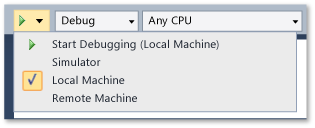

# Deploy Windows Store apps from Visual Studio
[!INCLUDE[vs2017banner](../includes/vs2017banner.md)]

Applies to Windows only](../Image/windows_only_content.png "windows_only_content")  
  
 The Visual Studio deployment functionality builds and registers Windows Store apps that are created with Visual Studio on a target device. Exactly how the app is registered depends on whether the target device is local or remote:  
  
- When the target is the local Visual Studio machine, Visual Studio registers the app from its build folder.  
  
- When the target is a remote device, Visual Studio copies the required files to the remote machine and registers the app on that device.  
  
  Deployment is automatic when you debug your app from Visual Studio by using the **Start Debugging** option (Keyboard: F5) or the **Start Without Debugging** option (Keyboard: CTRL + F5). You can also deploy your app manually. Manual deployment is useful in the following scenarios:  
  
- Ad-hoc testing on a local or remote machine.  
  
- Deploying an app that will start another app that you want to debug.  
  
- Deploying an app that will be debugged when it is started by another app or method.  
  
##   In this topic  
 In this topic, you can learn:  
  
 [How to deploy a Windows Store app](#BKMK_How_to_deploy_a_Windows_Store_app)  
  
 [How to specify a remote device](#BKMK_How_to_specify_a_remote_device)  
  
 [Deployment options](#BKMK_Deployment_options)  
  
##   How to deploy a Windows Store app  
 Manually deploying an app is a simple process:  
  
1.  If you are deploying to a remote device, specify the name or IP address of the device in the property project page of the app's startup project. (The steps to do this are listed further down in this topic.).  
  
2.  On the debugger Visual Studio toolbar, choose the deployment target from the drop-down list next to the **Start Debugging** button.  
  
       
  
3.  On the **Build** menu, choose **Deploy**  
  
##   How to specify a remote device  
 **Prerequisites**  
  
 To deploy an app to a remote device:  
  
-   A developer's license must be installed on the remote device.  
  
-   The Visual Studio Remote Tools must be installed on the remote device and the Remote Debugging Monitor must be running.  
  
     Deployment uses the remote debugger network channel to send the app files to the remote device.  
  
#### To specify a remote device  
  
1. On the Debug property page of the startup project, specify the name or IP address of a remote deployment target.  
  
2. To open the Debug property page, choose the project in Solution Explorer and then choose **Properties** from the shortcut menu.  
  
3. Then choose the **Debug** node on the property pages window.  
  
4. You can type the name or IP address of the remote device, or you can choose the device from the **Select Remote Debugger Connection** dialog box.  
  
      
  
    The **Select Remote Debugger Connection** dialog box displays the devices on the local network subnet and any device that is directly connected to the Visual Studio machine by an Ethernet cable.  
  
   **Specifying the remote device in a JavaScript or Visual C++ project page**  
  
     
  
5. Choose **Remote Debugger** from the **Debugger to launch** list.  
  
6. Enter the network name of the remote device in the **Machine Name** box. Or, you can choose the down arrow in the box to select the device from the Select Remote Debugger Connection dialog box.  
  
   **Specifying the remote device in a Visual C# and Visual Basic project page**  
  
     
  
7. Choose **Remote Machine** from the **Target Device** list.  
  
8. Enter the network name of the remote device in the **Remote Machine** box or click **Find** to choose the device from the **Select Remote Debugger Connection** dialog box.  
  
##   Deployment options  
 You can set the following deployment options on the Debug property page of the startup project.  
  
 **Allow Network Loopback**  
 For security reasons, a [!INCLUDE[win8_appname_long](../includes/win8-appname-long-md.md)] app that is installed in the standard manner is not allowed to make network calls to the device it is installed on. By default, Visual Studio deployment creates an exemption from this rule for the deployed app. This exemption allows you to test communication procedures on a single machine. Before you submit your app to the [!INCLUDE[win8_appstore_long](../includes/win8-appstore-long-md.md)], you should test your app without the exemption.  
  
 To remove the network loopback exemption from the app:  
  
- On the C# and VB Debug property page, clear the **Allow Network Loopback** check box.  
  
- On the JavaScript and Debug property page, set the **Allow Network Loopback** value to **No**.  
  
  **Do not launch, but debug my code when it starts (C# and VB) / Launch Application (JavaScript and C++)**  
  To configure the deployment to automatically start a debugging session when the app is launched:  
  
- On the C# and VB Debug property page, check the **Do not launch, but debug my code when it starts** check box.  
  
- On the JavaScript and Debug property page, set the **Launch Application** value to **Yes**.  
  
## See Also  
 [Run apps from Visual Studio](../debugger/run-store-apps-from-visual-studio.md)

