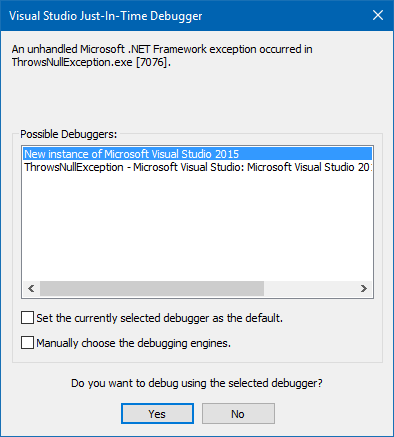
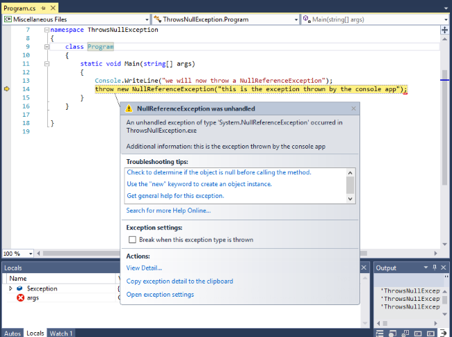

# Just-In-Time Debugging in Visual Studio
[!INCLUDE[vs2017banner](../includes/vs2017banner.md)]

Just-In-Time debugging launches Visual Studio automatically when an exception or crash occurs in an application that is running outside Visual Studio. This enables you to test your application when Visual Studio is not running, and begin debugging with Visual Studio when a problem occurs.

Just-In-Time debugging works for Windows desktop apps. It does not work for Windows Universal apps, and it does not work for managed code that is hosted in a native application, such as Visualizers.

## <a name="BKMK_Scenario"></a> Did the Just-in-Time debugger dialog box appear when trying to run an app?

The actions you should take when you see the Visual Studio Just-in-Time debugger dialog box depend on what you are trying to do:

#### If you want to get rid of the dialog box and just run the app normally

1. (Advanced users) If you have Visual Studio installed (or you had it installed previously and removed it), [disable Just-in-Time debugging](#BKMK_Enabling) and try to run the app again.

2. If you are running a web app in Internet Explorer, disable script debugging.

    Disable script debugging in the Internet Options dialog box. You can access this from the **Control Panel** / **Network and Internet** / **Internet Options** (the exact steps depend on your version of Windows and Internet Explorer).

    

3. Re-open the web page where you found the error. If this does not resolve the issue, contact the owner of the web app to fix the issue.

4. If you are running another type of Windows app, you will need to contact the owner of the app to fix the error, and then re-install the fixed version of the app.

#### If you want to fix or debug the error (advanced users)

- You must have [Visual Studio installed](https://www.microsoft.com/download/details.aspx?id=48146) to view the detailed information about the error and to try to debug it. See [Using JIT](#BKMK_Using_JIT) for detailed instructions. If you cannot resolve the error and fix the app, contact the owner of the app to resolve the error.

##  <a name="BKMK_Enabling"></a> Enable or disable Just-In-Time debugging
 You can enable or disable Just-In-Time debugging from the Visual Studio **Tools / Options** dialog box.

#### To enable or disable Just-In-Time debugging

1. Open Visual Studio. On the **Tools** menu, click **Options**.

2. In the **Options** dialog box, select the **Debugging** folder.

3. In the **Debugging** folder, select the **Just-In-Time** page.

4. In the **Enable Just-In-Time debugging of these types of code** box, select or clear the relevant program types: **Managed**, **Native**, or **Script**.

    To disable Just-In-Time debugging, once it has been enabled, you must be running with Administrator privileges. Enabling Just-In-Time debugging sets a registry key, and Administrator privileges are required to change that key.

5. Click **OK**.

   Just-In-Time debugging may still be enabled even if Visual Studio is no longer installed on your computer. When Visual Studio is not installed, you cannot disable Just-In-Time debugging from the Visual Studio **Options** dialog box. In that case, you can disable Just-In-Time debugging by editing the Windows registry.

#### To disable Just-In-Time debugging by editing the registry

1.  On the **Start** menu, search for and run `regedit.exe`

2.  In the **Registry Editor** window, locate and delete the follow registry entries:

    -   HKEY_LOCAL_MACHINE\SOFTWARE\Microsoft\Windows NT\CurrentVersion\AeDebug\Debugger

    -   HKEY_LOCAL_MACHINE\SOFTWARE\Microsoft\\.NETFramework\DbgManagedDebugger

3.  If your computer is running a 64-bit operating system, delete the following registry entries also:

    -   HKEY_LOCAL_MACHINE\SOFTWARE\Wow6432Node\Microsoft\Windows NT\CurrentVersion\AeDebug\Debugger

    -   HKEY_LOCAL_MACHINE\SOFTWARE\Wow6432Node\Microsoft\\.NETFramework\DbgManagedDebugger

4.  Take care not to accidentally delete or change any other registry keys.

5.  Close the **Registry Editor** window.

> [!NOTE]
>  If you are trying to disable Just-In-Time debugging for a server-side app and these steps don't resolve the issue, turn off server-side debugging in the IIS application settings and retry.

#### To enable Just-In-Time debugging of a Windows Form

1.  By default, Windows Forms applications have a top-level exception handler that allows the program to continue to run if it can recover. For example, if your Windows Forms application throws an unhandled exception, you will see a dialog like the following:

     

     To enable Just-In-Time debugging of a Windows Forms application, you must perform the following additional steps:

2.  Set the `jitDebugging` value to `true` in the `system.windows.form` section of the machine.config or *\<application name>*.exe.config file:

    ```
    <configuration>
        <system.windows.forms jitDebugging="true" />
    </configuration>
    ```

3.  In a C++ Windows Form application, you must also set `DebuggableAttribute` in a .config file or in your code. If you compile with [/Zi](http://msdn.microsoft.com/library/ce9fa7e1-0c9b-47e3-98ea-26d1a16257c8) and without [/Og](http://msdn.microsoft.com/library/d10630cc-b9cf-4e97-bde3-8d7ee79e9435), the compiler sets this attribute for you. If you want to debug a non-optimized release build, however, you must set this yourself. You can do this by adding the following line to your the AssemblyInfo.cpp file of your application:

    ```
    [assembly:System::Diagnostics::DebuggableAttribute(true, true)];
    ```

     For more information, see <xref:System.Diagnostics.DebuggableAttribute>.

## <a name="BKMK_Using_JIT">Use Just-In-Time Debugging
 This section shows what happens when an executable throws an exception.

 You must have Visual Studio installed to follow these steps. If you don't have Visual Studio, you can download the free [Visual Studio 2015 Community Edition](https://www.microsoft.com/download/details.aspx?id=48146).

 When you install Visual Studio, Just-In-Time debugging is enabled by default.

 For the purposes of this section, we'll make a C# console app in Visual Studio that throws a <xref:System.NullReferenceException>.

 In Visual Studio, create a C# console app (**File / New / Project / Visual C# / Console Application**) named **ThrowsNullException**. For more information about creating projects in Visual Studio, see [Walkthrough: Create a Simple Application](../ide/walkthrough-create-a-simple-application-with-visual-csharp-or-visual-basic.md).

 When the project opens in Visual Studio, open the Program.cs file. Replace the Main() method with the following code, which prints a line to the console and then throws a NullReferenceException:

```csharp
static void Main(string[] args)
{
    Console.WriteLine("we will now throw a NullReferenceException");
    throw new NullReferenceException("this is the exception thrown by the console app");
}
```

> [!IMPORTANT]
>  In order for this procedure to work in a [release configuration](../debugger/how-to-set-debug-and-release-configurations.md), you need to turn off [Just My Code](../debugger/just-my-code.md). In Visual Studio, click **Tools / Options**. In the **Options** dialog, select **Debugging**. Remove the check from **Enable Just My Code**.

 Build the solution (in Visual Studio, choose **Build / Rebuild Solution**). You can choose either the Debug or the Release configuration. For more information about build configurations, see [Understanding Build Configurations](../ide/understanding-build-configurations.md).

 The build process creates an executable ThrowsNullException.exe. You can find it under the folder where you created the C# project: **...\ThrowsNullException\ThrowsNullException\bin\Debug** or **...\ThrowsNullException\ThrowsNullException\bin\Release**.

 Double-click the ThrowsNullException.exe. You should see a command window like this:

 

 After a few seconds, an error window appears:

 

 Do not click **Cancel**! After a few seconds, you should see two buttons, **Debug** and **Close program**. Click **Debug**.

> [!CAUTION]
>  If your application contains untrusted code, a dialog box with a security warning appears. This dialog box enables you to decide whether or not to proceed with debugging. Before you continue with debugging, decide whether you trust the code. Did you write the code yourself? Do you trust the coder? If the application is running on a remote machine, do you recognize the name of the process? Even if the application is running locally, that does not necessarily mean it can be trusted. Consider the possibility of malicious code running on your computer. If you decide that the code you are about to debug is trustworthy, click **Debug**. Otherwise, click **Don't Debug**.

 The **Visual Studio Just-In-Time Debugger** window appears:

 

 Under **Possible Debuggers**, you should see that the **New instance of Microsoft Visual Studio 2015** line is selected. If it isn't selected already, select it now.

 At the bottom of the window, under **Do you want to debug using the selected debugger?**, click **Yes**.

 The ThrowsNullException project opens in a new instance of Visual Studio, with execution stopped at the line that throws the exception:

 

 You can start debugging at this point. If this were a real application, you would need to find out why the code is throwing the exception.

## Just-In-Time debugging errors
 if you don’t see the dialog when the program crashes, this might due to Windows Error Reporting settings on your computer. For more information, see [.WER Settings](https://msdn.microsoft.com/library/windows/desktop/bb513638\(v=vs.85\).aspx).

 You might see the following error messages that are associated with Just-In-Time debugging.

-   **Unable to attach to the crashing process. The specified program is not a Windows or MS-DOS program.**

     This error occurs when you try to attach to a process running as another user.

     To work around this problem, start Visual Studio, open the **Attach to Process** dialog box from the **Debug** menu, and find the process you want to debug in the **Available Processes** list. If you do not know the name of the process, look at the **Visual Studio Just-In-Time Debugger** dialog and note the process ID. Select the process in the **Available Processes** list and click **Attach**. In the **Visual Studio Just-In-Time Debugger** dialog, click **No** to dismiss the dialog box.

-   **Debugger could not be started because no user is logged on.**

     This error occurs when Just-In-Time debugging tries to start Visual Studio on a machine where there is no user logged onto the console. Because no user is logged on, there is no user session to display the Just-In-Time debugging dialog box.

     To fix this problem, log onto the machine.

-   **Class not registered.**

     This error indicates that the debugger tried to create a COM class that is not registered, probably due to an installation problem.

     To fix this problem, use the setup disk to reinstall or repair your Visual Studio installation.

## See Also
 [Debugger Security](../debugger/debugger-security.md)
 [Debugger Basics](../debugger/debugger-basics.md)
 [Just-In-Time, Debugging, Options Dialog Box](../debugger/just-in-time-debugging-options-dialog-box.md)
 [Security Warning: Attaching to a process owned by an untrusted user can be dangerous. If the following information looks suspicious or you are unsure, do not attach to this process](../debugger/security-warning-attaching-to-a-process-owned-by-an-untrusted-user-can-be-dangerous-if-the-following-information-looks-suspicious-or-you-are-unsure-do-not-attach-to-this-process.md)
