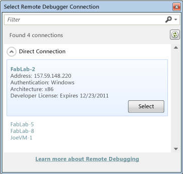
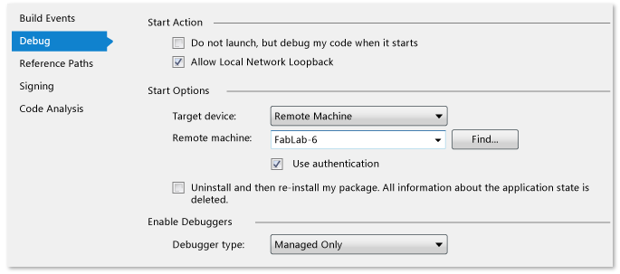

# Run Windows Store apps on a remote machine
[!INCLUDE[vs2017banner](../includes/vs2017banner.md)]

The latest version of this topic can be found at [Run Windows Store apps on a remote machine](https://docs.microsoft.com/visualstudio/debugger/run-windows-store-apps-on-a-remote-machine).  
  
Applies to Windows only](../Image/windows_only_content.png "windows_only_content")  
  
 The Visual Studio Remote Tools app enables you to run, debug, profile, and test a Windows Store app that is running on one device from a second computer that is running Visual Studio. Running on a remote device can be especially effective when the Visual Studio computer does not support functionality that is specific to Windows Store apps, such as touch, geo-location, and physical orientation. This topic describes the procedures to configure and start a remote session.  
  
##   In this topic  
 You can learn:  
  
 [Prerequisites](#BKMK_Prerequisites)  
  
 [Security](#BKMK_Security)  
  
 [How to connect directly to a remote device](#BKMK_DirectConnect)  
  
 [Installing the Remote Tools](#BKMK_Installing_the_Remote_Tools)  
  
 [Starting the Remote Debugger Monitor](#BKMK_Starting_the_Remote_Debugger_Monitor)  
  
 [Configuring the remote debugger](#BKMK_ConfigureRemoteDebugger)  
  
 [Configuring the Visual Studio project for remote debugging](#BKMK_ConnectVS)  
  
-   [Choosing the remote device for C# and Visual Basic projects](#BKMK_Choosing_the_remote_device_for_C__and_Visual_Basic_projects)  
  
-   [Choosing the remote device for JavaScript and C++ projects](#BKMK_Choosing_the_remote_device_for_JavaScript_and_C___projects)  
  
 [Running a remote debugging session](#BKMK_RunRemoteDebug)  
  
##   Prerequisites  
 To debug on a remote device:  
  
-   The remote device and the Visual Studio computer must be connected over a network or connected directly through an Ethernet cable. Debugging over the internet is not supported.  
  
-   A developer's license must be installed on the remote device.  
  
-   The remote device must be running the remote debugging components.  
  
-   You must be an administrator on the remote device to configure the firewall during installation. You must have user access to the remote device to run or connect to the remote debugger.  
  
##   Security  
 By default, the remote debugger uses Windows Authentication.  
  
> [!WARNING]
>  You can also choose to run the remote debugger in No Authentication mode, but this mode is strongly discouraged. There is no network security when you run in this mode. Choose the No Authentication mode only if you are sure that the network is not at risk of from malicious or hostile traffic.  
  
##   How to connect directly to a remote device  
 To connect directly to a remote device, connect the Visual Studio computer to the device with a standard Ethernet cable. If the device does not have an Ethernet port, you can use a USB to Ethernet adapter to connect to the cable.  
  
##   Installing the Remote Tools  
  
> [!NOTE]
>  **Versions and updates**  
>   
>  The **Remote Tools for Visual Studio 2015** are not supported for previous versions of Visual Studio.  
>   
>  We recommend that you install the update version of the Remote Tools for Visual Studio 2015 that matches the update version of your Visual Studio installation.  
>   
>  The VS debugger is compatible with any combination of versions of VS 2015 and the Remote Tools for VS 2015. However, the newest functionality in Visual Studio requires both Visual Studio and the Remote Tools to be on the most up to date version.  
>   
>  Other diagnostic tools might require the same versions of the remote tools and Visual Studio.  
  
 **Installing the remote debugging components on a remote device**  
  
 To run or save the installation program for the remote tools, choose one of the links in this table that matches your version of Visual Studio:  
  
|Version|Link|Notes|
|-|-|-|
|Visual Studio 2015 Update 3|[Remote tools](https://my.visualstudio.com/Downloads?q=remote%20tools%20visual%20studio%202015)|If prompted, join the free Visual Studio Dev Essentials group or you can just sign in with a valid Visual Studio subscription. Then re-open the link if necessary. Always download the version matching your device operating system (x86, x64, or  ARM version)|
|Visual Studio 2015 (older)|[Remote tools](https://my.visualstudio.com/Downloads?q=remote%20tools%20visual%20studio%202015)|If prompted, join the free Visual Studio Dev Essentials group or you can just sign in with a valid Visual Studio subscription. Then re-open the link if necessary.Always download the version matching your device operating system (x86, x64, or  ARM version)|
|Visual Studio 2013|[Remote tools](https://msdn.microsoft.com/library/bt727f1t(v=vs.120).aspx#BKMK_Installing_the_Remote_Tools)|Download page in Visual Studio 2013 documentation|
  
 You can choose to download the install program or you can run it immediately. When you run the install program, accept the user agreement, and then choose **Install**.  
  
 By default, the remote debugging components are installed in the **C:\Program Files\Microsoft Visual Studio 14.0\Common7\IDE\Remote Debugger** folder.  
  
##   Starting the Remote Debugger Monitor  
  
> [!NOTE]
>  Because the remote debugger configures the firewall to allow communication with the Visual Studio host, you must be an administrator on the remote device when you start the remote debugger for the first time.  
  
 After you have installed the Remote Tools, choose **Remote Debugger** on the **Start** screen. The **Remote Debugging Configuration** appears the first time that you start the remote debugger.  
  
 On the **Remote Debugging Configuration** dialog box:  
  
1.  If the Windows Web Services API is not installed, choose **Install**  
  
2.  In the **Configure Windows Firewall** group, choose the networks that you want to allow connections to. Only those networks that the device is currently connected to are enabled. You must choose at least one network.  
  
3.  Choose **Configure remote debugging** to set the firewall options and start the remote debugger.  Open the **Visual Studio Remote Debugging Monitor** dialog box to give users permissions to the remote tools and to set other advanced options.  
  
4.  The **Visual Studio Remote Debugging Monitor** dialog box appears. You can give users permissions to the remote tools and set other advanced option from this dialog box.  
  
##   Configuring the remote debugger  
 You use two tools to modify the configuration of the remote debugger.  
  
1.  On the **Tools** menu of the **Visual Studio Remote Debugging Monitor**:  
  
    1.  Choose **Options** to change the port number, authentication mode, or timeout interval of the remote debugger.  
  
    2.  Choose **Permissions** to add or remove users that have permission for remote debugging.  
  
        > [!NOTE]
        >  Permissions must be granted to every user account that debugs remotely.  
  
 You use the **Remote Debugger Configuration Wizard** to set advanced options for the remote debugger. To open the wizard, choose **Remote Debugger Configuration Wizard** on the Start screen.  
  
1.  On the **Configure the Visual Studio Remote Debugger** page, you can choose to run the remote debugger as a service. In most cases, running as a service is not required.  
  
2.  On the **Configure the Windows Firewall for Debugging** page, you can add or remove the type of networks that you want the remote debugger to connect to. Only those networks that the device is currently connected to are enabled. You must choose at least one network.  
  
##   Configuring the Visual Studio project for remote debugging  
 You specify the remote device to connect to in the properties of the project. The procedure differs depending on the programming language. You can type the network name of the remote device, or you can select it from the Select Remote Debugger Connection dialog box.  
  
   
  
 The dialog box lists only those devices that are on the local subnet of the Visual Studio computer and that are running the remote debugger.  
  
> [!TIP]
>  If you have trouble connecting to a remote device, try entering the IP address of the device. To determine the IP address of a device, open a command window and then type **ipconfig**. The IP address is listed as **IPv4 Address**.  
  
###   Choosing the remote device for C# and Visual Basic projects  
   
  
1.  Select the project name in Solution Explorer and then choose **Properties** from the shortcut menu.  
  
2.  Select **Debug**.  
  
3.  Choose **Remote Machine** from the **Target Device** list.  
  
4.  Enter the network name of the remote device in the **Remote Machine** box or choose **Find** to choose the device from the **Select Remote Debugger Connection** dialog box.  
  
###   Choosing the remote device for JavaScript and C++ projects  
   
  
1.  Select the project name in Solution Explorer and then choose **Properties** from the shortcut menu.  
  
2.  Expand the **Configuration Properties** node and then select **Debugging**.  
  
3.  Choose **Remote Debugger** from the **Debugger to launch** list.  
  
4.  Enter the network name of the remote device in the **Machine Name** box or choose the down arrow in the box to choose the device from the **Select Remote Debugger Connection** dialog box.  
  
##   Running a remote debugging session  
 You start, stop, and navigate a remote debug session the same way you do a local session. Before you start debugging, make sure the Remote Debugging Monitor is running on the remote device.  
  
 Then choose **Start Debugging** on the **Debug** menu (Keyboard: F5). The project is recompiled, then deployed to and started on the remote device. The debugger suspends execution at breakpoints, and you can step into, over, and out of your code. Choose **Stop Debugging** to end your debug session and close the remote app. For more information, see [Debug apps in Visual Studio](../debugger/debug-store-apps-in-visual-studio.md).  
  
## See Also  
 [Testing Store apps with Visual Studio](../test/testing-store-apps-with-visual-studio.md)   
 [Debug apps in Visual Studio](../debugger/debug-store-apps-in-visual-studio.md)

