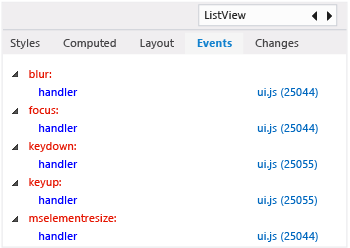

# View DOM event listeners
[!INCLUDE[vs2017banner](../includes/vs2017banner.md)]

Applies to Windows and Windows Phone](../Image/windows_and_phone_content.png "windows_and_phone_content")

 The **Events** tab of DOM Explorer shows the events that are associated with a DOM element. Each top node in the **Events** tab represents an event that has active subscribers. The top node contains subnodes that represent the registered event listeners for the specific event. In addition to viewing the event listeners, you can use this tab to navigate to the location of the event listener in the JavaScript code. The information in this topic applies to Store apps using HTML and JavaScript.

 The list on the **Events** tab is dynamic. If you add an event listener while the app is running, the new event listener will appear there. For info on adding and removing event listeners, see [Tips for resolving issues with event listeners](#Tips) in this topic.

> [!NOTE]
>  Event listeners for code elements that aren't DOM elements, such as `xhr`, don't appear on the **Events** tab.

## View event listeners for DOM elements
 This example shows a Windows Phone Store app. The DOM Explorer features described here are also supported for Windows Store apps.

#### To view event listeners

1.  In Visual Studio, create a JavaScript app that uses the Windows Phone Pivot Application project template.

2.  With the template open in Visual Studio, select **Emulator 8.1 WVGA 4in 512MB** in the drop-down list on the Debug toolbar in the debugger:

     

3.  Press F5 to run the app in debug mode.

4.  In the running app, go to the **Section 3** pivot item.

5.  Switch to Visual Studio (Alt+Tab or F12).

6.  In DOM Explorer, choose `Find` in the upper-right corner.

7.  Type `ListView`, and then press Enter.

8.  If necessary, choose the **Next** button to find the `DIV` element that represents the `ListView` control (this element has a `data-win-control` value of `WinJS.UI.ListView`).

     The `DIV` element should now be selected in DOM Explorer.

9. Choose the **Events** tab in the pane on the right side of DOM Explorer.

     You can now see the events that have active subscribers for the `DIV` element, as shown here.

     

10. To locate the event listeners for these events, choose the associated JavaScript file links.

11. To quickly identify event listeners for parent elements in the DOM hierarchy, choose a parent element in the hierarchy list at the bottom of the DOM Explorer.

     

     The **Events** tab shows event listeners for any element that you choose in the hierarchy list.

###  <a name="Tips"></a> Tips for resolving issues with event listeners
 In some app scenarios, event listeners must be explicitly removed using [removeEventListener](http://msdn.microsoft.com/library/ie/ff975250\(v=vs.85\).aspx). Use the **Events** tab in the DOM Explorer to test whether event listeners have been removed from DOM elements while running code. Here are some tips to help resolve these types of issues:

-   For apps that use the single-page navigation model implemented in the Visual Studio [project templates](http://msdn.microsoft.com/library/windows/apps/hh758331.aspx), it's not typically necessary to remove event listeners registered for objects, such as DOM elements, that are part of a page. In this scenario, a DOM element and its associated event listeners have the same lifetime, and they can be garbage-collected.

-   If the lifetime of the DOM element or object is different from the associated event listener, you might have to call the `removeEventListener` method. For example, if you use the `window.onresize` event, you might have to remove the event listener if you navigate away from the page where you handle the event.

-   If `removeEventListener` fails to remove the specified listener, it might be getting called on a different instance of the object. You can use the [bind Method (Function)](/visualstudio/scripting-docs/javascript/reference/bind-method-function-javascript) method to resolve this issue when you add the listener.

-   To remove an event listener that was added by using either [bind Method (Function)](/visualstudio/scripting-docs/javascript/reference/bind-method-function-javascript) or by using an anonymous function, store an instance of the function when you add the listener. Here's one way to safely use this pattern:

    ```javascript
    // You could use the following code within the constructor function of an object, or
    // in the ready function of a PageControl object (Store app).
    this.storedHandler = this._handlerFunc.bind(this);
    elem.addEventListener('mouseup', this.storedHandler);

    // In this example, add the following code in the PageControl object's unload function.
    elem.removeEventListener('mouseup', this.storedHandler);

    ```

     If you use the following code instead of storing a reference to the bound function, you won't be able to remove the event listener explicitly:

    ```javascript
    // Avoid this pattern. No reference to the bound function is available.
    elem.addEventListener('mouseup', this._handlerFunc.bind(this));
    ```

-   You can't remove an event listener by using `removeEventListener` if you added it by using the `obj.on<eventname>` attribute, such as `window.onresize = handlerFunc`.

-   Use the JavaScript memory analyzer to [JavaScript Memory](../profiling/javascript-memory.md) in your app. Event listeners that must be explicitly removed might appear as a memory leak.

## See Also

- [Quickstart: Debug HTML and CSS](../debugger/quickstart-debug-html-and-css.md)
- [Debug CSS styles using DOM Explorer](../debugger/debug-css-styles-using-dom-explorer.md)
- [Debug layout using DOM Explorer](../debugger/debug-layout-using-dom-explorer.md)