# Walkthrough: Creating a Realistic 3-D Billiard Ball
[!INCLUDE[vs2017banner](../includes/vs2017banner.md)]

This walkthrough demonstrates how to create a realistic 3-D billiard ball by using the Shader Designer and Image Editor in [!INCLUDE[vsprvs](../includes/vsprvs-md.md)]. The 3-D appearance of the billiard ball is achieved by combining several shader techniques with appropriate texture resources.  
  
 This document demonstrates these activities:  
  
-   Creating the basic appearance of a billiard ball by using shape and texture.  
  
-   Adding depth by using the Lambert lighting model.  
  
-   Enhancing the basic appearance by using specular highlights.  
  
-   Creating a sense of space by reflecting the environment.  
  
## Prerequisites  
 You need the following components and skills to complete this walkthrough:  
  
-   A tool for assembling textures into a cube map, such as the DirectX Texture Tool that is included in the June 2010 DirectX SDK.  
  
-   Familiarity with the Image Editor in [!INCLUDE[vsprvs](../includes/vsprvs-md.md)].  
  
-   Familiarity with the Shader Designer in [!INCLUDE[vsprvs](../includes/vsprvs-md.md)].  
  
## Creating the basic appearance with shape and texture  
 In computer graphics, the most-basic elements of appearance are shape and color. In a computer simulation, it is common to use a 3-D model to represent the shape of a real-world object. Color detail is then applied to the surface of the model by using a texture map.  
  
 Typically, you might have to ask an artist to create a 3-D model that you can use, but because a billiard ball is a common shape (a sphere), the Shader Designer already has a suitable model built in.  
  
 The sphere is the default preview shape in the Shader Designer; if you are currently using a different shape to preview your shader, switch back to the sphere.  
  
#### To preview the shader by using a sphere  
  
- On the Shader Designer toolbar, choose **Preview with sphere.**  
  
  In the next step, you'll create a shader program that applies a texture to the model, but first you have to create a texture that you can use. This walkthrough demonstrates how to create the texture by using the Image Editor, which is a part of [!INCLUDE[vsprvs](../includes/vsprvs-md.md)], but you can use any image editor that can save the texture in a suitable format.  
  
  Make sure that the **Properties** window and the **Toolbox** are displayed.  
  
#### To create a billiard ball texture by using the Image Editor  
  
1. Create a texture to work with. For information about how to add a texture to your project, see the Getting Started section in [Image Editor](../designers/image-editor.md).  
  
2. Set the image size so that its width is twice its height; this is necessary because of the way that a texture is mapped onto the spherical surface of the billiard ball. To resize the image, in the **Properties** window, specify new values for the **Width** and **Height** properties. For example, set the width to 512 and the height to 256.  
  
3. Draw a texture for the billiard ball, keeping in mind how a texture is mapped onto a sphere.  
  
    The texture should look similar to this:  
  
      
  
4. Optionally, you might want to decrease the storage requirements of this texture. You can do that by reducing the width of the texture to match its height. This compresses the texture along its width, but due to the way that the texture is mapped to the sphere, it will be expanded when the billiard ball is rendered. After resizing, the texture should look similar to this:  
  
    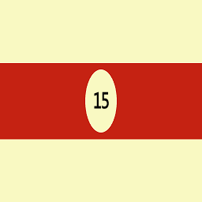  
  
   Now you can create a shader that applies this texture to the model.  
  
#### To create a basic texture shader  
  
1. Create a DGSL shader to work with. For information about how to add a DGSL shader to your project, see the Getting Started section in [Shader Designer](../designers/shader-designer.md).  
  
    By default, a shader graph looks like this:  
  
    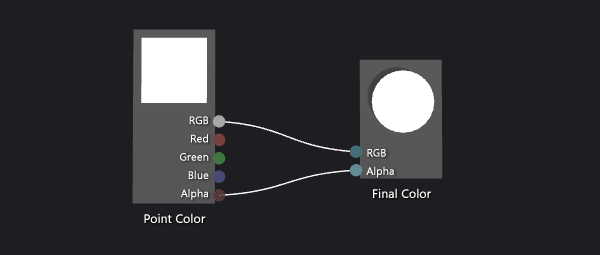  
  
2. Modify the default shader so that it applies the value of a texture sample to the current pixel. The shader graph should look like this:  
  
    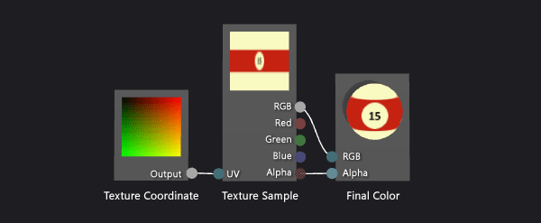  
  
3. Apply the texture that you created in the previous procedure by configuring the texture properties. Set the value of the **Texture** property of the **Texture Sample** node to **Texture1**, and then specify the texture file by using the **Filename** property of the **Texture1** property group in the same property window.  
  
   For more information about how to apply a texture in your shader, see [How to: Create a Basic Texture Shader](../designers/how-to-create-a-basic-texture-shader.md).  
  
   Your billiard ball should now look similar to this:  
  
   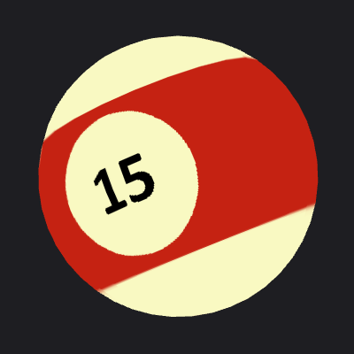  
  
## Creating depth with the Lambert lighting model  
 So far, you've created an easily recognizable billiard ball. However, it appears flat and uninteresting—more like a cartoon picture of a billiard ball than a convincing replica. The flat appearance results from the simplistic shader, which behaves as if each pixel on the surface of the billiard ball receives the same amount of light.  
  
 In the real world, light appears brightest on surfaces that directly face a light source and appears less bright on surfaces that are at an oblique angle to the light source. This is because the energy in the light rays is distributed across the smallest surface area when the surface directly faces the light source. As the surface turns away from the light source, the same amount of energy is distributed across an increasingly larger surface area. A surface that faces away from a light source receives no light energy at all, resulting in a completely dark appearance. This variance in brightness across the surface of an object is an important visual cue that helps indicate the shape of an object; without it, the object appears flat.  
  
 In computer graphics, *lighting models*—simplified approximations of complex, real-world lighting interactions—are used to replicate the appearance of real-world lighting. The Lambert lighting model varies the amount of diffusely reflected light across the surface of an object as described in the previous paragraph. You can add the Lambert lighting model to your shader to give the billiard ball a more convincing 3-D appearance.  
  
#### To add Lambert lighting to your shader  
  
- Modify your shader to modulate the value of the texture sample by the Lambert lighting value. Your shader graph should look like this:  
  
   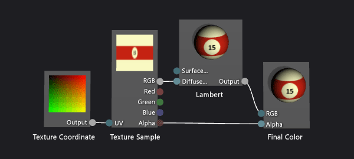  
  
- Optionally, you can adjust how the lighting behaves by configuring the **MaterialDiffuse** property of the shader graph. To access properties of the shader graph, choose an empty area of the design surface, and then locate the property that you want to access in the **Properties** window.  
  
  For more information about how to apply Lambert lighting in your shader, see [How to: Create a Basic Lambert Shader](../designers/how-to-create-a-basic-lambert-shader.md).  
  
  With Lambert lighting applied, your billiard ball should look similar to this:  
  
  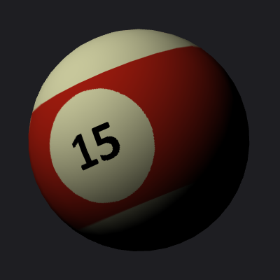  
  
## Enhancing the basic appearance with specular highlights  
 The Lambert lighting model provides the sense of shape and dimension that was absent in the texture-only shader. However, the billiard ball still has a somewhat dull appearance.  
  
 A real billiard ball usually has a glossy finish that reflects a portion of the light that falls on it. Some of this reflected light results in specular highlights, which simulate the reflecting properties of a surface. Depending on the properties of the finish, the highlights can be localized or broad, intense or subtle. These specular reflections are modeled by using the relationship between a light source, the orientation of the surface, and the camera position—that is, the highlight is most intense when the orientation of the surface reflects the light source directly into the camera, and is less intense when the reflection is less direct.  
  
 The Phong lighting model builds on the Lambert lighting model to include specular highlights as described in the previous paragraph. You can add the Phong lighting model to your shader to give the billiard ball a simulated finish that results in a more interesting appearance.  
  
#### To add specular highlights to your shader  
  
1. Modify your shader to include the specular contribution by using additive blending. Your shader graph should look like this:  
  
    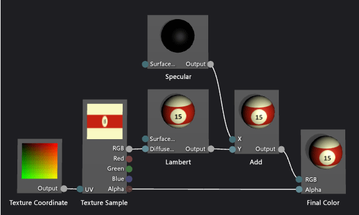  
  
2. Optionally, you can adjust the way that the specular highlight behaves by configuring the specular properties (**MaterialSpecular** and **MaterialSpecularPower**) of the shader graph. To access properties of the shader graph, choose an empty area of the design surface, and then in the **Properties** window, locate the property that you want to access.  
  
   For more information about how to apply specular highlights in your shader, see [How to: Create a Basic Phong Shader](../designers/how-to-create-a-basic-phong-shader.md).  
  
   With specular highlighting applied, your billiard ball should look similar to this:  
  
   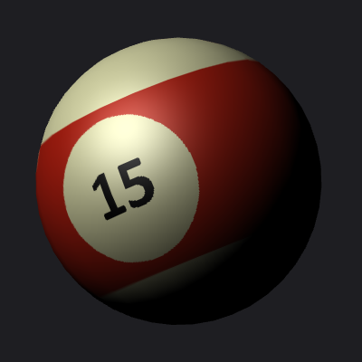  
  
## Creating a sense of space by reflecting the environment  
 With specular highlights applied, your billiard ball looks pretty convincing. It's got the right shape, the right paint job, and the right finish. However, there's still one more technique that will make your billiard ball look more like a part of its environment.  
  
 If you examine a real billiard ball closely, you can see that its glossy surface doesn't just exhibit specular highlights but also faintly reflects an image of the world around it. You can simulate this reflection by using an image of the environment as a texture and combining it with the model's own texture to determine the final color of each pixel. Depending on the kind of finish you want, you can combine more or less of the reflection texture together with the rest of the shader. For example, a shader that simulates a highly reflective surface like a mirror might use only the reflection texture, but a shader that simulates a more subtle reflection like the one found on a billiard ball might combine just a small portion of the reflection texture's value together with the rest of the shader calculation.  
  
 Of course, you can't just apply the reflected image to the model in the same way that you apply the model's texture map. If you did, the reflection of the world would move with the billiard ball as if the reflection were glued to it. Because a reflection can come from any direction, you need a way to provide a reflection map value for any angle, and a way to keep the reflection map oriented according to the world. To satisfy these requirements you can use a special kind of texture map—called a *cube map*—that provides six textures arranged to form the sides of a cube. From inside this cube, you can point in any direction to find a texture value. If the textures on each side of the cube contain images of the environment, you can simulate any reflection by sampling the correct location on the surface of the cube. By keeping the cube aligned to the world, you'll get an accurate reflection of the environment. To determine where the cube should be sampled, you just calculate the reflection of the camera vector off the surface of the object, and then use it as 3-D texture coordinates. Using cube maps in this way is a common technique that's known as *environment mapping*.  
  
 Environment mapping provides an efficient approximation of real reflections as described in the preceding paragraphs. You can blend environment-mapped reflections into your shader to give the billiard ball a simulated finish that makes the billiard ball seem more grounded in the scene.  
  
 The first step is to create a cube map texture. In many kinds of apps, the contents of the cube map don't have to be perfect to be effective, especially when the reflection is subtle or doesn't occupy a prominent space on the screen. For example, many games use pre-computed cube maps for environment mapping and just use the one nearest to each reflective object, although this means that the reflection isn't correct. Even a rough approximation is often good enough for a convincing effect.  
  
#### To create textures for an environment map by using the Image Editor  
  
1. Create a texture to work with. For information about how to add a texture to your project, see the Getting Started section in [Image Editor](../designers/image-editor.md).  
  
2. Set the image size so that its width is equal to its height, and is a power of two in size; this is necessary because of the way that a cube map is indexed. To resize the image, in the **Properties** window, specify new values for the **Width** and **Height** properties. For example, set the value of the **Width** and **Height** properties to 256.  
  
3. Use a solid color to fill the texture. This texture will be the bottom of the cube map, which corresponds to the surface of the billiard table. Keep the color you used in mind for the next texture.  
  
4. Create a second texture that is the same size as the first. This texture will be repeated on the four sides of the cube map, which correspond to the surface and sides of a billiard table, and to the area around the billiard table. Make sure to draw the surface of the billiard table in this texture by using the same color as in the bottom texture. The texture should look similar to this:  
  
    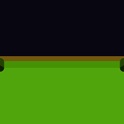  
  
    Remember that a reflection map doesn't have to be photorealistic to be effective; for example, the cube map used to create the images in this article contains just four pockets instead of six.  
  
5. Create a third texture that is the same size as the others. This texture will be the top of the cube map, which corresponds to the ceiling above the billiard table. To make this part of the reflection more interesting, you can draw an overhead light to reinforce the specular highlights that you added to the shader in the previous procedure. The texture should look similar to this:  
  
    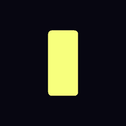  
  
   Now that you have created individual textures for the sides of the cube map, you can use a tool to assemble them into a cube map that can be stored in a single .dds texture. You can use any program you want to create the cube map as long as it can save the cube map in the .dds texture format. This walkthrough demonstrates how to create the texture by using the DirectX Texture Tool that's a part of the June 2010 DirectX SDK.  
  
#### To assemble a cube map by using the DirectX Texture Tool  
  
1. In the DirectX Texture Tool, on the main menu, choose **File**, **New Texture**. The **New Texture** dialog box appears.  
  
2. In the **Texture Type** group, choose **Cubemap Texture**.  
  
3. In the **Dimensions** group, enter the correct value for the **Width** and **Height**, and then choose **OK**. A new texture document appears. By default, the texture first shown in the texture document corresponds to the **Positive X** cube face.  
  
4. Load the texture that you created for the side of the texture cube onto the cube face. On the main menu, choose **File**, **Open Onto This Cubemap Face**, select the texture that you created for the side of the cube, and then choose **Open**.  
  
5. Repeat step 4 for the **Negative X**, **Positive Z**, and **Negative Z** cube faces. To do so, you must view the face that you want to load. To view a different cube map face, on the main menu, choose **View**, **Cube Map Face**, and then select the face that you want to view.  
  
6. For the **Positive Y** cube face, load the texture that you created for the top of the texture cube.  
  
7. For the **Negative Y** cube face, load the texture that you created for the bottom of the texture cube.  
  
8. Save the texture.  
  
   You can imagine the layout of the cube map like this:  
  
   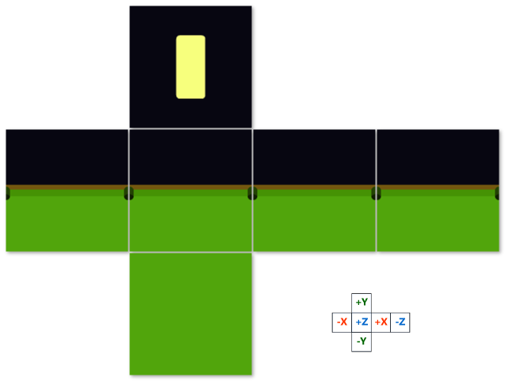  
  
   The image at the top is the positive Y (+Y) cube face; in the middle, from left to right, is the –X, +Z, +X, and –Z cube faces; at the bottom is the –Y cube face.  
  
   Now you can modify the shader to blend the cube map sample into the rest of the shader.  
  
#### To add environment mapping to your shader  
  
1. Modify your shader to include the environment mapping contribution by using additive blending. Your shader graph should look like this:  
  
    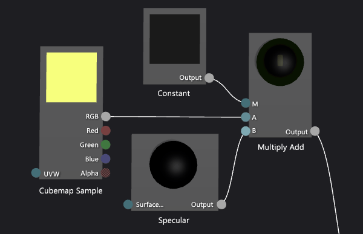  
  
    Note that you can use a **Multiply-Add** node to simplify the shader graph.  
  
    Here's a more detailed view of the shader nodes that implement environment mapping:  
  
    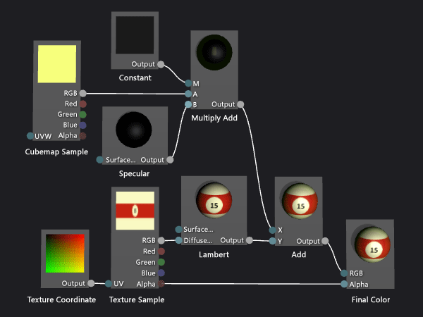  
  
2. Apply the texture that you created in the previous procedure by configuring the texture properties of the cube map. Set the value of the **Texture** property of the **Cubemap Sample** node to **Texture2**, and then specify the texture file by using the **Filename** property of the **Texture2** property group.  
  
3. Optionally, you can adjust the reflectivity of the billiard ball by configuring the **Output** property of the **Constant** node. To access properties of the node, select it and then in the **Properties** window, locate the property that you want to access.  
  
   With environment mapping applied, your billiard ball should look similar to this:  
  
   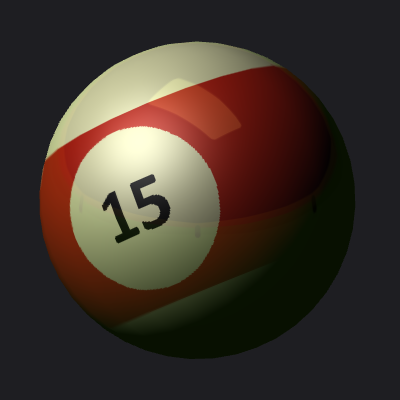  
  
   In this final image, notice how the effects that you added come together to create a very convincing billiard ball. The shape, texture, and lighting create the basic appearance of a 3-D object, and the specular highlights and reflections make the billiard ball more interesting and look like a part of its environment.  
  
## See Also  
 [How to: Export a Shader](../designers/how-to-export-a-shader.md)   
 [How to: Apply a Shader to a 3-D Model](../designers/how-to-apply-a-shader-to-a-3-d-model.md)   
 [Shader Designer](../designers/shader-designer.md)   
 [Image Editor](../designers/image-editor.md)   
 [Shader Designer Nodes](../designers/shader-designer-nodes.md)

