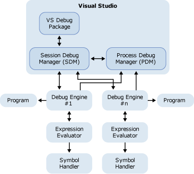

# Debugger Components
[!INCLUDE[vs2017banner](../../includes/vs2017banner.md)]

  
The [!INCLUDE[vsprvs](../../includes/vsprvs-md.md)] debugger is implemented as a VSPackage and manages the entire debug session. The debug session comprises the following elements:  
  
-   **Debug Package:** The [!INCLUDE[vsprvs](../../includes/vsprvs-md.md)] debugger provides the same user interface no matter what is being debugged.  
  
-   **Session debug manager (SDM):** Provides a consistent programmatic interface to the [!INCLUDE[vsprvs](../../includes/vsprvs-md.md)] Debugger for the management of a variety of debug engines. It is implemented by [!INCLUDE[vsprvs](../../includes/vsprvs-md.md)].  
  
-   **Process debug manager (PDM):** Manages, for all running instances of [!INCLUDE[vsprvs](../../includes/vsprvs-md.md)], a list of all programs that can be or are being debugged. It is implemented by [!INCLUDE[vsprvs](../../includes/vsprvs-md.md)].  
  
-   **Debug engine (DE):** Is responsible for monitoring a program being debugged, communicating the state of the running program to the SDM and the PDM, and interacting with the expression evaluator and symbol provider to provide real-time analysis of the state of a program's memory and variables. It is implemented by [!INCLUDE[vsprvs](../../includes/vsprvs-md.md)] (for the languages it supports) and third-party vendors who want to support their own run time.  
  
-   **Expression evaluator (EE):** Provides support for dynamically evaluating variables and expressions supplied by the user when a program has been stopped at a particular point. It is implemented by [!INCLUDE[vsprvs](../../includes/vsprvs-md.md)] (for the languages it supports) and third-party vendors who want to support their own languages.  
  
-   **Symbol provider (SP):** Also called a symbol handler, maps the debugging symbols of a program to a running instance of the program so that meaningful information can be provided (such as source-code-level debugging and expression evaluation). It is implemented by [!INCLUDE[vsprvs](../../includes/vsprvs-md.md)] (for the Common Language Runtime [CLR] symbols and the Program DataBase [PDB] symbol file format) and by third-party vendors who have their own proprietary method of storing debugging information.  
  
 The following diagram shows the relationship among these elements of the Visual Studio debugger.  
  
   
  
## In This Section  
 [Debug Package](../../extensibility/debugger/debug-package.md)  
 Discusses the debug package, which runs in the [!INCLUDE[vsprvs](../../includes/vsprvs-md.md)] shell and handles all of the UI.  
  
 [Process Debug Manager](../../extensibility/debugger/process-debug-manager.md)  
 Provides an overview of the features of the PDM, which is the manager of the processes that can be debugged.  
  
 [Session Debug Manager](../../extensibility/debugger/session-debug-manager.md)  
 Defines the SDM, which provides a unified view of the debug session to the IDE. The SDM manages the DE.  
  
 [Debug Engine](../../extensibility/debugger/debug-engine.md)  
 Documents the debugging services that the DE provides.  
  
 [Operational Modes](../../extensibility/debugger/operational-modes.md)  
 Provides an overview of the three modes in which the IDE can operate: design mode, run mode, and break mode. Transition mechanisms are also discussed.  
  
 [Expression Evaluator](../../extensibility/debugger/expression-evaluator.md)  
 Explains the purpose of the EE at run time.  
  
 [Symbol Provider](../../extensibility/debugger/symbol-provider.md)  
 Discusses how, at implementation, the symbol provider evaluates variables and expressions.  
  
 [Type Visualizer and Custom Viewer](../../extensibility/debugger/type-visualizer-and-custom-viewer.md)  
 Discusses what a type visualizer and custom viewer are and what role the expression evaluator plays in supporting both.  
  
## Related Sections  
 [Debugger Concepts](../../extensibility/debugger/debugger-concepts.md)  
 Describes the main debugging architectural concepts.  
  
 [Debugger Contexts](../../extensibility/debugger/debugger-contexts.md)  
 Explains how the DE operates simultaneously within code, documentation, and expression evaluation contexts. Describes, for each of the three contexts, the location, position, or evaluation relevant to it.  
  
 [Debugging Tasks](../../extensibility/debugger/debugging-tasks.md)  
 Contains links to various debugging tasks, such as launching a program and evaluating expressions.  
  
## See Also  
 [Getting Started](../../extensibility/debugger/getting-started-with-debugger-extensibility.md)

