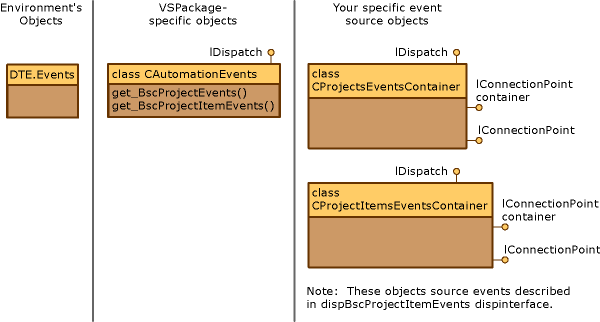

# Exposing Events in the Visual Studio SDK
[!INCLUDE[vs2017banner](../../includes/vs2017banner.md)]

The latest version of this topic can be found at [Exposing Events in the Visual Studio SDK](https://docs.microsoft.com/visualstudio/extensibility/internals/exposing-events-in-the-visual-studio-sdk).  
  
[!INCLUDE[vsprvs](../../includes/vsprvs-md.md)] lets you source events by using automation. We recommend that you source events for projects and project items.  
  
 Events are retrieved by automation consumers from the <xref:EnvDTE.DTEClass.Events%2A> object or <xref:EnvDTE.DTEClass.GetObject%2A> ("EventObjectName"). The environment calls `IDispatch::Invoke` by using the `DISPATCH_METHOD` or `DISPATCH_PROPERTYGET` flags to return an event.  
  
 The following process explains how VSPackage-specific events are returned.  
  
1.  The environment starts.  
  
2.  It reads from the registry all value names under the Automation, AutomationEvents and AutomationProperties keys of all VSPackages, and stores those names in a table.  
  
3.  An automation consumer calls, in this example, `DTE.Events.AutomationProjectsEvents` or `DTE.Events.AutomationProjectItemsEvents`.  
  
4.  The environment finds the string parameter in the table and loads the corresponding VSPackage.  
  
5.  The environment calls the <xref:Microsoft.VisualStudio.Shell.Interop.IVsPackage.GetAutomationObject%2A> method by using the name passed in the call; in this example, AutomationProjectsEvents or AutomationProjectItemsEvents.  
  
6.  The VSPackage creates a root object that has methods such as `get_AutomationProjectsEvents` and `get_AutomationProjectItemEvents` and then returns an IDispatch pointer to the object.  
  
7.  The environment calls the appropriate method based on the name passed into the automation call.  
  
8.  The `get_` method creates another IDispatch-based event object that implements both the `IConnectionPointContainer` interface and the `IConnectionPoint` interface and returns an IDispatchpointer to the object.  
  
 To expose an event by using automation, you must respond to <xref:Microsoft.VisualStudio.Shell.Interop.IVsPackage.GetAutomationObject%2A> and watch for the strings that you add to the registry. In the Basic Project sample, the strings are "BscProjectsEvents" and "BscProjectItemsEvents".  
  
## Registry Entries from the Basic Project Sample  
 This section shows where to add automation event values to the registry.  
  
 [HKEY_LOCAL_MACHINE\SOFTWARE\Microsoft\VisualStudio\8.0\Packages\\<PkgGUID\>\AutomationEvents]  
  
 "AutomationProjectEvents"="Returns the AutomationProjectEvents Object"  
  
 "AutomationProjectItemEvents"="Returns the AutomationProjectItemsEvents Object"  
  
|Name|Type|Range|Description|  
|----------|----------|-----------|-----------------|  
|Default (@)|REG_SZ|Unused|Unused. You can use the data field for documentation.|  
|AutomationProjectsEvents|REG_SZ|Name of your event object.|Only the key name is relevant. You can use the data field for documentation.<br /><br /> This example comes from the Basic Project sample.|  
|AutomationProjectItemEvents|REG_SZ|Name of your event object|Only the key name is relevant. You can use the data field for documentation.<br /><br /> This example comes from the Basic Project sample.|  
  
 When any of your event objects are requested by an automation consumer, create a root object that has methods for any event that your VSPackage supports. The environment calls the appropriate `get_` method on this object. For example, if `DTE.Events.AutomationProjectsEvents` is called, the `get_AutomationProjectsEvents` method on the root object is invoked.  
  
   
Automation model for events  
  
 The class `CProjectEventsContainer` represents the source object for BscProjectsEvents, while `CProjectItemsEventsContainer` represents the source object for BscProjectItemsEvents.  
  
 In most cases, you must return a new object for every event request because most event objects take a filter object. When you fire your event, check this filter to verify that the event handler is being called.  
  
 AutomationEvents.h and AutomationEvents.cpp contain declarations and implementations of the classes in the following table.  
  
|Class|Description|  
|-----------|-----------------|  
|`CAutomationEvents`|Implements an event root object, retrieved from the `DTE.Events` object.|  
|`CProjectsEventsContainer` and `CProjectItemsEventsContainer`|Implement the event source objects that fire the corresponding events.|  
  
 The following code example shows how to respond to a request for an event object.  
  
```cpp#  
STDMETHODIMP CVsPackage::GetAutomationObject(  
    /* [in]  */ LPCOLESTR       pszPropName,   
    /* [out] */ IDispatch **    ppIDispatch)  
{  
    ExpectedPtrRet(ppIDispatch);  
    *ppIDispatch = NULL;  
  
    if (_wcsicmp(pszPropName, g_wszAutomationProjects) == 0)   
        //Is the requested name our Projects object?  
    {  
        return GetAutomationProjects(ppIDispatch);  
        // Gets our Projects object.  
    }  
    else if (_wcsicmp(pszPropName, g_wszAutomationProjectsEvents) == 0)  
        //Is the requested name our ProjectsEvents object?  
    {  
        return CAutomationEvents::GetAutomationEvents(ppIDispatch);  
          // Gets our ProjectEvents object.  
    }  
    else if (_wcsicmp(pszPropName, g_wszAutomationProjectItemsEvents) == 0)  //Is the requested name our ProjectsItemsEvents object?  
    {  
        return CAutomationEvents::GetAutomationEvents(ppIDispatch);  
          // Gets our ProjectItemsEvents object.  
    }  
    return E_INVALIDARG;  
}  
```  
  
 In the code above, `g_wszAutomationProjects` is the name of your project collection ("FigProjects"), `g_wszAutomationProjectsEvents` ("FigProjectsEvents") and `g_wszAutomationProjectItemsEvents` ("FigProjectItemEvents") are the names of project events and project items events that are sourced from your VSPackage implementation.  
  
 Event objects are retrieved from the same central location, the `DTE.Events` object. This way, all event objects are grouped together so that an end user does not have to browse the entire object model to find a specific event. This also lets you provide your specific VSPackage objects, instead of requiring you to implement your own code for system-wide events. However, for the end user,who must find an event for your `ProjectItem` interface, it is not immediately clear from where that event object is retrieved.  
  
## See Also  
 <xref:Microsoft.VisualStudio.Shell.Interop.IVsPackage.GetAutomationObject%2A>   
 [VSSDK Samples](../../misc/vssdk-samples.md)

