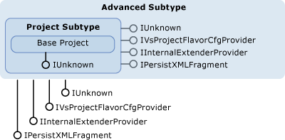
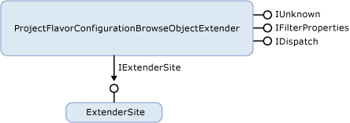

# Project Subtypes Design
[!INCLUDE[vs2017banner](../../includes/vs2017banner.md)]

Project subtypes let VSPackages extend projects based on the Microsoft Build Engine (MSBuild). The use of aggregation lets you reuse the bulk of the core managed project system implemented in [!INCLUDE[vsprvs](../../includes/vsprvs-md.md)] yet still customize the behavior for a particular scenario.  
  
 The following topics detail the basic design and implementation of project subtypes:  
  
-   Project Subtype Design.  
  
-   Multi-level Aggregation.  
  
-   Supporting Interfaces.  
  
## Project Subtype Design  
 The initialization of a project subtype is achieved by aggregating the main <xref:Microsoft.VisualStudio.Shell.Interop.IVsHierarchy> and <xref:Microsoft.VisualStudio.Shell.Interop.IVsProject> objects. This aggregation enables a project subtype to override or enhance most of the capabilities of the base project. Project subtypes get the first chance to handle properties using <xref:Microsoft.VisualStudio.Shell.Interop.IVsHierarchy>, commands using <xref:Microsoft.VisualStudio.OLE.Interop.IOleCommandTarget> and <xref:Microsoft.VisualStudio.Shell.Interop.IVsUIHierarchy>, and project item management using <xref:Microsoft.VisualStudio.Shell.Interop.IVsProject3>. Project subtypes can also extend:  
  
-   Project configuration objects.  
  
-   Configuration-dependent objects.  
  
-   Configuration-independent browse objects.  
  
-   Project automation objects.  
  
-   Project automation property collections.  
  
 For more information on extensibility by project subtypes, see [Properties and Methods Extended by Project Subtypes](../../extensibility/internals/properties-and-methods-extended-by-project-subtypes.md).  
  
##### Policy Files  
 The [!INCLUDE[vsprvs](../../includes/vsprvs-md.md)] environment provides an example of extending the base project system with a project subtype in its implementation of policy files. A policy file allows the shaping of the [!INCLUDE[vsprvs](../../includes/vsprvs-md.md)] environment by managing features that include the Solution Explorer, **Add Project** dialog box, **Add New Item** dialog box and the **Properties** dialog box. The policy subtype overrides and enhances these features through <xref:Microsoft.VisualStudio.Shell.Interop.IVsFilterAddProjectItemDlg>, `IOleCommandTarget` and <xref:Microsoft.VisualStudio.Shell.Interop.IVsUIHierarchy> implementations.  
  
##### Aggregation Mechanism  
 The environment's project subtype aggregation mechanism supports multiple levels of aggregation, thus allowing an advanced subtype to be implemented by further flavoring a flavored project. Also, the supporting objects of a project subtype, such as <xref:Microsoft.VisualStudio.Shell.Interop.IVsProjectFlavorCfg>, are designed to allow multiple levels of layering. In keeping with the constraints of COM and COM aggregation rules, project subtypes and base projects need to be programmed cooperatively to enable the inner subtype or the base project to properly participate in delegating method calls and managing reference counts. That is, the project about to be aggregated has to be programmed to support aggregation.  
  
 The following illustration shows a schematic representation of a multi-level project subtype aggregation.  
  
   
Multilevel Project Subtype  
  
 A multi-level project subtype aggregation consists of three levels, a base project, which is aggregated by a project subtype, then further aggregated by an advanced project subtype. The figure focuses on some of the supporting interfaces that are provided as a part of the [!INCLUDE[vsprvs](../../includes/vsprvs-md.md)] project subtype architecture.  
  
##### Deployment Mechanisms  
 Among many of the base project system functionalities enhanced by a project subtype are deployment mechanisms. A project subtype influences deployment mechanisms by implementing configuration interfaces (such as <xref:Microsoft.VisualStudio.Shell.Interop.IVsDeployableProjectCfg> and <xref:Microsoft.VisualStudio.Shell.Interop.IVsBuildableProjectCfg>) that are retrieved by calling QueryInterface on <xref:Microsoft.VisualStudio.Shell.Interop.IVsProjectCfgProvider>. In a scenario where both the project subtype and the advanced project subtype add different configuration implementations, the base project calls `QueryInterface` on the advanced project subtype's `IUnknown`. If the inner project subtype contains the configuration implementation that the base project is asking for, the advanced project subtype delegates to the implementation provided by the inner project subtype. As a mechanism to persist state from one aggregation level to another, all the levels of project subtypes implement <xref:Microsoft.VisualStudio.Shell.Interop.IPersistXMLFragment> to persist non-build related XML data into the project files. For more information, see [Persisting Data in the MSBuild Project File](../../extensibility/internals/persisting-data-in-the-msbuild-project-file.md). <xref:EnvDTE80.IInternalExtenderProvider> is implemented as a mechanism to retrieve automation extenders from the project subtypes.  
  
 The following illustration focuses on the automation extender implementation, the project configuration browse object in particular, used by project subtypes to extend the base project system.  
  
   
Project Subtype Automation Extender.  
  
 Project subtypes can further extend the base project system by extending the automation object model. These are defined as a part of the DTE automation object and are used to extend the Project object, the `ProjectItem` object and the `Configuration` object. For more information see, [Extending the Object Model of the Base Project](../../extensibility/internals/extending-the-object-model-of-the-base-project.md).  
  
## Multi-level Aggregation  
 A project subtype implementation that wraps a lower level project subtype needs to be programmed cooperatively to allow the inner project subtype to function properly. A list of programming responsibilities includes:  
  
-   The <xref:Microsoft.VisualStudio.Shell.Interop.IPersistXMLFragment> implementation of the project subtype that is wrapping the inner subtype must delegate to the <xref:Microsoft.VisualStudio.Shell.Interop.IPersistXMLFragment> implementation of the inner project subtype for both <xref:Microsoft.VisualStudio.Shell.Interop.IPersistXMLFragment.Load%2A> and <xref:Microsoft.VisualStudio.Shell.Interop.IPersistXMLFragment.Save%2A> methods.  
  
-   The <xref:EnvDTE80.IInternalExtenderProvider> implementation of the wrapper project subtype must delegate to that of its inner project subtype. In particular, the implementation of <xref:EnvDTE80.IInternalExtenderProvider.GetExtenderNames%2A> needs to get the string of names from the inner project subtype and then concatenate the strings it wants to add as extenders.  
  
-   The <xref:Microsoft.VisualStudio.Shell.Interop.IVsProjectCfgProvider> implementation of a wrapper project subtype must instantiate the <xref:Microsoft.VisualStudio.Shell.Interop.IVsProjectFlavorCfg> object of its inner project subtype and hold it as a private delegate, since only the base project's project configuration object directly knows that the wrapper project subtype configuration object exists. The outer project subtype can initially choose configuration interfaces it wants to handle directly, and then delegate the rest to the inner project subtype's implementation of <xref:Microsoft.VisualStudio.Shell.Interop.IVsProjectFlavorCfg.get_CfgType%2A>.  
  
## Supporting Interfaces  
 The base project delegates calls to supporting interfaces added by a project subtype, to extend various aspects of its implementation. This includes extending project configuration objects and various property browser objects. These interfaces are retrieved by calling `QueryInterface` on `punkOuter` (a pointer to the `IUnknown`) of the outermost project subtype aggregator.  
  
|Interface|Project Subtype|  
|---------------|---------------------|  
|<xref:Microsoft.VisualStudio.Shell.Interop.IVsProjectFlavorCfg>|Allows the project subtype to:   -   Provide an implementation of <xref:Microsoft.VisualStudio.Shell.Interop.IVsDeployableProjectCfg>. -   Control the launch of the debugger by allowing the project subtype to provide its own implementation of <xref:Microsoft.VisualStudio.Shell.Interop.IVsDebuggableProjectCfg>. -   Disable design-time expression evaluation by appropriately handling the `DBGLAUNCH_DesignTimeExprEval` case in its implementation of <xref:Microsoft.VisualStudio.Shell.Interop.IVsDebuggableProjectCfg.QueryDebugLaunch%2A>.|  
|<xref:EnvDTE80.IInternalExtenderProvider>|Allows the project subtype to:   -   Extend the <xref:Microsoft.VisualStudio.Shell.Interop.__VSHPROPID> of the project to add or remove configuration independent properties of the project. -   Extend the project automation object (<xref:Microsoft.VisualStudio.Shell.Interop.__VSHPROPID>) of the project.   Property values above are taken from <xref:Microsoft.VisualStudio.Shell.Interop.__VSHPROPID2> enumeration.|  
|<xref:Microsoft.VisualStudio.Shell.Interop.IVsCfgBrowseObject>|Allows the project subtype to map back to the <xref:Microsoft.VisualStudio.Shell.Interop.IVsCfg> object given the project configuration browse object.|  
|<xref:Microsoft.VisualStudio.Shell.Interop.IVsBrowseObject>|Allows the project subtype to map back to the <xref:Microsoft.VisualStudio.Shell.Interop.IVsHierarchy> or the `VSITEMID` object, given the project configuration browse object.|  
|<xref:Microsoft.VisualStudio.Shell.Interop.IPersistXMLFragment>|Allows the project subtype to persist arbitrary XML structured data to the project file (.vbproj or .csproj). This data is not visible to MSBuild.|  
|<xref:Microsoft.VisualStudio.Shell.Interop.IVsBuildPropertyStorage>|Allows the project subtype to:   -   Add new MSBuild properties to be persisted. -   Remove unnecessary properties from MSBuild. -   Query for a current value of an MSBuild property. -   Change the current value of an MSBuild property.|  
  
## See Also  
 <xref:Microsoft.VisualStudio.Shell.Interop.__VSPROPID>   
 <xref:Microsoft.VisualStudio.Shell.Interop.__VSPROPID2>

