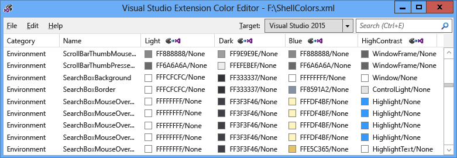
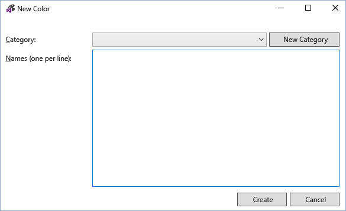
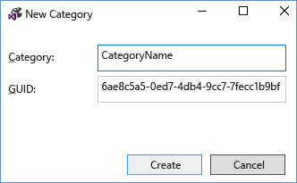
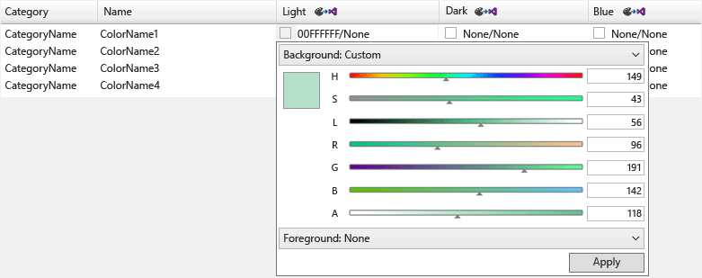
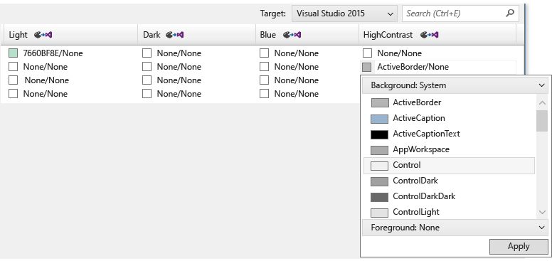
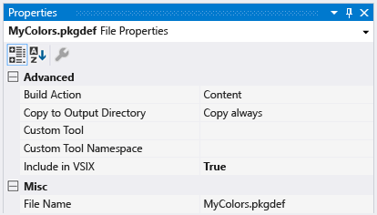
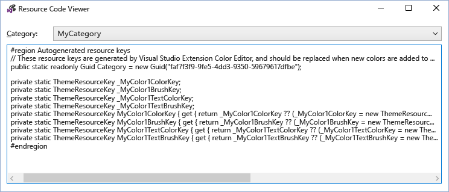

# VSIX Color Editor
[!INCLUDE[vs2017banner](../../includes/vs2017banner.md)]

The Visual Studio Extension Color Editor tool can create and edit custom colors for Visual Studio. The tool can also generate theme resource keys so that the colors can be used in code. This tool is useful for making colors for a Visual Studio extension that supports theming. This tool can open .pkgdef and .xml files. Visual Studio themes (.vstheme files) can be used with the Visual Studio Extension Color Editor by changing the file extension to .xml. Additionally, .vstheme files can be imported into a current .xml file.  
  
   
  
 **Package definition files**  
  
 Package definition (.pkgdef) files are the files that define themes. The colors themselves are stored in theme color .xml files, which are compiled into a .pkgdef file. The .pkgdef files are deployed to Visual Studio searchable locations, processed at runtime, and merged together to define themes.  
  
 **Color tokens**  
  
 A color token is made up of four elements:  
  
-   **Category name:** A logical grouping for a set of colors. Use an existing category name if there are already colors that are specific to the desired UI element, or group of UI elements.  
  
-   **Token name:** A descriptive name for the color token and token sets. Sets include background and foreground (text) token names as well as all their states, and these should be named so that it is easy to identify the pairs and the states that they apply to.  
  
-   **Color values (or hues):** Needed for each colored theme. Always create background and text color values in pairs. Colors are paired for background/foreground so that the text (foreground) color is always readable against the background color on which it is drawn. These colors are linked and will be used together in the UI. If the background is not intended for use with text, do not define a foreground color.  
  
-   **System color name:** For use in high-contrast displays.  
  
## How to use the tool  
 As much as possible, and where appropriate, existing Visual Studio colors should be reused instead of making new ones. However, for cases where no appropriate colors are defined, custom colors should be created to keep an extension theming compatible.  
  
 **Creating new color tokens**  
  
 To create custom colors using the Visual Studio Extension Color Editor, follow these steps:  
  
1.  Determine the category and token names for the new color tokens.  
  
2.  Choose the hues that the UI element will use for each theme and the system color for High Contrast.  
  
3.  Use the color editor to create new color tokens.  
  
4.  Use the colors in a Visual Studio extension.  
  
5.  Test the changes in Visual Studio.  
  
 **Step 1: Determine the category and token names for the new color tokens.**  
  
 The preferred naming scheme for a VSColor is **[Category] [UI type] [State]**. Do not use the word “color” in VSColor names, as it is redundant.  
  
 Category names provide logical groupings, and should be defined as narrowly as possible. For example, the name of a single tool window could be a category name, but the name of an entire business unit or project team is not. Grouping entries into categories helps prevent confusion between colors with the same name.  
  
 A token name must clearly indicate the element type and the situations, or “state,” for which the color will be applied. For example, an active data tip’s **[UI type]** could be named “**DataTip**” and the **[State]** could be named “**Active**,” resulting in a color name of “**DataTipActive**.” Since data tips have text, both a foreground and a background color need to be defined. By using a background/foreground pairing, the color editor will automatically create the colors “**DataTipActive**” for the background and “**DataTipActiveText**” for the foreground.  
  
 If the piece of UI has only one state, the **[State]** part of the name can be omitted. For example, if a search box has a border and there is no state change that would affect the border’s color, then the name for the border’s color token can simply be called “**SearchBoxBorder**.”  
  
 Some common state names include:  
  
-   Active  
  
-   Inactive  
  
-   MouseOver  
  
-   MouseDown  
  
-   Selected  
  
-   Focused  
  
 Examples of a few token names for parts of a list item control:  
  
-   ListItem  
  
-   ListItemBorder  
  
-   ListItemMouseOver  
  
-   ListItemMouseOverBorder  
  
-   ListItemSelected  
  
-   ListItemSelectedBorder  
  
-   ListItemDisabled  
  
-   ListItemDisabledBorder  
  
 **Step 2: Choose the hues that the UI element will use for each theme and the system color for High Contrast.**  
  
 When choosing custom colors for UI, select a similar existing UI element, and use its colors as a base. The colors for in-the-box UI elements have undergone review and testing, so they will look appropriate and behave correctly in all themes.  
  
 **Step 3: Use the color editor to create new color tokens.**  
  
 Launch the color editor and open or create a new custom theme colors .xml file. Select **Edit > New Color** from the menu. This opens a dialog for specifying the category and one or more names for color entries within that category:  
  
   
  
 Select an existing category, or select **New Category** to create a new category. Another dialog will open, creating a new category name:  
  
   
  
 The new category will then become available in the **New Color** category drop-down menu. After choosing a category, enter one name per line for each new color token and select “Create” when finished:  
  
   
  
 The color values are shown in background/foreground pairs, with “None” indicating that the color has not been defined. Note: if a color does not have a text color/background color pair, then only the background needs to be defined.  
  
   
  
 To edit a color token, select a color entry for the theme (column) of that token. Add the color value by either typing a hex color value in 8-digit ARGB format, entering a system color name into the cell, or using the drop-down menu to select the desired color via a set of color sliders or a list of system colors.  
  
   
  
   
  
 For components that do not need to display text, enter only one color value: the background color. Otherwise, enter values for both background and text color, separated by a forward slash.  
  
 When entering values for High Contrast, enter valid Windows system color names. Do not enter hardcoded ARGB values. You can view a list of valid system color names by selecting “Background: System” or “Foreground: System” from the color value drop-down menus. When creating elements that have text components, use the correct background/text system color pair or the text might be unreadable.  
  
 When you finish creating, setting, and editing the color tokens, save them into the desired .xml or .pkgdef format. Color tokens with neither a background nor a foreground set will be saved as empty colors in .xml format, but discarded in .pkgdef format. A dialog will warn you of potential color loss if you attempt to save empty colors to a .pkgdef file.  
  
 **Step 4: Use the colors in a Visual Studio extension.**  
  
 After defining the new color tokens, include the .pkgdef in the project file with “Build Action” set to “Content,” and “Include in VSIX” set to “True.”  
  
   
  
 In the Visual Studio Extension Color Editor, choose File > View Resource Code to view code that is used for accessing the custom colors in WPF-based UI.  
  
   
  
 Include this code in a static class in the project. A reference to **Microsoft.VisualStudio.Shell.\<VSVersion>.0.dll** needs to be added to the project to use the **ThemeResourceKey** type.  
  
```csharp  
namespace MyCustomColors  
{  
    public static class MyCategory  
    {  
        #region Autogenerated resource keys  
        // These resource keys are generated by Visual Studio Extension Color Editor, and should be replaced when new colors are added to this category.  
        public static readonly Guid Category = new Guid("faf7f3f9-9fe5-4dd3-9350-59679617dfbe");  
  
        private static ThemeResourceKey _MyColor1ColorKey;  
        private static ThemeResourceKey _MyColor1BrushKey;  
        private static ThemeResourceKey _MyColor1TextColorKey;  
        private static ThemeResourceKey _MyColor1TextBrushKey;  
        public static ThemeResourceKey MyColor1ColorKey { get { return _MyColor1ColorKey ?? (_MyColor1ColorKey = new ThemeResourceKey(Category, "MyColor1", ThemeResourceKeyType.BackgroundColor)); } }  
        public static ThemeResourceKey MyColor1BrushKey { get { return _MyColor1BrushKey ?? (_MyColor1BrushKey = new ThemeResourceKey(Category, "MyColor1", ThemeResourceKeyType.BackgroundBrush)); } }  
        public static ThemeResourceKey MyColor1TextColorKey { get { return _MyColor1TextColorKey ?? (_MyColor1TextColorKey = new ThemeResourceKey(Category, "MyColor1", ThemeResourceKeyType.ForegroundColor)); } }  
        public static ThemeResourceKey MyColor1TextBrushKey { get { return _MyColor1TextBrushKey ?? (_MyColor1TextBrushKey = new ThemeResourceKey(Category, "MyColor1", ThemeResourceKeyType.ForegroundBrush)); } }  
        #endregion  
    }  
}  
```  
  
 This enables access to the colors in XAML code and allows the UI to respond to theme changes.  
  
```xaml  
<UserControl x:Class="NewTestProject.TestPackageControl" Name="MyToolWindow"  
             xmlns="http://schemas.microsoft.com/winfx/2006/xaml/presentation"  
             xmlns:x="http://schemas.microsoft.com/winfx/2006/xaml"  
             xmlns:ns="clr-namespace:MyCustomColors">  
  <Grid>  
    <TextBlock Background="{DynamicResource {x:Static ns:MyCategory.MyColor1BrushKey}}"  
               Foreground="{DynamicResource {x:Static ns:MyCategory.MyColor1TextBrushKey}}"  
      >Sample Text</TextBlock>  
  
  </Grid>  
</UserControl>  
```  
  
 **Step 5: Test the changes in Visual Studio.**  
  
 The color editor can temporarily apply color tokens to the running instances of Visual Studio to view live changes to colors without rebuilding the extension package. To do so, click the “Apply this theme to running Visual Studio windows” button located on the header of each theme column. This temporary theme will go away when the VSIX Color Editor is closed.  
  
   
  
 To make the changes permanent, rebuild and redeploy the Visual Studio extension after adding the new colors to the .pkgdef file and writing the code that will use those colors. Rebuilding the Visual Studio extension will merge the registry values for the new colors into the rest of the themes. Then relaunch Visual Studio, view the UI, and verify that the new colors appear as expected.  
  
## Notes  
 This tool is intended to be used for creating custom colors for the preexisting Visual Studio themes, or for editing the colors of a custom Visual Studio theme. To create complete custom Visual Studio themes, download the [Visual Studio Color Theme Editor extension](http://visualstudiogallery.msdn.microsoft.com/6f4b51b6-5c6b-4a81-9cb5-f2daa560430b) from the Visual Studio Extensions Gallery.  
  
## Sample Output  
 **XML color output**  
  
 The .xml file generated by the tool will be similar to this:  
  
```xml  
<Themes>  
  <Theme Name="Light" GUID="{de3dbbcd-f642-433c-8353-8f1df4370aba}">  
    <Category Name="CategoryName" GUID="{eee9d521-dac2-48d9-9a5e-5c625ba2040c}">  
      <Color Name="ColorName1">  
        <Background Type="CT_RAW" Source="FFFFFFFF" />  
      </Color>  
      <Color Name="ColorName2">  
        <Background Type="CT_RAW" Source="FFFFFFFF" />  
        <Foreground Type="CT_RAW" Source="FF000000" />  
      </Color>  
      <Color Name="ColorName3">  
        <Background Type="CT_RAW" Source="FFFF0000" />  
      </Color>  
      <Color Name="ColorName4">  
        <Background Type="CT_RAW" Source="FF000088" />  
        <Foreground Type="CT_RAW" Source="FFFFFFFF" />  
      </Color>  
    </Category>  
  </Theme>  
  <Theme Name="Dark" GUID="{1ded0138-47ce-435e-84ef-9ec1f439b749}">...</Theme>  
  <Theme Name="Blue" GUID="{a4d6a176-b948-4b29-8c66-53c97a1ed7d0}">...</Theme>  
  <Theme Name="HighContrast" GUID="{a5c004b4-2d4b-494e-bf01-45fc492522c7}">...</Theme>  
</Themes>  
  
```  
  
 **PKGDEF color output**  
  
 The .pkgdef file generated by the tool will be similar to this:  
  
```  
[$RootKey$\Themes\{de3dbbcd-f642-433c-8353-8f1df4370aba}\CategoryName]  
"Data"=hex:78,00,00,00,0b,00,00,00,01,00,00,00,21,d5,e9,ee,c2,da,d9,48,9a,5e,5c,62,5b,a2,04,0c,04,00,00,00,0a,00,00,00,43,6f,6c,6f,72,4e,61,6d,65,31,01,ff,ff,ff,ff,00,0a,00,00,00,43,6f,6c,6f,72,4e,61,6d,65,32,01,ff,ff,ff,ff,01,00,00,00,ff,0a,00,00,00,43,6f,6c,6f,72,4e,61,6d,65,33,01,ff,00,00,ff,00,0a,00,00,00,43,6f,6c,6f,72,4e,61,6d,65,34,01,00,00,88,ff,01,ff,ff,ff,ff  
[$RootKey$\Themes\{1ded0138-47ce-435e-84ef-9ec1f439b749}\CategoryName]  
"Data"=hex:...  
[$RootKey$\Themes\{a4d6a176-b948-4b29-8c66-53c97a1ed7d0}\CategoryName]  
"Data"=hex:...  
[$RootKey$\Themes\{a5c004b4-2d4b-494e-bf01-45fc492522c7}\CategoryName]  
"Data"=hex:...  
  
```  
  
 **C# resource keys wrapper**  
  
 The color resource keys generated by the tool will be similar to this:  
  
```csharp  
namespace MyNamespace  
{  
    public static class MyColors  
    {  
        #region Autogenerated resource keys  
        // These resource keys are generated by Visual Studio Extension Color Editor, and should be replaced when new colors are added to this category.  
  
        public static string ColorName1ColorKey { get { return "ColorName1ColorKey"; } }  
        public static string ColorName1BrushKey { get { return "ColorName1BrushKey"; } }  
  
        public static string ColorName2ColorKey { get { return "ColorName2ColorKey"; } }  
        public static string ColorName2BrushKey { get { return "ColorName2BrushKey"; } }  
        public static string ColorName2TextColorKey { get { return "ColorName2TextColorKey"; } }  
        public static string ColorName2TextBrushKey { get { return "ColorName2TextBrushKey"; } }  
  
        public static string ColorName3ColorKey { get { return "ColorName4ColorKey"; } }  
        public static string ColorName3BrushKey { get { return "ColorName4BrushKey"; } }  
        public static string ColorName3TextColorKey { get { return "ColorName4TextColorKey"; } }  
        public static string ColorName3TextBrushKey { get { return "ColorName4TextBrushKey"; } }  
        #endregion  
    }  
}  
```  
  
 **WPF resource dictionary wrapper**  
  
 The color **ResourceDictionary** keys generated by the tool will be similar to this:  
  
```xaml  
<ResourceDictionary xmlns="http://schemas.microsoft.com/winfx/2006/xaml/presentation"  
        xmlns:x="http://schemas.microsoft.com/winfx/2006/xaml"  
        xmlns:colors="clr-namespace:MyNamespace">  
  
  <SolidColorBrush x:Key="{x:Static colors:MyColors.ColorName1BrushKey}" Color="#FFFFFFFF" />  
  <Color x:Key="{x:Static colors:MyColors.ColorName1ColorKey}" A="255" R="255" G="255" B="255" />  
  
  <SolidColorBrush x:Key="{x:Static colors:MyColors.ColorName2BrushKey}" Color="#FFFFFFFF" />  
  <Color x:Key="{x:Static colors:MyColors.ColorName2ColorKey}" A="255" R="255" G="255" B="255" />  
  <SolidColorBrush x:Key="{x:Static colors:MyColors.ColorName2TextBrushKey}" Color="#FF000000" />  
  <Color x:Key="{x:Static colors:MyColors.ColorName2TextColorKey}" A="255" R="0" G="0" B="0" />  
  
  <SolidColorBrush x:Key="{x:Static colors:MyColors.ColorName3BrushKey}" Color="#FFFF0000" />  
  <Color x:Key="{x:Static colors:MyColors.ColorName3ColorKey}" A="255" R="255" G="0" B="0" />  
  
  <SolidColorBrush x:Key="{x:Static colors:MyColors.ColorName4BrushKey}" Color="#FF000088" />  
  <Color x:Key="{x:Static colors:MyColors.ColorName4ColorKey}" A="255" R="0" G="0" B="136" />  
  <SolidColorBrush x:Key="{x:Static colors:MyColors.ColorName4TextBrushKey}" Color="#FFFFFFFF" />  
  <Color x:Key="{x:Static colors:MyColors.ColorName4TextColorKey}" A="255" R="255" G="255" B="255" />  
</ResourceDictionary>  
```

