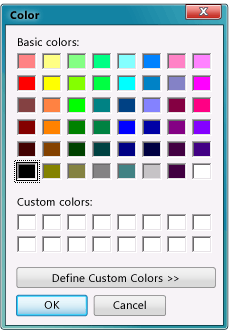

# Step 11: Run Your Program and Try Other Features
[!INCLUDE[vs2017banner](../includes/vs2017banner.md)]

The latest version of this topic can be found at [Step 11: Run Your Program and Try Other Features](https://docs.microsoft.com/visualstudio/ide/step-11-run-your-program-and-try-other-features).  
  
Your program is finished and ready to run. You can run your program and set the background color of the PictureBox. To learn more, try to improve the program by changing the color of the form, customizing the buttons and check box, and changing the properties of the form.  
  
 To download a completed version of the sample, see [Complete Picture Viewer tutorial sample](http://code.msdn.microsoft.com/Complete-Picture-Viewer-7d91d3a8).  
  
 For a video version of this topic, see [Tutorial 1: Create a Picture Viewer in Visual Basic - Video 5](http://go.microsoft.com/fwlink/?LinkId=205216) or [Tutorial 1: Create a Picture Viewer in C# - Video 5](http://go.microsoft.com/fwlink/?LinkId=205206). These videos use an earlier version of Visual Studio, so there are slight differences in some menu commands and other user interface elements. However, the concepts and procedures work similarly in the current version of Visual Studio.  
  
### To run your program and set the background color  
  
1.  Choose F5, or on the menu bar, choose **Debug**, **Start Debugging**.  
  
2.  Before you open a picture, choose the **Set the background color** button. The **Color** dialog box opens.  
  
       
Color dialog box  
  
3.  Choose a color to set the PictureBox background color. Look closely at the `backgroundButton_Click()` method to understand how it works.  
  
    > [!NOTE]
    >  You can load a picture from the Internet by pasting its URL into the **Open File** dialog box. Try to find an image with a transparent background, so your background color shows.  
  
4.  Choose the **Clear the picture** button to make sure it clears. Then, exit the program by choosing the **Close** button.  
  
### To try other features  
  
-   Change the color of the form and the buttons by using the **BackColor** property.  
  
-   Customize your buttons and check box using the **Font** and **ForeColor** properties.  
  
-   Change your form's **FormBorderStyle** and **ControlBox** properties.  
  
-   Use your form's **AcceptButton** and **CancelButton** properties so that buttons are automatically chosen when the user chooses the ENTER or ESC key. Make the program open the **Open File** dialog box when the user chooses ENTER and close the box when the user chooses ESC.  
  
### To continue or review  
  
-   To learn more about programming in Visual Studio, see [Programming Concepts](http://msdn.microsoft.com/library/65c12cca-af4f-4017-886e-2dbc00a189d6).  
  
-   To learn more about Visual Basic, see [Developing Applications with Visual Basic](http://msdn.microsoft.com/library/1e1c0c81-6d95-4167-a98b-44b1efb6d25f).  
  
-   To learn more about Visual C#, see [Introduction to the C# Language and the .NET Framework](http://msdn.microsoft.com/library/0a2dff4e-cd84-42ff-8141-e89889b24081).  
  
-   To go to the next tutorial, see [Tutorial 2: Create a Timed Math Quiz](../ide/tutorial-2-create-a-timed-math-quiz.md).  
  
-   To return to the previous tutorial step, see [Step 10: Write Code for Additional Buttons and a Check Box](../ide/step-10-write-code-for-additional-buttons-and-a-check-box.md).

