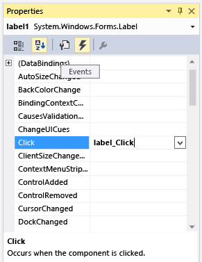

# Step 4: Add a Click Event Handler to Each Label
[!INCLUDE[vs2017banner](../includes/vs2017banner.md)]

The latest version of this topic can be found at [Step 4: Add a Click Event Handler to Each Label](https://docs.microsoft.com/visualstudio/ide/step-4-add-a-click-event-handler-to-each-label).  
  
The matching game works as follows:  
  
1.  When a player chooses one of the squares with a hidden icon, the program shows the icon to the player by changing the icon color to black.  
  
2.  Then the player chooses another hidden icon.  
  
3.  If the icons match, they stay visible. If not, both icons are hidden again.  
  
 To get your program to work that way, you add a Click event handler that changes the color of the label that is chosen.  
  
### To add a Click event handler to each label  
  
1.  Open the form in the Windows Forms Designer. In Solution Explorer, choose Form1.cs or Form1.vb. On the menu bar, choose **View**, **Designer**.  
  
2.  Choose the first label control to select it. Then, hold down the CTRL key while you choose each of the other labels to select them. Be sure that every label is selected.  
  
3.  Choose the **Events** button on the tool bar in the **Properties** window to view the **Events** page in the **Properties** window. Scroll down to the **Click** event, and enter **label_Click** in the box, as shown in the following picture.  
  
       
Properties window showing Click event  
  
4.  Choose the ENTER key. The IDE adds a Click event handler called `label_Click()` to the code, and hooks it to each of the labels on the form.  
  
5.  Fill in the rest of the code, as follows:  
  
     [!code-csharp[VbExpressTutorial4Step2_3_4#4](../snippets/csharp/VS_Snippets_VBCSharp/vbexpresstutorial4step2_3_4/cs/form1.cs#4)]
     [!code-vb[VbExpressTutorial4Step2_3_4#4](../snippets/visualbasic/VS_Snippets_VBCSharp/vbexpresstutorial4step2_3_4/vb/form1.vb#4)]  
  
    > [!NOTE]
    >  If you copy and paste the `label_Click()` code block rather than entering the code manually, be sure to replace the existing `label_Click()` code. Otherwise, you'll end up with a duplicate code block.  
  
    > [!NOTE]
    >  You may recognize `object sender` at the top of the event handler as the same one used in the [Tutorial 2: Create a Timed Math Quiz](../ide/tutorial-2-create-a-timed-math-quiz.md) tutorial. Because you hooked up different label control Click event to a single event handler method, the same method is called no matter which label the user chooses. The event handler method needs to know which label was chosen, so it uses the name **sender** to identify the label control. The first line of the method tells the program that it's not just a generic object, but specifically a label control, and that it uses the name **clickedLabel** to access the label's properties and methods.  
  
     This method first checks whether **clickedLabel** was successfully converted (cast) from an object to a label control. If unsuccessful, it has a value of `null` (C#) or `Nothing` (Visual Basic), and you don't want to execute the remainder of the code in the method. Next, the method checks the chosen label's text color by using the label's **ForeColor** property. If the label's text color is black, then that means the icon's already been chosen and the method is done. (That's what the `return` statement does: It tells the program to stop executing the method.) Otherwise, the icon hasn't been chosen, so the program changes the label's text color to black.  
  
6.  On the menu bar, choose **File**, **Save All** to save your progress, and then, on the menu bar, choose **Debug**, **Start Debugging** to run your program. You should see an empty form with a blue background. Choose any of the cells in the form, and one of the icons should become visible. Continue choosing different places in the form. As you choose the icons, they should appear.  
  
### To continue or review  
  
-   To go to the next tutorial step, see [Step 5: Add Label References](../ide/step-5-add-label-references.md).  
  
-   To return to the previous tutorial step, see [Step 3: Assign a Random Icon to Each Label](../ide/step-3-assign-a-random-icon-to-each-label.md).

