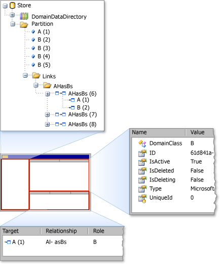

# Debugging by Using the Store Viewer
[!INCLUDE[vs2017banner](../includes/vs2017banner.md)]

With the Store Viewer, you can examine the state of a *store* used by [!INCLUDE[dsl](../includes/dsl-md.md)]. The Store Viewer displays all of the domain model elements that are in a specific store, along with element properties and links between elements.  
  
## Opening Store Viewer  
 When you are in the [!INCLUDE[vsprvs](../includes/vsprvs-md.md)] experimental build, stop your code at a breakpoint where an instance of the store contains model information. Then, open the Store Viewer by typing the following command in the **Immediate** window:  
  
```  
Microsoft.VisualStudio.Modeling.Diagnostics.StoreViewer.Show(mystore);  
```  
  
> [!NOTE]
>  You must replace `mystore` with the name of your store instance. Also, if you add the namespace to your code, you can type the command for displaying Store Viewer without the fully qualified namespace:  
>   
>  `using Microsoft.VisualStudio.Modeling.Diagnostics;`  
>   
>  `…`  
>   
>  `StoreViewer.Show(mystore);`  
  
 The `Show` method has several overloads. You can specify an instance of a store or a partition as the parameter.  
  
 As an alternative, you can put the line of code that displays the Store Viewer anywhere in your code where the parameter that you pass to the `Show` method is in scope. This action displays the Store Viewer when the line of code executes as a snapshot of the contents of the store.  
  
### Using Store Viewer  
 When the Store Viewer opens, a modeless Windows Forms window appears, as the following illustration shows.  
  
   
Store Viewer  
  
 The Store Viewer has three panes: the left pane, top-right pane, and bottom-right pane. The left pane is a tree view of the types in the `DomainDataDirectory` member of a store. If you expand the Partition node and click an element, the element's properties appear in the top-right pane. If the element is linked to other elements, the additional elements appear in the bottom-right pane. If you double-click an element in the bottom-right pane, the element is highlighted in the left pane.  
  
## See Also  
 [Navigating and Updating a Model in Program Code](../modeling/navigating-and-updating-a-model-in-program-code.md)


