# Scenario: Change your design using visualization and modeling
[!INCLUDE[vs2017banner](../includes/vs2017banner.md)]

The latest version of this topic can be found at [Scenario: Change your design using visualization and modeling](https://docs.microsoft.com/visualstudio/modeling/scenario-change-your-design-using-visualization-and-modeling).  
  
Make sure that your software system meets users' needs by using the visualization and modeling tools in Visual Studio. Use tools such as Unified Modeling Language (UML) diagrams, code maps, layer diagrams, and class diagrams to:  
  
 To see which versions of Visual Studio support each tool, see [Version support for architecture and modeling tools](../modeling/what-s-new-for-design-in-visual-studio.md#VersionSupport).  
  
-   Clarify users' requirements and business processes.  
  
-   Visualize and explore existing code.  
  
-   Describe changes to an existing system.  
  
-   Verify that the system meets its requirements.  
  
-   Keep code consistent with the design.  
  
 This walkthrough:  
  
-   Describes how these tools can benefit your software project.  
  
-   Shows how you might use these tools, regardless your development approach, with an example scenario.  
  
 To find out more about these tools and the scenarios that they support, see:  
  
-   [Analyzing and Modeling Architecture](../modeling/analyze-and-model-your-architecture.md)  
  
-   [Visualize code](../modeling/visualize-code.md)  
  
-   [Create models for your app](../modeling/create-models-for-your-app.md)  
  
##   Scenario Overview  
 This scenario describes episodes from the software development lifecycles of two fictitious companies: Dinner Now and Lucerne Publishing. Dinner Now provides a Web-based meal delivery service in Seattle. Customers can order meals and pay for them on the Dinner Now Web site. The orders are then sent to the appropriate local restaurant for delivery. Lucerne Publishing, a company in New York, runs several businesses both off and on the Web. For example, they run a Web site where customers can post restaurant reviews.  
  
 Lucerne recently acquired Dinner Now and wants to make the following changes:  
  
-   Integrate their Web sites by adding restaurant review capabilities to Dinner Now.  
  
-   Replace Dinner Now's payment system with Lucerne's system.  
  
-   Expand the Dinner Now service across the region.  
  
 Dinner Now uses SCRUM and eXtreme Programming. They have very high test coverage and very little unsupported code. They minimize risks by creating small but working versions of a system and then adding functionality incrementally. They develop their code over short and frequent iterations. This lets them embrace change confidently, refactor code frequently, and avoid "big design up front".  
  
 Lucerne maintains a vastly larger and complex collection of systems, some of which are more than 40 years old. They are very cautious about making changes because of the complexity and scope of legacy code. They follow a more rigorous development process, preferring to design detailed solutions and to document the design and changes that occur during development.  
  
 Both teams use modeling diagrams in Visual Studio to help them develop systems that meet the users' needs. They use Team Foundation Server alongside other tools to help them plan, organize, and manage their work.  
  
 For more information about Team Foundation Server, see:  
  
-   [Planning and tracking work](#PlanningTracking)  
  
-   [Testing, validating, and checking in updated code](#TestValidateCheckInCode)  
  
##   Roles of Architecture and Modeling Diagrams in Software Development  
 The following table describes roles that these tools can play during multiple and various stages of the software development lifecycle:  
  
||**User Requirements Modeling**|**Business Process Modeling**|**System Architecture & Design**|**Code Visualization & Exploration**|**Verification**|  
|------|------------------------------------|-----------------------------------|--------------------------------------|------------------------------------------|----------------------|  
|Use case diagram (UML)|√|√|||√|  
|Activity diagram (UML)|√|√|√||√|  
|Class diagram (UML)|√|√|√||√|  
|Component diagram (UML)|√|√|√||√|  
|Sequence diagram (UML)|√|√|√||√|  
|Domain-Specific Language (DSL) diagram|√|√|√|||  
|Layer diagram, layer validation|||√|√|√|  
|Code map|||√|√|√|  
|Class Designer (code-based)||||√||  
  
 To draw UML diagrams and layer diagrams, you must create a modeling project as part of an existing solution or a new one. These diagrams must be created in the modeling project. Items on UML diagrams are part of a common model, and the UML diagrams are views of that model. Items on layer diagrams are located in the modeling project, but they are not stored in the common model. Code maps and .NET class diagrams created from code exist outside the modeling project.  
  
 See:  
  
-   [Create UML modeling projects and diagrams](../modeling/create-uml-modeling-projects-and-diagrams.md)  
  
-   [Create layer diagrams from your code](../modeling/create-layer-diagrams-from-your-code.md)  
  
-   [Map dependencies across your solutions](../modeling/map-dependencies-across-your-solutions.md)  
  
-   [How to: Add Class Diagrams to Projects (Class Designer)](../ide/how-to-add-class-diagrams-to-projects-class-designer.md)  
  
-   [Modeling SDK for Visual Studio - Domain-Specific Languages](../modeling/modeling-sdk-for-visual-studio-domain-specific-languages.md)  
  
 To show alternate views of the architecture, you can reuse certain elements from the same model on multiple or different diagrams. For example, you can drag a component to another component diagram or to a sequence diagram so that it can function as an actor. See [Edit UML models and diagrams](../modeling/edit-uml-models-and-diagrams.md).  
  
 Both teams also use layer validation to make sure that code under development remains consistent with the design.  
  
 See:  
  
-   [Keeping Code Consistent with the Design](#ValidatingCode)  
  
-   [Describe the Logical Architecture: Layer Diagrams](#DescribeLayers)  
  
-   [Validate code with layer diagrams](../modeling/validate-code-with-layer-diagrams.md)  
  
    > [!NOTE]
    >  Some versions of Visual Studio support layer validation and read-only versions of code maps and UML diagrams for visualization and modeling. To see which versions of Visual Studio support this feature, see [Version support for architecture and modeling tools](../modeling/what-s-new-for-design-in-visual-studio.md#VersionSupport).  
  
##   Understanding and Communicating Information about the System  
 There is no prescribed order for using the Visual Studio modeling diagrams, so you can use them as they fit with your needs or approach. Usually, teams revisit their models iteratively and frequently throughout a project. Each diagram offers particular strengths to help you understand, describe, and communicate different aspects of the system under development.  
  
 Dinner Now and Lucerne communicate with each another and with project stakeholders by using diagrams as their common language. For example, Dinner Now uses diagrams to perform these tasks:  
  
-   Visualize existing code.  
  
-   Communicate with Lucerne about new or updated user stories.  
  
-   Identify changes that are required to support new or updated user stories.  
  
 Lucerne uses diagrams to perform these tasks:  
  
-   Learn about the Dinner Now business process.  
  
-   Understand the design of the system.  
  
-   Communicate with Dinner Now about new or updated user requirements.  
  
-   Document updates to the system.  
  
 The diagrams are integrated with Team Foundation Server so the teams can plan, manage, and track their work more easily. For example, they use models to identify test cases and development tasks and to estimate their work. Lucerne links Team Foundation Server work items to model elements so that they can monitor progress and make sure that the system meets the users' requirements. For example, they link use cases to test case work items so they can see that use cases are fulfilled when all the tests pass.  
  
 Before teams check in their changes, they validate the code against the tests and the design by running builds that include layer validation and automated tests. This helps make sure that the updated code does not conflict with the design and break previously working functionality.  
  
 See:  
  
-   [Understanding the role of the system in the business process](#UnderstandingBPMandSystemDesign)  
  
-   [Describing new or updated user requirements](#DescribingURM)  
  
-   [Creating tests from models](#CreatingTests)  
  
-   [Identifying changes to the existing system](#DeterminingChanges)  
  
-   [Keeping code consistent with the design](#ValidatingCode)  
  
-   [General tips for creating and using models](#GeneralTips)  
  
-   [Planning and tracking work](#PlanningTracking)  
  
-   [Testing, validating, and checking in updated code](#TestValidateCheckInCode)  
  
###   Understanding the Role of the System in the Business Process  
 Lucerne wants to learn more about the Dinner Now business process. They create the following diagrams to clarify their understanding with Dinner Now more easily:  
  
|**Diagram**|**Describes**|  
|-----------------|-------------------|  
|*Use case diagram (UML)*   See:   -   [UML Use Case Diagrams: Reference](../modeling/uml-use-case-diagrams-reference.md) -   [UML Use Case Diagrams: Guidelines](../modeling/uml-use-case-diagrams-guidelines.md)|-   The activities that the Dinner Now system supports -   The people and external systems that perform the activities -   The major components of the system that support each activity -   The parts of the business process that are outside the scope of the current system, for example, food delivery|  
|*Activity diagram (UML)*   See:   -   [UML Activity Diagrams: Reference](../modeling/uml-activity-diagrams-reference.md) -   [UML Activity Diagrams: Guidelines](../modeling/uml-activity-diagrams-guidelines.md)|The flow of steps that occur when a customer creates an order|  
|*Class diagram (UML)*   See:   -   [UML Class Diagrams: Reference](../modeling/uml-class-diagrams-reference.md) -   [UML Class Diagrams: Guidelines](../modeling/uml-class-diagrams-guidelines.md)|The business entities and terms that used in discussion and the relationships between those entities. For example, Order and Menu Item are part of the vocabulary in this scenario.|  
  
 For example, Lucerne creates the following use case diagram to understand the tasks that are performed on the Dinner Now Web site and who performs them:  
  
 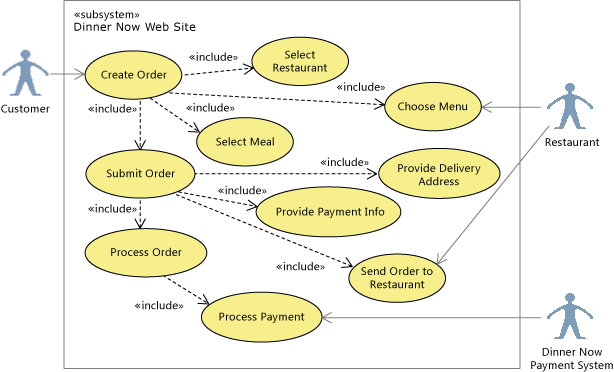  
  
 **UML Use Case Diagram**  
  
 The following activity diagram describes the flow of steps when a customer creates an order on the Dinner Now Web site. In this release, comment elements identify the roles, and lines create *swimlanes*, which organize the steps by role:  
  
   
  
 **UML Activity Diagram**  
  
 The following class diagram describes the entities that participate in the order process:  
  
 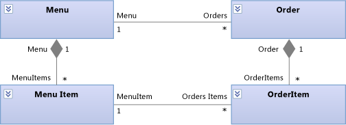  
  
 **UML Class Diagram**  
  
###   Describing New or Updated User Requirements  
 Lucerne wants to add functionality to the Dinner Now system so that customers can read and contribute restaurant reviews. They update the following diagrams so that they can describe and discuss this new requirement with Dinner Now:  
  
|**Diagram**|**Describes**|  
|-----------------|-------------------|  
|*Use case diagram (UML)*   See:   -   [UML Use Case Diagrams: Reference](../modeling/uml-use-case-diagrams-reference.md) -   [UML Use Case Diagrams: Guidelines](../modeling/uml-use-case-diagrams-guidelines.md)|A new use case for "Write a restaurant review"|  
|*Activity diagram (UML)*   See:   -   [UML Activity Diagrams: Reference](../modeling/uml-activity-diagrams-reference.md) -   [UML Activity Diagrams: Guidelines](../modeling/uml-activity-diagrams-guidelines.md)|The steps that occur when a customer wants to write a restaurant review|  
|*Class diagram (UML)*   See:   -   [UML Class Diagrams: Reference](../modeling/uml-class-diagrams-reference.md) -   [UML Class Diagrams: Guidelines](../modeling/uml-class-diagrams-guidelines.md)|The data that is required to store a review|  
  
 For example, the following use case diagram includes a new "Write Review" use case to represent the new requirement. It is highlighted in orange on the diagram for easier identification:  
  
 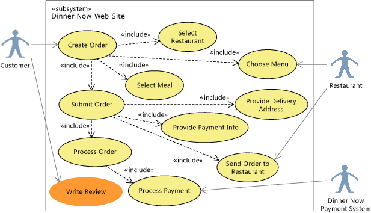  
  
 **UML use case diagram**  
  
 The following activity diagram includes new elements in orange to describe the flow of steps in the new use case:  
  
 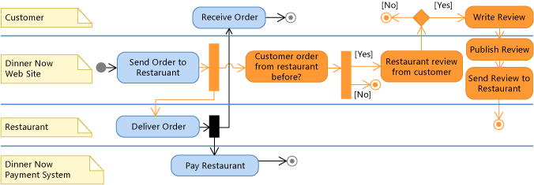  
  
 **UML activity diagram**  
  
 The following class diagram includes a new Review class and its relationships to other classes so that the teams can discuss its details. Notice that a Customer and a Restaurant can have multiple Reviews:  
  
 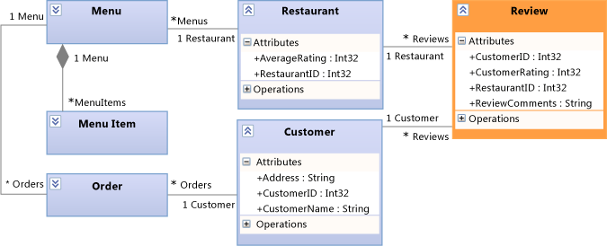  
  
 **UML class diagram**  
  
###   Creating Tests from Models  
 Both teams agree that they need a complete set of tests for the system and its components before they make any changes. Lucerne has a specialized team that performs system and component-level testing. They reuse the tests created by Dinner Now and structure those tests using the UML diagrams:  
  
-   Each use case is represented by one or multiple tests. The elements on the use case diagram link to Test Case work items in Team Foundation Server.  
  
-   Each flow on an activity diagram or system-level sequence diagram is linked to one test at the very least. The test team systematically makes sure that they test every possible path through the activity diagram.  
  
-   The terms used to describe the tests are based on the terms defined by use case, class, and activity diagrams.  
  
 As requirements change and the diagrams are updated to reflect those changes, the tests are also updated. A requirement is considered fulfilled only when the tests pass. When it is possible or practical, the tests are defined and based on UML diagrams before implementation starts.  
  
 See:  
  
-   [Develop tests from a model](../modeling/develop-tests-from-a-model.md)  
  
-   [Validate your UML model](../modeling/validate-your-uml-model.md)  
  
###   Identifying Changes to the Existing System  
 Dinner Now must estimate the cost of meeting the new requirement. This depends partly on how much this change will affect other parts of the system. To help them understand this, one of the Dinner Now developers creates these maps and diagrams from existing code:  
  
|**Map or diagram**|**Shows**|  
|------------------------|---------------|  
|*Code map*   See:   -   [Map dependencies across your solutions](../modeling/map-dependencies-across-your-solutions.md) -   [Browse and rearrange code maps](../modeling/browse-and-rearrange-code-maps.md) -   [Customize code maps by editing the DGML files](../modeling/customize-code-maps-by-editing-the-dgml-files.md)|Dependencies and other relationships in code.   For example, Dinner Now might start by reviewing assembly code maps for an overview of the assemblies and their dependencies. They can drill into the maps to explore the namespaces and classes in those assemblies.   Dinner Now can also create maps to explore particular areas and other kinds of relationships in the code. They use Solution Explorer to find and select the areas and relationships that interest them.|  
|*Code-based class diagram*   See [How to: Add Class Diagrams to Projects (Class Designer)](../ide/how-to-add-class-diagrams-to-projects-class-designer.md).|Existing classes in code|  
  
 For example, the developer creates a code map. She adjusts its scope to focus on the areas that will be affected by the new scenario. These areas are selected and highlighted on the map:  
  
 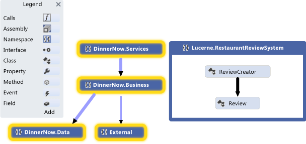  
  
 **Namespace code map**  
  
 The developer expands the selected namespaces to see their classes, methods, and relationships:  
  
 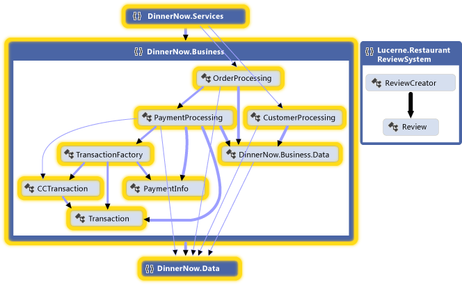  
  
 **Expanded namespace code map with visible cross-group links**  
  
 The developer examines the code to find the affected classes and methods. To see the effects of each change as you make them, regenerate code maps after each change. See [Visualize code](../modeling/visualize-code.md).  
  
 To describe changes to other parts of the system, such as components or interactions, the team might draw these elements on whiteboards. They might also draw the following diagrams in Visual Studio so that the details can be captured, managed, and understood by both teams:  
  
|**Diagrams**|**Describes**|  
|------------------|-------------------|  
|*Activity diagram (UML)*   See:   -   [UML Activity Diagrams: Reference](../modeling/uml-activity-diagrams-reference.md) -   [UML Activity Diagrams: Guidelines](../modeling/uml-activity-diagrams-guidelines.md)|The flow of steps that occur when the system notices that a customer places an order from a restaurant again, prompting the customer to write a review.|  
|*Class diagram (UML)*   See:   -   [UML Class Diagrams: Reference](../modeling/uml-class-diagrams-reference.md) -   [UML Class Diagrams: Guidelines](../modeling/uml-class-diagrams-guidelines.md)|Logical classes and their relationships. For example, a new class is added to describe a **Review** and its relationships with other entities, such as **Restaurant**, **Menu**, and **Customer**.   To associate reviews with a customer, the system must store customer details. A UML class diagram can help clarify those details.|  
|*Code-based class diagram*   See [How to: Add Class Diagrams to Projects (Class Designer)](../ide/how-to-add-class-diagrams-to-projects-class-designer.md).|Existing classes in code.|  
|*Component diagram (UML)*   See:   -   [UML Component Diagrams: Reference](../modeling/uml-component-diagrams-reference.md) -   [UML Component Diagrams: Guidelines](../modeling/uml-component-diagrams-guidelines.md)|The high-level parts of the system, such as the Dinner Now Web site, and their interfaces. These interfaces define how components interact with each another through the methods or services that they provide and consume.|  
|*Sequence diagram (UML)*   See:   -   [UML Sequence Diagrams: Reference](../modeling/uml-sequence-diagrams-reference.md) -   [UML Sequence Diagrams: Guidelines](../modeling/uml-sequence-diagrams-guidelines.md)|The sequence of interactions between instances.|  
  
 For example, the following component diagram shows the new component, which is a part of the Dinner Now Web Site component. The ReviewProcessing component handles the functionality of creating reviews and appears highlighted in orange:  
  
 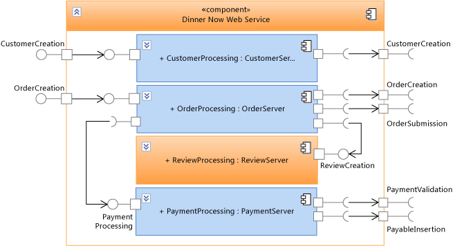  
  
 **UML component diagram**  
  
 The following sequence diagram shows the sequence of interactions that occur when the Dinner Now Web Site checks whether the customer has ordered from a restaurant before. If this is true, then it asks the customer to create a review, which is sent to the restaurant and published by the Web site:  
  
 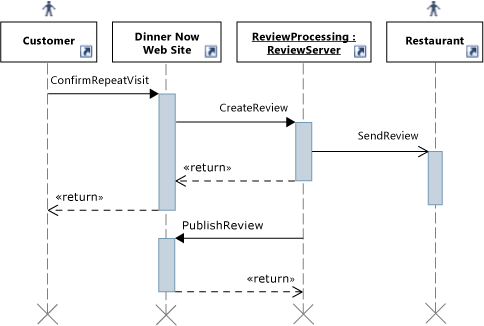  
  
 **UML sequence diagram**  
  
###   Keeping Code Consistent with the Design  
 Dinner Now must make sure that the updated code stays consistent with the design. They create layer diagrams that describe the layers of functionality in the system, specify the permitted dependencies between them, and associate solution artifacts to those layers.  
  
|**Diagram**|**Describes**|  
|-----------------|-------------------|  
|*Layer diagram*   See:   -   [Create layer diagrams from your code](../modeling/create-layer-diagrams-from-your-code.md) -   [Layer Diagrams: Reference](../modeling/layer-diagrams-reference.md) -   [Layer Diagrams: Guidelines](../modeling/layer-diagrams-guidelines.md) -   [Validate code with layer diagrams](../modeling/validate-code-with-layer-diagrams.md)|The logical architecture of the code.   A layer diagram organizes and maps the artifacts in a [!INCLUDE[vsprvs](../includes/vsprvs-md.md)] solution to abstract groups called *layers*. These layers identify the roles, tasks, or functions that these artifacts perform in the system.   Layer diagrams are useful for describing the intended design of the system and validating evolving code against that design.   To create layers, drag items from Solution Explorer, code maps, Class View, and Object Browser. To draw new layers, use the toolbox or right-click the diagram surface.   To view existing dependencies, right-click the layer diagram surface, and then click **Generate Dependencies**. To specify intended dependencies, draw new dependencies.|  
  
 For example, the following layer diagram describes dependencies between layers and the number of artifacts that are associated with each layer:  
  
   
  
 **Layer Diagram**  
  
 To make sure that conflicts with the design do not occur during code development, the teams uses layer validation on builds that are run on Team Foundation Build. They also create a custom MSBuild task to require layer validation in their check-in operations. They use build reports to collect validation errors.  
  
 See:  
  
-   [Define your build process](../Topic/Define%20your%20build%20process.md)  
  
-   [Use a gated check-in build process to validate changes](../Topic/Use%20a%20gated%20check-in%20build%20process%20to%20validate%20changes.md)  
  
-   [Customize your build process template](../Topic/Customize%20your%20build%20process%20template.md)  
  
###   General Tips for Creating and Using Models  
  
-   Most diagrams consist of nodes that are connected by lines. For each diagram type, the toolbox provides different kinds of nodes and lines.  
  
     To open the toolbox, on the **View** menu, click **Toolbox**.  
  
-   To create a node, drag it from the toolbox to the diagram. Certain kinds of nodes must be dragged onto existing nodes. For example, on a component diagram, a new port must be added to an existing component.  
  
-   To create a line or a connection, click the appropriate tool in the toolbox, click the source node, and then click the target node. Some lines can be created only between certain kinds of nodes. When you move the pointer over a possible source or target, the pointer indicates whether you can create a connection.  
  
-   When you create items on UML diagrams, you are also adding them to a common model. The UML diagrams in a modeling project are views of that model. Items on a layer diagram are part of the modeling project, even though they are not stored in the common model.  
  
     To see the model, on the **Architecture** menu, point to  **Windows**, and then click **UML Model Explorer**.  
  
-   In some cases, you can drag certain items from **UML Model Explorer** to a UML diagram. Some elements within the same model can be used on multiple or different diagrams to show alternate views of the architecture. For example, you can drag a component to another component diagram or to a sequence diagram to use as an actor.  
  
-   Visual Studio supports UML 2.1.2. This overview describes only the major features of the UML diagrams in this release, but there are many books that discuss UML and its use in detail.  
  
 See [Create models for your app](../modeling/create-models-for-your-app.md).  
  
###   Planning and Tracking Work  
 Visual Studio modeling diagrams are integrated with Team Foundation Server so that you can plan, manage, and track work more easily. Both teams use models to identify test cases and development tasks and to estimate their work. Lucerne creates and links Team Foundation Server work items to model elements, such as use cases or components. This helps them monitor their progress and trace their work back to the users' requirements. This helps them make sure that their changes continue to meet those requirements.  
  
 As their work progresses, the teams update their work items to reflect the time that they spent on their tasks. They also monitor and report status on their work by using the following Team Foundation Server features:  
  
-   Daily *burndown reports* that show whether they will complete the planned work in the expected time. They generate other similar reports from Team Foundation Server to track the progress of bugs.  
  
-   An *iteration worksheet* that uses Microsoft Excel to help the team monitor and balance the workload between its members. This worksheet is linked to Team Foundation Server and provides focus for discussion during their regular progress meetings.  
  
-   A *development dashboard* that uses Office Project to keep the team informed about important project information.  
  
 See:  
  
-   [Track work using Visual Studio Team Services or Team Foundation Server](../Topic/Track%20work%20using%20VSTS%20or%20TFS.md)  
  
-   [Link model elements and work items](../modeling/link-model-elements-and-work-items.md)  
  
-   [Charts, dashboards, and reports for Visual Studio ALM](../Topic/Charts,%20dashboards,%20and%20reports%20for%20Visual%20Studio%20ALM.md)  
  
-   [Create your backlog and tasks using Project](../Topic/Create%20your%20backlog%20and%20tasks%20using%20Project.md)  
  
###   Testing, Validating, and Checking In Code  
 As the teams complete each task, they check their code into Team Foundation version control and receive reminders from Team Foundation Server, if they forget. Before Team Foundation Server accepts their check-ins, the teams run unit tests and layer validation to verify the code against their test cases and the design. They use Team Foundation Server to run builds, automated unit tests, and layer validation regularly. This helps make sure that the code meets the following criteria:  
  
-   It works.  
  
-   It does not break previously working code.  
  
-   It does not conflict with the design.  
  
 Dinner Now has a large collection of automated tests, which Lucerne can reuse because almost all still apply. Lucerne can also build on these tests and add new ones to cover new functionality. Both also use Visual Studio to run manual tests.  
  
 To make sure that the code conforms to the design, the teams configure their builds in Team Foundation Build to include layer validation. If any conflicts occur, a report is generated with the details.  
  
 See:  
  
-   [Testing the application](../Topic/Test%20apps%20early%20and%20often.md)  
  
-   [Validate your system during development](../modeling/validate-your-system-during-development.md)  
  
-   [Use version control](http://go.microsoft.com/fwlink/?LinkID=525605)  
  
-   [Build the application](../Topic/Build%20the%20application.md)  
  
##   Updating the System Using Visualization and Modeling  
 Lucerne and Dinner Now must integrate their payment systems. The following sections show the modeling diagrams in Visual Studio help them perform this task:  
  
-   [Understand the User Requirements: Use Case Diagrams](#UnderstandUseCases)  
  
-   [Understand the Business Process: Activity Diagrams](#UnderstandActivities)  
  
-   [Describe the System Structure: Component Diagrams](#DescribeComponents)  
  
-   [Describe the Interactions: Sequence Diagrams](#DescribeSequence)  
  
-   [Visualize Existing Code: Code Maps](#VisualizeCode)  
  
-   [Define a Glossary of Types: Class Diagrams](#DefineClasses)  
  
-   [Describe the Logical Architecture: Layer Diagrams](#DescribeLayers)  
  
 See:  
  
-   [Create models for your app](../modeling/create-models-for-your-app.md)  
  
-   [Visualize code](../modeling/visualize-code.md)  
  
-   [Use models in your development process](../modeling/use-models-in-your-development-process.md)  
  
-   [Model user requirements](../modeling/model-user-requirements.md)  
  
-   [Model your app's architecture](../modeling/model-your-app-s-architecture.md)  
  
###   Understand the User Requirements: Use Case Diagrams  
 Use case diagrams summarize the activities that a system supports and who performs those activities. Lucerne uses a use case diagram to learn the following about the Dinner Now system:  
  
-   Customers create orders.  
  
-   Restaurants receive orders.  
  
-   The External Payment Processor Gateway, which the Dinner Now Payment System uses to validate payments, is out of scope for the Web site.  
  
 The diagram also shows how some of the major use cases divide into smaller use cases. Lucerne wants to use its own payment system. They highlight the Process Payment use case in a different color to indicate that it requires changes:  
  
 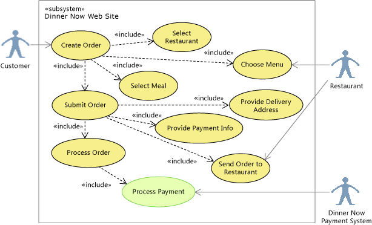  
  
 **Highlighting Process Payment on the use case diagram**  
  
 If development time was short, the team might discuss whether they want to let customers pay restaurants directly. To show this, they would replace the Process Payment use case with one that is outside the Dinner Now system boundary. They would then link the Customer directly to the Restaurant, indicating that Dinner Now would only process orders:  
  
 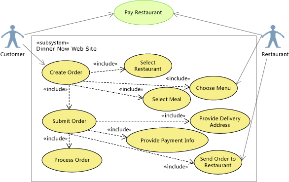  
  
 **Rescoping Pay Restaurant on the use case diagram**  
  
 See:  
  
-   [UML Use Case Diagrams: Reference](../modeling/uml-use-case-diagrams-reference.md)  
  
-   [UML Use Case Diagrams: Guidelines](../modeling/uml-use-case-diagrams-guidelines.md)  
  
#### Drawing a Use Case Diagram  
 A use case diagram has the following major features:  
  
-   *Actors* represent roles played by persons, organizations, machines, or software systems. For example, Customer, Restaurant, and the Dinner Now Payment System are actors.  
  
-   *Use cases* represent interactions between actors and the system under development.  They can represent any scale of interaction from a single mouse-click or message to a transaction extended over many days.  
  
-   *Associations* link actors to use cases.  
  
-   A larger use case can *include* smaller ones, for example, Create Order includes Select Restaurant. You can *extend* a use case, which adds goals and steps to the extended use case, to indicate that the use case occurs only under certain conditions. Use cases can also inherit from each another.  
  
-   A *subsystem* represents the software system that is under development or one of its components. It is a large box that contains use cases. A use case diagram clarifies what is inside or outside the subsystem boundary. To indicate that the user must accomplish certain goals in other ways, draw those use cases outside the subsystem boundary.  
  
-   *Artifacts* link elements on the diagram to other diagrams or documents.  
  
 See:  
  
-   [UML Use Case Diagrams: Reference](../modeling/uml-use-case-diagrams-reference.md)  
  
-   [UML Use Case Diagrams: Guidelines](../modeling/uml-use-case-diagrams-guidelines.md)  
  
#### Summary: Strengths of Use Case Diagrams  
 Use case diagrams help you visualize:  
  
-   The activities that a system supports or does not support  
  
-   The people and external systems that perform those activities  
  
-   The major components of the system that support each activity, which you can represent as subsystems nested inside the parent system  
  
-   How a use case might divide into smaller ones or variations  
  
#### Relationship to Other Diagrams  
  
|**Diagram**|**Describes**|  
|-----------------|-------------------|  
|Activity diagram|The flow of steps in a use case and those who perform those steps in that use case.   The names of use cases frequently mirror the steps in an activity diagram. Activity diagrams support elements such as decisions, merges, inputs and outputs, concurrent flows, and so on.   See:   -   [UML Activity Diagrams: Reference](../modeling/uml-activity-diagrams-reference.md) -   [UML Activity Diagrams: Guidelines](../modeling/uml-activity-diagrams-guidelines.md)|  
|Sequence diagram|The sequence of interactions between the participants in a use case.   See:   -   [UML Sequence Diagrams: Reference](../modeling/uml-sequence-diagrams-reference.md) -   [UML Sequence Diagrams: Guidelines](../modeling/uml-sequence-diagrams-guidelines.md)|  
|Class diagram (UML)|The entities or types that participate in the use case.   See:   -   [UML Class Diagrams: Reference](../modeling/uml-class-diagrams-reference.md) -   [UML Class Diagrams: Guidelines](../modeling/uml-class-diagrams-guidelines.md)|  
  
###   Understand the Business Process: Activity Diagrams  
 Activity diagrams describe the flow of steps in a business process and provide a simple way to communicate workflow. A development project can have multiple activity diagrams. Usually, an activity encompasses all actions that result from one external action, such as ordering a meal, updating a menu, or adding a new restaurant to the business. An activity might also describe the details of a complex action.  
  
 Lucerne updates the following activity diagram to show that Lucerne processes the payment and pays the restaurant. They replace the Dinner Now Payment System with the Lucerne Payment System as highlighted:  
  
 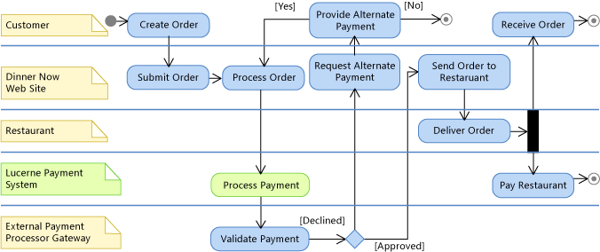  
  
 **Replacing the Dinner Now Payment System on the activity diagram**  
  
 The updated diagram helps Lucerne and Dinner Now visualize where the Lucerne Payment System fits into the business process. In this release, comments are used to identify the roles that perform the steps. Lines are used to create *swimlanes*, which organize the steps by role.  
  
 The teams might also consider discussing an alternative story where the customer pays the restaurant instead after the order is delivered. This would create different requirements for the software system.  
  
 Previously, Dinner Now drew these diagrams on a whiteboard or in PowerPoint. They now also use Visual Studio to draw these diagrams so that both teams can capture, understand, and manage the details.  
  
 See:  
  
-   [UML Activity Diagrams: Reference](../modeling/uml-activity-diagrams-reference.md)  
  
-   [UML Activity Diagrams: Guidelines](../modeling/uml-activity-diagrams-guidelines.md)  
  
#### Drawing an Activity Diagram  
 An activity diagram has the following major features:  
  
-   An *initial node* that indicates the first action of the activity.  
  
     The diagram should always have one of these nodes.  
  
-   *Actions* that describe steps where the user or software performs a task.  
  
-   *Control flows* that show the flow between actions.  
  
-   *Decision nodes* that represent conditional branches in the flow.  
  
-   *Fork nodes* that divide single flows into concurrent flows.  
  
-   *Activity final nodes* that shows ends of the activity.  
  
     Although these nodes are optional, it is useful to include them on the diagram to show where the activity ends.  
  
 See:  
  
-   [UML Activity Diagrams: Reference](../modeling/uml-activity-diagrams-reference.md)  
  
-   [UML Activity Diagrams: Guidelines](../modeling/uml-activity-diagrams-guidelines.md)  
  
#### Summary: Strengths of Activity Diagrams  
 Activity diagrams help you visualize and describe the flow of control and information between the actions of a business, system, or program. This is a simple and useful way to describe workflow when communicating with other people.  
  
#### Relationship to Other Diagrams  
  
|**Diagram**|**Description**|  
|-----------------|---------------------|  
|Use case diagram|Summarize the activities that each actor performs.   See:   -   [UML Use Case Diagrams: Reference](../modeling/uml-use-case-diagrams-reference.md) -   [UML Use Case Diagrams: Guidelines](../modeling/uml-use-case-diagrams-guidelines.md)|  
|Component diagram|Visualize the system as a collection of reusable parts that provide or consume behavior through a well-defined set of interfaces.   See:   -   [UML Component Diagrams: Reference](../modeling/uml-component-diagrams-reference.md) -   [UML Component Diagrams: Guidelines](../modeling/uml-component-diagrams-guidelines.md)|  
  
###   Describe the System Structure: Component Diagrams  
 Component diagrams describe a system as a collection of separable parts that provide or consume behavior through a well-defined set of interfaces. The parts can be on any scale and can connect in any manner.  
  
 To help Lucerne and Dinner Now visualize and discuss the system's components and their interfaces, they create the following component diagrams:  
  
 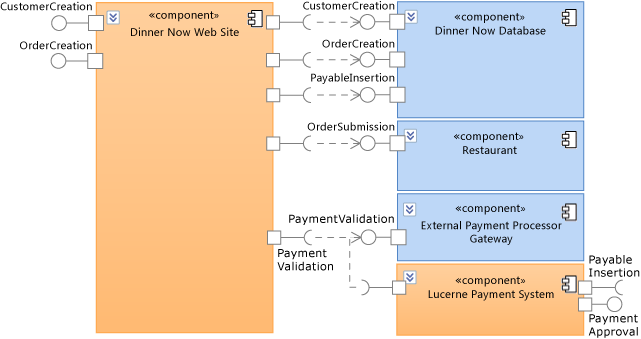  
  
 **Components of the Dinner Now payment system**  
  
 This diagram shows different component types and their *dependencies*. For example, both the Dinner Now Web Site and the Lucerne Payment System require the External Payment Processor Gateway to validate payments. The arrows between components represent the dependencies that indicate which components require the functionality of other components.  
  
 To use the Lucerne Payment System, the Dinner Now Web Site must be updated to use the PaymentApproval and PayableInsertion interfaces on the Lucerne Payment System.  
  
 The following diagram shows a specific configuration of components for the Dinner Now Web Site. This configuration indicates that any instance of the Web site consists of four *parts*:  
  
-   CustomerProcessing  
  
-   OrderProcessing  
  
-   ReviewProcessing  
  
-   PaymentProcessing  
  
 These parts are instances of the specified component types and are connected as follows:  
  
 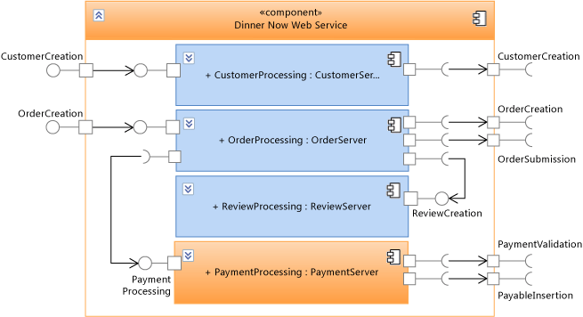  
  
 **Components inside the Dinner Now Web Site**  
  
 The Dinner Now Web Site delegates its behavior to these parts, which handle the functions of the Web site. The arrows between the parent component and its member components show *delegations* that indicate which parts handle the messages that the parent receives or sends through its interfaces.  
  
 In this configuration, the PaymentProcessing component processes customer payments. Therefore, it must be updated to integrate with Lucerne's payment system. In other scenarios, multiple instances of a component type might exist in the same parent component.  
  
 See:  
  
-   [UML Component Diagrams: Reference](../modeling/uml-component-diagrams-reference.md)  
  
-   [UML Component Diagrams: Guidelines](../modeling/uml-component-diagrams-guidelines.md)  
  
#### Drawing a Component Diagram  
 A component diagram has the following major features:  
  
-   *Components* that represent separable pieces of system functionality.  
  
-   *Provided interface ports* that represent groups of messages or calls which components implement and are used by other components or external systems.  
  
-   *Required interface ports* that represent groups of messages or calls which components send to other components or external systems. This kind of port describes the operations that a component at least expects from other components or external systems.  
  
-   *Parts* are members of components and are typically instances of other components. A part is a piece of the internal design of the parent component.  
  
-   *Dependencies* that indicate components require the functionality of other components.  
  
-   *Delegations* that indicate parts of a component handle the messages sent from or received by the parent component.  
  
 See:  
  
-   [UML Component Diagrams: Reference](../modeling/uml-component-diagrams-reference.md)  
  
-   [UML Component Diagrams: Guidelines](../modeling/uml-component-diagrams-guidelines.md)  
  
#### Summary: Strengths of Component Diagrams  
 Component diagrams help you visualize:  
  
-   The system as a collection of separable parts regardless of their implementation language or style.  
  
-   Components with well-defined interfaces, making the design easier to understand and update when the requirements change.  
  
#### Relationship to Other Diagrams  
  
|**Diagram**|**Description**|  
|-----------------|---------------------|  
|Code map|Visualize the organization and relationships in existing code.   To identify candidates for components, create a code map and group items by their function in the system.   See:   -   [Map dependencies across your solutions](../modeling/map-dependencies-across-your-solutions.md)|  
|Sequence diagram|Visualize the sequence of interactions between components or the parts inside a component.   To create a lifeline on a sequence diagram from a component, right-click the component, and then click **Create Lifeline**.   See:   -   [UML Sequence Diagrams: Reference](../modeling/uml-sequence-diagrams-reference.md) -   [UML Sequence Diagrams: Guidelines](../modeling/uml-sequence-diagrams-guidelines.md)|  
|Class diagram (UML)|Define the interfaces on the provided or required ports and the classes that implement the functionality of the components.   See:   -   [UML Class Diagrams: Reference](../modeling/uml-class-diagrams-reference.md) -   [UML Class Diagrams: Guidelines](../modeling/uml-class-diagrams-guidelines.md)|  
|Layer diagram|Describe the logical architecture of the system as it relates to components. Use layer validation to make sure that the code stays consistent with the design.   See:   -   [Create layer diagrams from your code](../modeling/create-layer-diagrams-from-your-code.md) -   [Layer Diagrams: Reference](../modeling/layer-diagrams-reference.md) -   [Layer Diagrams: Guidelines](../modeling/layer-diagrams-guidelines.md) -   [Validate code with layer diagrams](../modeling/validate-code-with-layer-diagrams.md)|  
|Activity diagram|Visualize the internal processing that components perform in response to incoming messages.   See:   -   [UML Activity Diagrams: Reference](../modeling/uml-activity-diagrams-reference.md) -   [UML Activity Diagrams: Guidelines](../modeling/uml-activity-diagrams-guidelines.md)|  
  
###   Visualize Existing Code: Code Maps  
 Code maps show the current organization and relationships in the code. Items are represented by *nodes* on the map, and relationships are represented by *links*. Code maps can help you perform the following kinds of tasks:  
  
-   Explore unfamiliar code.  
  
-   Understand where and how a proposed change might affect existing code.  
  
-   Find areas of complexity, natural layers or patterns, or other areas that might benefit from improvement.  
  
 For example, Dinner Now must estimate the cost of updating the PaymentProcessing component. This depends partly on how much this change will affect other parts of the system. To help them understand this, one of the Dinner Now developers generates code maps from the code and adjusts the scope focus on the areas that might be affected by the change.  
  
 The following map shows the dependencies between the PaymentProcessing class and other parts of the Dinner Now system, which appear selected:  
  
 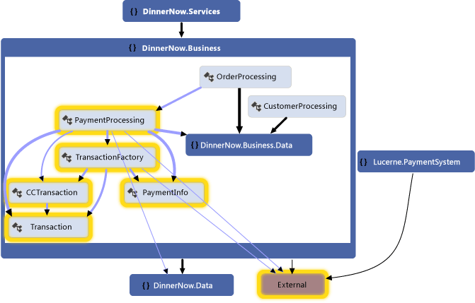  
  
 **Code map for Dinner Now payment system**  
  
 The developer explores the map by expanding the PaymentProcessing class and selecting its members to see the areas that are potentially affected:  
  
 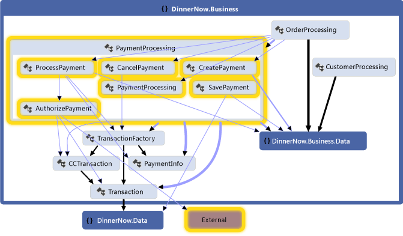  
  
 **Methods inside PaymentProcessing class and their dependencies**  
  
 They generate the following map for the Lucerne Payment System to inspect its classes, methods, and dependencies. The team sees that the Lucerne system might also require work to interact with the other parts of Dinner Now:  
  
 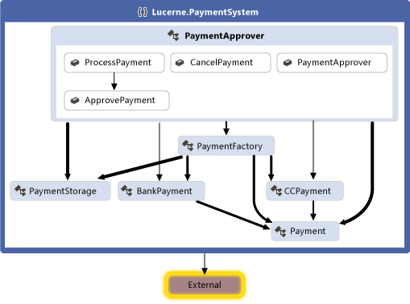  
  
 **Code map for Lucerne Payment System**  
  
 Both teams work together to determine the changes that are required to integrate the two systems. They decide to refactor some of the code so that it will be easier to update. The PaymentApprover class will move to the DinnerNow.Business namespace and will require some new methods. The Dinner Now classes that handle transactions will have their own namespace. The teams create and use work items to plan, organize, and track their work. They link the work items to model elements where it is useful.  
  
 After reorganizing the code, the teams generate a new code map to see the updated structure and relationships:  
  
 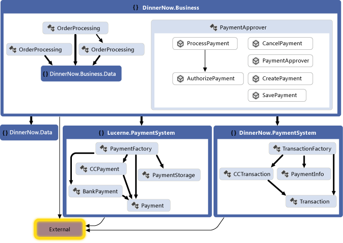  
  
 **Code map with reorganized code**  
  
 This map shows that the PaymentApprover class is now in the DinnerNow.Business namespace and has some new methods. The Dinner Now transaction classes now have their own PaymentSystem namespace, which makes it easier to deal with that code later.  
  
#### Creating a Code Map  
  
-   For a quick overview of source code, follow these steps to generate a code map:  
  
     On the **Architecture** menu, click **Generate Code Map For Solution**.  
  
     For a quick overview of compiled code, create a blank code map, and then drag assembly files or binary files to the map surface.  
  
-   To explore specific code or solution items, use Solution Explorer to select items and relationships that you want to visualize. You can then either generate a new map or add selected items to an existing map. See [Map dependencies across your solutions](../modeling/map-dependencies-across-your-solutions.md).  
  
-   To help you explore the map, rearrange the layout so that it suits the kinds of tasks that you want to perform.  
  
     For example, to visualize layering in the code, select a tree layout. See [Browse and rearrange code maps](../modeling/browse-and-rearrange-code-maps.md).  
  
#### Summary: Strengths of Code Maps  
 Code maps help you:  
  
-   Learn about the organization and relationships in existing code.  
  
-   Identify areas that might be affected by a proposed change.  
  
-   Find areas of complexity, patterns, layers, or other areas that you could improve to make the code easier to maintain, change, and reuse.  
  
#### Relationship to Other Diagrams  
  
|**Diagram**|**Describes**|  
|-----------------|-------------------|  
|Layer diagram|The logical architecture of the system. Use layer validation to make sure that the code stays consistent with the design.   To help you identify existing layers or intended layers, create a code map and group related items. To create a layer diagram, see:   -   [Create layer diagrams from your code](../modeling/create-layer-diagrams-from-your-code.md) -   [Layer Diagrams: Guidelines](../modeling/layer-diagrams-guidelines.md)|  
|Component diagram|Components, their interfaces, and their relationships.   To help you identify components, create a code map and group items by their function in the system.   See:   -   [UML Component Diagrams: Reference](../modeling/uml-component-diagrams-reference.md) -   [UML Component Diagrams: Guidelines](../modeling/uml-component-diagrams-guidelines.md)|  
|Class diagram (UML)|Classes, their attributes and operations, and their relationships.   To help you identify these elements, create a UML class diagram that shows those elements.   See:   -   [UML Class Diagrams: Reference](../modeling/uml-class-diagrams-reference.md) -   [UML Class Diagrams: Guidelines](../modeling/uml-class-diagrams-guidelines.md)|  
|Class diagram (code-based)|Existing classes in code for a specific project.   To visualize and modify an existing class in code, use Class Designer.   See [How to: Add Class Diagrams to Projects (Class Designer)](../ide/how-to-add-class-diagrams-to-projects-class-designer.md).|  
  
###   Describe the Interactions: Sequence Diagrams  
 Sequence diagrams describe a series of interactions between parts of a system. The parts can be of any scale. For example, they can range from individual objects in a program to large subsystems or external actors. The interactions can be of any scale and type. For example, they can range from individual messages to extended transactions and can be function calls or Web service messages.  
  
 To help Lucerne and Dinner Now describe and discuss the steps in the Process Payment use case, they create the following sequence diagram from the component diagram. The lifelines mirror the Dinner Now Web Site component and its parts. The messages that appear between lifelines follow the connections on the component diagrams:  
  
 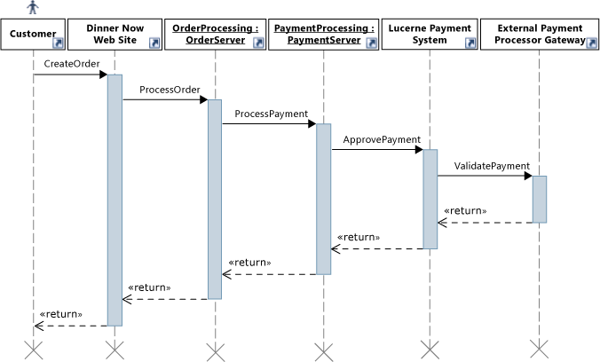  
  
 **Sequence diagram for the Process Payment use case**  
  
 The sequence diagram shows that when the customer creates an order, the Dinner Now Web Site calls ProcessOrder on an instance of OrderProcessing. Next, OrderProcessing calls ProcessPayment on PaymentProcessing. This continues until the External Payment Processor Gateway validates the payment. Only then does control return to the Dinner Now Web Site.  
  
 Lucerne must estimate the cost of updating their payment system to integrate with the Dinner Now system. To help them understand this, they might also create code maps to visualize the affected code.  
  
 See:  
  
-   [UML Sequence Diagrams: Reference](../modeling/uml-sequence-diagrams-reference.md)  
  
-   [UML Sequence Diagrams: Guidelines](../modeling/uml-sequence-diagrams-guidelines.md)  
  
-   [Map dependencies across your solutions](../modeling/map-dependencies-across-your-solutions.md)  
  
#### Drawing a Sequence Diagram  
 A sequence diagram has the following major features:  
  
-   Vertical *lifelines* represent actors or instances of software objects.  
  
     To add an actor symbol, which indicates a participant is outside the system under development, click the lifeline. In the **Properties** window, set **Actor** to **True**. If the **Properties** window is not open, press **F4**.  
  
-   Horizontal *messages* represent method calls, Web service messages, or some other communication. *Execution occurrences* are vertical shaded rectangles that appear on lifelines and represent the periods during which receiving objects process calls.  
  
-   During a *synchronous* message, the sender object waits for control to <\<return>> as in a regular function call. During an *asynchronous* message, the sender can continue immediately.  
  
-   Use <\<create>> messages to indicate the construction of objects by other objects. It should be the first message sent to the object.  
  
 See:  
  
-   [UML Sequence Diagrams: Reference](../modeling/uml-sequence-diagrams-reference.md)  
  
-   [UML Sequence Diagrams: Guidelines](../modeling/uml-sequence-diagrams-guidelines.md)  
  
#### Summary: Strengths of Sequence Diagrams  
 Sequence diagrams help you visualize:  
  
-   The flow of control that transfers between actors or objects during the execution of a use case.  
  
-   The implementation of a method call or message.  
  
#### Relationship to Other Diagrams  
  
|**Diagram**|**Description**|  
|-----------------|---------------------|  
|Class diagram (UML)|Define the classes that lifelines represent and the parameters and return values that are used in messages sent between lifelines.   To create a class from a lifeline, right-click the lifeline, and then click **Create Class** or **Create Interface**. To create a lifeline from a type on a class diagram, right-click the type, and then click **Create Lifeline**.   See:   -   [UML Class Diagrams: Reference](../modeling/uml-class-diagrams-reference.md) -   [UML Class Diagrams: Guidelines](../modeling/uml-class-diagrams-guidelines.md)|  
|Component diagram|Describe the components that lifelines represent and the interfaces that provide and consume the behavior represented by messages.   To create a lifeline from a component diagram, right-click the component, and then click **Create Lifeline**.   See:   -   [UML Component Diagrams: Reference](../modeling/uml-component-diagrams-reference.md) -   [UML Component Diagrams: Guidelines](../modeling/uml-component-diagrams-guidelines.md)|  
|Use case diagram|Summarize the interactions between users and components on a sequence diagram as a use case, which represents a user's goal.   See:   -   [UML Use Case Diagrams: Reference](../modeling/uml-use-case-diagrams-reference.md) -   [UML Use Case Diagrams: Guidelines](../modeling/uml-use-case-diagrams-guidelines.md)|  
  
###   Define a Glossary of Types: Class Diagrams  
 Class diagrams define the entities, terms, or concepts that participate in the system and their relationships with one another. For example, you can use these diagrams during development to describe the attributes and operations for each class, regardless of their implementation language or style.  
  
 To help Lucerne describe and discuss the entities that participate in the Process Payment use case, they draw the following class diagram:  
  
 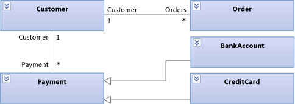  
  
 **Process Payment entities on a class diagram**  
  
 This diagram shows that a Customer can have many orders and different ways to pay for orders. BankAccount and CreditCard both inherit from Payment.  
  
 During development, Lucerne uses the following class diagram to describe and discuss the details of each class:  
  
 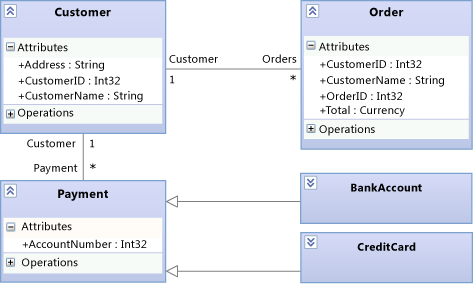  
  
 **Process Payment details on the class diagram**  
  
 See:  
  
-   [UML Class Diagrams: Reference](../modeling/uml-class-diagrams-reference.md)  
  
-   [UML Class Diagrams: Guidelines](../modeling/uml-class-diagrams-guidelines.md)  
  
#### Drawing a Class Diagram  
 A class diagram has the following major features:  
  
-   Types such as classes, interfaces, and enumerations:  
  
    -   A *class* is the definition of objects that share specific structural or behavioral characteristics.  
  
    -   An *interface* defines a part of the externally visible behavior of an object.  
  
    -   An *enumeration* is a classifier that contains a list of literal values.  
  
-   *Attributes* are values of a certain type that describe each instance of a *classifier*. A classifier is a general name for types, components, use cases, and even actors.  
  
-   *Operations* are methods or functions that instances of a classifier can perform.  
  
-   An *association* indicates some kind of relationship between two classifiers.  
  
    -   An *aggregation* is an association that indicates a shared ownership between classifiers.  
  
    -   A *composition* is an association that indicates a whole-part relationship between classifiers.  
  
     To show aggregations or compositions, set the **Aggregation** property on an association. **Shared** shows aggregations and **Composite** shows compositions.  
  
-   A *dependency* indicates that changing the definition of one classifier might change the definition of another classifier.  
  
-   A *generalization* indicates that a specific classifier inherits part of its definition from a general classifier. A *realization* indicates that a class implements the operations and attributes offered by an interface.  
  
     To create these relationships, use the **Inheritance** tool. Alternatively, a realization can be represented as a *lollipop*.  
  
-   *Packages* are groups of classifiers, associations, lifelines, components, and other packages. *Import* relationships indicate that one package includes all definitions of another package.  
  
 As a starting point to explore and discuss existing classes, you can use Class Designer to create class diagrams from code.  
  
 See:  
  
-   [UML Class Diagrams: Reference](../modeling/uml-class-diagrams-reference.md)  
  
-   [UML Class Diagrams: Guidelines](../modeling/uml-class-diagrams-guidelines.md)  
  
-   [How to: Add Class Diagrams to Projects (Class Designer)](../ide/how-to-add-class-diagrams-to-projects-class-designer.md)  
  
#### Summary: Strengths of Class Diagrams  
 Class diagrams help you define:  
  
-   A common glossary of terms to use when discussing the users' needs and the entities that participate in the system. See [Model user requirements](../modeling/model-user-requirements.md).  
  
-   Types that are used by parts of the system, such as components, regardless of their implementation. See [Model your app's architecture](../modeling/model-your-app-s-architecture.md).  
  
-   Relationships, such as dependencies, between types. For example, you can show that one type can be associated with multiple instances of another type.  
  
#### Relationship to Other Diagrams  
  
|**Diagram**|**Description**|  
|-----------------|---------------------|  
|Use case diagram|Define the types that are used to describe goals and steps in use cases.   See:   -   [UML Use Case Diagrams: Reference](../modeling/uml-use-case-diagrams-reference.md) -   [UML Use Case Diagrams: Guidelines](../modeling/uml-use-case-diagrams-guidelines.md)|  
|Activity diagram|Define the types of data that pass through object nodes, input pins, output pins, and activity parameter nodes.   See:   -   [UML Activity Diagrams: Reference](../modeling/uml-activity-diagrams-reference.md) -   [UML Activity Diagrams: Guidelines](../modeling/uml-activity-diagrams-guidelines.md)|  
|Component diagram|Describe components, their interfaces, and their relationships. A class might also describe a complete component.   See:   -   [UML Component Diagrams: Reference](../modeling/uml-component-diagrams-reference.md) -   [UML Component Diagrams: Guidelines](../modeling/uml-component-diagrams-guidelines.md)|  
|Layer diagram|Define the logical architecture of the system as it relates to classes.   Use layer validation to make sure that the code stays consistent with the design.   See:   -   [Create layer diagrams from your code](../modeling/create-layer-diagrams-from-your-code.md) -   [Layer Diagrams: Reference](../modeling/layer-diagrams-reference.md) -   [Layer Diagrams: Guidelines](../modeling/layer-diagrams-guidelines.md) -   [Validate code with layer diagrams](../modeling/validate-code-with-layer-diagrams.md)|  
|Sequence diagram|Define the types of lifelines and the operations, parameters, and return values for all messages that the lifeline can receive.   To create a lifeline from a type on a class diagram, right-click the type, and then click **Create Lifeline**.   See:   -   [UML Sequence Diagrams: Reference](../modeling/uml-sequence-diagrams-reference.md) -   [UML Sequence Diagrams: Guidelines](../modeling/uml-sequence-diagrams-guidelines.md)|  
|Code map|Visualize the organization and relationships in existing code.   To identify classes, their relationships, and their methods, create a code map that shows those elements.   See:   -   [Map dependencies across your solutions](../modeling/map-dependencies-across-your-solutions.md)|  
  
###   Describe the Logical Architecture: Layer Diagrams  
 Layer diagrams describe the logical architecture of a system by organizing the artifacts in your solution into abstract groups, or *layers*. Artifacts can be many things, such as namespaces, projects, classes, methods, and so on. Layers represent and describe the roles or tasks that the artifacts perform in the system. You can also include layer validation in your build and check-in operations to make sure that the code stays consistent with its design.  
  
 To keep the code consistent with the design, Dinner Now and Lucerne use the following layer diagram to validate their code as it evolves:  
  
   
  
 **Layer diagram for Dinner Now integrated with Lucerne**  
  
 The layers on this diagram link to the corresponding Dinner Now and Lucerne solution artifacts. For example, the Business layer links to the DinnerNow.Business namespace and its members, which now include the PaymentApprover class. The Resource Access layer links to the DinnerNow.Data namespace. The arrows, or *dependencies*, specify that only the Business layer can use the functionality in the Resource Access layer. As the teams update their code, layer validation is performed regularly to catch conflicts as they occur and to help the teams resolve them promptly.  
  
 The teams work together to incrementally integrate and test the two systems. They first make sure that PaymentApprover and the rest of Dinner Now work with one another successfully before they deal with PaymentProcessing.  
  
 The following code map shows the new calls between the Dinner Now and PaymentApprover:  
  
 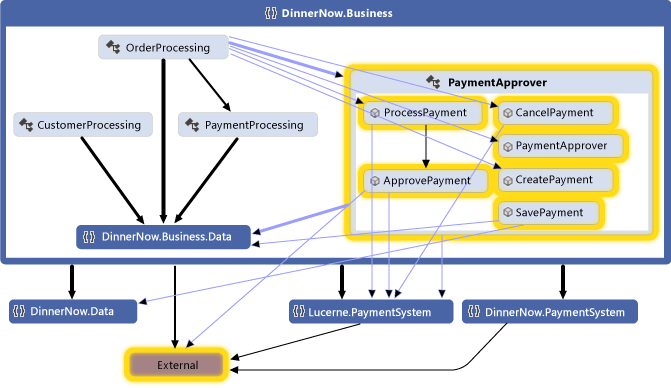  
  
 **Code map with updated method calls**  
  
 After they confirm that the system works as expected, Dinner Now comments out the PaymentProcessing code. The layer validation reports are clean, and the resulting code map shows that no more PaymentProcessing dependencies exist:  
  
 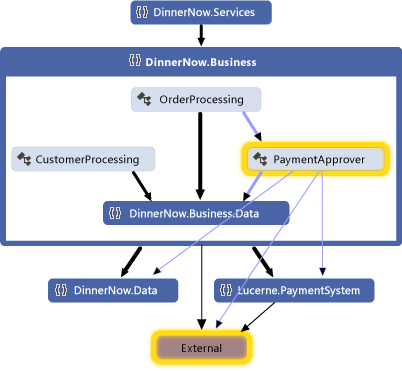  
  
 **Code map without PaymentProcessing**  
  
#### Drawing a Layer Diagram  
 A layer diagram has the following major features:  
  
-   *Layers* describe logical groups of artifacts.  
  
-   A *link* is an association between a layer and an artifact.  
  
     To create layers from artifacts, drag items from Solution Explorer, code maps, Class View, or Object Browser. To draw new layers and then link them to artifacts, use the toolbox or right-click the diagram surface to create the layers, and then drag items to those layers.  
  
     The number on a layer shows the number of artifacts that are linked to the layer. These artifacts can be namespaces, projects, classes, methods, and so on. When you interpret the number of artifacts on a layer, remember the following:  
  
    -   If a layer links to an artifact that contains other artifacts, but the layer does not link directly to the other artifacts, then the number includes only the linked artifact. However, the other artifacts are included for analysis during layer validation.  
  
         For example, if a layer is linked to a single namespace, then the number of linked artifacts is 1, even if the namespace contains classes. If the layer also has links to each class in the namespace, then the number will include the linked classes.  
  
    -   If a layer contains other layers that are linked to artifacts, then the container layer is also linked to those artifacts, even though the number on the container layer does not include those artifacts.  
  
     To see the artifacts that are linked to a layer, right-click the layer, and then click **View Links** to open **Layer Explorer**.  
  
-   A *dependency* indicates that one layer can use the functionality in another layer, but not vice versa. A *bidirectional dependency* indicates that one layer can use the functionality in another layer, and vice versa.  
  
     To display existing dependencies on the layer diagram, right-click the diagram surface, and then click **Generate Dependencies**. To describe intended dependencies, draw new ones.  
  
 See:  
  
-   [Create layer diagrams from your code](../modeling/create-layer-diagrams-from-your-code.md)  
  
-   [Layer Diagrams: Reference](../modeling/layer-diagrams-reference.md)  
  
-   [Layer Diagrams: Guidelines](../modeling/layer-diagrams-guidelines.md)  
  
-   [Validate code with layer diagrams](../modeling/validate-code-with-layer-diagrams.md)  
  
#### Summary: Strengths of Layer Diagrams  
 Layer diagrams help you:  
  
-   Describe the logical architecture of a system according to the functionality of its artifacts.  
  
-   Make sure that code under development conforms to the specified design.  
  
#### Relationship to Other Diagrams  
  
|**Diagram**|**Description**|  
|-----------------|---------------------|  
|Code map|Visualize the organization and relationships in existing code.   To create layers, generate a code map, and then group items on the map as potential layers. Drag the groups from the map to the layer diagram.   See:   -   [Map dependencies across your solutions](../modeling/map-dependencies-across-your-solutions.md) -   [Browse and rearrange code maps](../modeling/browse-and-rearrange-code-maps.md)|  
|Component diagram|Describe components, their interfaces, and their relationships.   To visualize layers, create a component diagram that describes the functionality of different components in the system.   See:   -   [UML Component Diagrams: Reference](../modeling/uml-component-diagrams-reference.md) -   [UML Component Diagrams: Guidelines](../modeling/uml-component-diagrams-guidelines.md)|  
  
## External Resources  
  
|**Category**|**Links**|  
|------------------|---------------|  
|**Forums**|-   [Visual Studio Visualization & Modeling Tools](http://go.microsoft.com/fwlink/?LinkId=184720) -   [Visual Studio Visualization & Modeling SDK (DSL Tools)](http://go.microsoft.com/fwlink/?LinkId=184721)|  
  
## See Also  
 [Visualize code](../modeling/visualize-code.md)   
 [Create models for your app](../modeling/create-models-for-your-app.md)   
 [Use models in your development process](../modeling/use-models-in-your-development-process.md)   
 [Use models in Agile development](http://msdn.microsoft.com/en-us/592ac27c-3d3e-454a-9c38-b76658ed137f)   
 [Validate your system during development](../modeling/validate-your-system-during-development.md)   
 [Extend UML models and diagrams](../modeling/extend-uml-models-and-diagrams.md)

