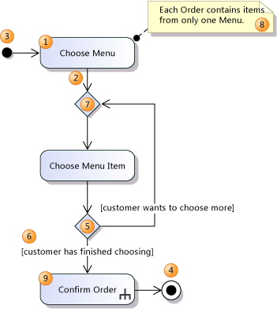
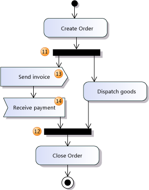
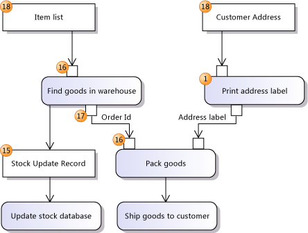

# UML Activity Diagrams: Reference
[!INCLUDE[vs2017banner](../includes/vs2017banner.md)]

  
An *activity diagram* shows a business process or a software process as a flow of work through a series of actions. People, software components, or computers can perform these actions.  
  
 You can use an activity diagram to describe processes of several types, such as the following examples:  
  
-   A business process or a flow of work between users and your system. For more information, see [Model user requirements](../modeling/model-user-requirements.md).  
  
-   The steps performed in a use case. For more information, see [UML Use Case Diagrams: Guidelines](../modeling/uml-use-case-diagrams-guidelines.md).  
  
-   A software protocol, that is, the permitted sequences of interactions between components.  
  
-   A software algorithm.  
  
 This topic describes the elements that you can use in activity diagrams. For more detailed in information about drawing activity diagrams see [UML Activity Diagrams: Guidelines](../modeling/uml-activity-diagrams-guidelines.md). To create a UML activity diagram, on the **Architecture** menu, click **New UML or Layer Diagram**. For more information about how to draw modeling diagrams in general, see [Edit UML models and diagrams](../modeling/edit-uml-models-and-diagrams.md).  
  
## Reading Activity Diagrams  
 The tables in the following sections describe the elements that you can use on an activity diagram and their main properties. For a full list of the properties of the elements, see [Properties of elements on UML activity diagrams](../modeling/properties-of-elements-on-uml-activity-diagrams.md).  
  
 The actions and other elements that appear in an activity diagram form one activity. You can see the activity in UML Model Explorer. It is created when you add the first element to the diagram.  
  
 To read a diagram, imagine that a token, or thread of control, passes along the connectors from one action to the next.  
  
### Simple Control Flows  
 You can show a sequence of actions with branches and loops. For more information about how to use the elements described here, see the Describing Control Flow section of the topic [UML Activity Diagrams: Guidelines](../modeling/uml-activity-diagrams-guidelines.md).  
  
   
  
||||  
|-|-|-|  
|**Shape**|**Element**|**Description and Main Properties**|  
|1|**Action**|A step in the activity, in which the users or software perform some task.   The action can start when a token has arrived at all its incoming flows. When it ends, tokens are sent on all the outgoing flows.   -   **Body** - Specifies the action in detail. -   **Language** - The language of the expression in Body. -   **Local Postconditions** - Constraints that must be satisfied when execution ends. The goal achieved by the action. -   **Local Preconditions** - Constraints that must be satisfied before execution begins.|  
|2|**Control Flow**|A connector that shows the flow of control between actions. To interpret the diagram, imagine that a token flows from one action to the next.   To create a control flow, use the **Connector** tool.|  
|3|**Initial Node**|Indicates the first action or actions in the activity. When the activity starts, a token flows from the initial node.|  
|4|**Activity Final Node**|An end to the activity. When a token arrives, the activity terminates.|  
|5|**Decision Node**|A conditional branch in a flow. Has one input and two or more outputs. An incoming token emerges on just one of the outputs.|  
|6|**Guard**|A condition that specifies whether a token can flow along a connector. Most frequently used on the outgoing flows of a decision node.   To set a guard, right-click a flow, click **Properties** and then set the **Guard** property.|  
|7|**Merge Node**|Required to merge flows that were split with a decision node. Has two or more inputs and one output. A token on any input emerges on the output.|  
|8|**Comment**|Provides additional information about elements to which it is linked.|  
|9|**Call Behavior Action**|An action that is defined in more detail on another activity diagram.   -   **IsSynchronous** - If true, the action waits until the activity terminates. -   **Behavior** - The activity invoked.|  
|(not shown)|**Call Operation Action**|An action that calls an operation on an instance of a class.|  
||**Activity**|The flow of work that is depicted by an activity diagram. To see the properties of an activity, you must select it in **UML Model Explorer**.   -   **Is Read Only** - If true, the activity should not change the state of any object. -   **Is Single Execution** - If true, there is at most one execution of this diagram at a time.|  
||**UML Activity Diagram**|The diagram that displays an Activity. To see its properties, click an empty part of the diagram. **Note:**  The names of the Activity Diagram, the file that contains the diagram, and the Activity displayed by the diagram can all be different.|  
  
### Concurrent Flows  
 You can describe sequences of actions that execute at the same time. For more information, see Drawing Concurrent Flows.  
  
   
  
||||  
|-|-|-|  
|**Shape**|**Element**|**Description**|  
|11|**Fork Node**|Divides a single flow into concurrent flows. Each incoming token produces a token on each outgoing connector.|  
|12|**Join Node**|Combines concurrent flows into a single flow. When every incoming flow has a token waiting, a token is produced on the output.|  
|13|**Send Signal Action**|An action that sends a message or signal to another activity or to a concurrent thread in the same activity. The type and content of the message is implied by the action's title or specified in additional comments.   The action can send data in the signal, which can be passed to the action in an object flow or input pin (16).|  
|14|**Accept Event Action**|An action that waits for a message or signal before the action can continue. The type of message the action can receive is implied by the title or specified in additional comments.   If the action has no incoming control flow, it produces a token whenever it receives a message.   The action can receive data in the signal, which can be passed on an object flow or output pin (17).   -   **IsUnmarshall** - If true, there can be several typed output pins, and data is unmarshalled onto them. If false, all data appears on one pin.|  
  
###   Data Flows  
 You can describe the flow of data from one action to another. For more information about the elements used in this section, see the Drawing Data Flows section of the topic Guidelines for Drawing an Activity Diagram.  
  
   
  
||||  
|-|-|-|  
|**Shape**|**Element**|**Description**|  
|15|**Object Node**|Represents data that passes along a flow.   -   **Ordering** - How multiple tokens are stored. -   **Selection** - Invokes a process, which can be defined in another diagram, that filters the data. -   **Upper Bound** - 0 indicates that data must pass directly along the flow; \* indicates that data can be stored in the flow. -   **Type** - the type of objects stored and transmitted.|  
|16|**Input Pin**|Represents data that an action can receive when it executes.   -   **Type** - the type of objects transmitted.|  
|17|**Output Pin**|Represents data that an action produces when it executes.   -   **Type** - the type of objects transmitted.|  
|18|**Activity Parameter Node**|An object node through which data can be received or produced by the activity.   Used when the activity represented by the diagram is called from another activity, or when the diagram describes an operation or function.   -   **Type** - the type of objects transmitted.|  
|(not shown)|**Object Flow**|A connector that shows the flow of data between actions and object nodes.   To create an object flow, use the **Connector** tool to link an input or output pin or an object node to another element.   -   **Selection** - Invokes a process, which can be defined in another diagram, that filters the data. -   **Transformation** - Invokes a process, which can be defined in another diagram, that transforms the data. -   **IsMulticast** - indicates that there might be several recipient objects or components. -   **IsMultiReceive** - indicates that inputs might be received from several objects or components.|  
  
## See Also  
 [Edit UML models and diagrams](../modeling/edit-uml-models-and-diagrams.md)   
 [UML Activity Diagrams: Guidelines](../modeling/uml-activity-diagrams-guidelines.md)

