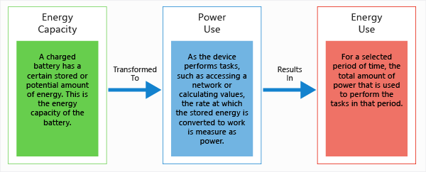
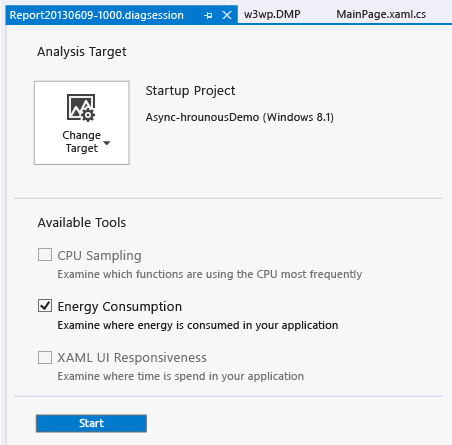
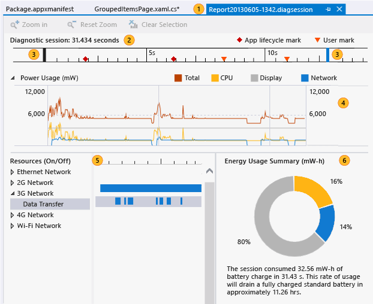
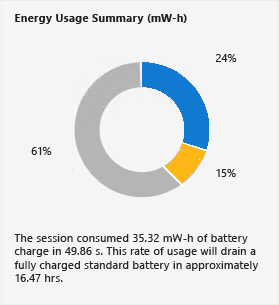

# Analyze energy use in Store apps
[!INCLUDE[vs2017banner](../includes/vs2017banner.md)]

  
The Visual Studio **Energy Consumption** profiler helps you analyze the power and energy consumption of Windows Store apps on low-power tablet devices that run all or part of the time on their own batteries. On a battery-powered device, an app that uses too much energy can cause so much customer dissatisfaction that, eventually, customers might even uninstall it. Optimizing energy use can increase your app’s adoption and use by customers.  
  
##  <a name="BKMK_What_the_Energy_Consumption_tool_is__how_it_works__and_what_it_measures"></a> What the Energy Consumption profiler is, how it works, and what it measures  
 The Energy Consumption profiler captures the activities of the display, CPU, and network connections of a device during a profiling session. It then generates estimates of the power used for those activities and the total amount of energy for the profiling session.  
  
> [!NOTE]
>  The energy profiler estimates power and energy use by using a software model of standard reference device hardware that is representative of the low powered tablet devices your application might run on. To provide the best estimates, we recommend that you collect the profile data on a low powered tablet device.  
>   
>  Although the model provides good estimates for a variety of low-powered devices, the actual values of the device you profile will likely be different. Use the values to find display, CPU, and network activities that are costly relative to other resource uses and so might be good candidates for optimization.  
  
 The Energy Consumption profiler uses these definitions of *power* and *energy*:  
  
-   *Power* measures the rate that force is used to perform work that is done in a period of time. In electrical science, the standard unit of power is a *watt*, which is defined as the rate at which work is done when one ampere of current flows through an electrical potential difference of one volt. In the **Power Usage** graph, the units are displayed as milliwatts **mW** which are one thousandth  of a watt.  
  
     Note that because power is a rate, it has a direction (the work can increase or decrease in a period of time) and a speed (the amount that the work increases or decreases).  
  
-   *Energy* measures the total amount of power, either as a capacity or potential, as in the power capacity of a battery, or as the total amounted of power expended over a period of time. The unit of energy is a watt-hour, the amount of power of one watt constantly applied for one hour. In the **Energy Summary**, the units are displayed as milliwatt-hours **mW-h**.  
  
   
  
 For example, a fully charged battery in a tablet has a certain amount of stored energy. As the energy is used to perform tasks such as communicating over a network, calculating values, or displaying graphics, the power of the battery dissipates at different rates. For any period of time, the total of the power consumed is also measured by energy.  
  
##  <a name="BKMK_Identify_scenarios_with_user_marks"></a> Identify scenarios with user marks  
 You can add *user marks* to your profiling data to help identify areas in the timeline ruler.  
  
   
  
 The mark appears as an orange triangle in the timeline at the time the method executed. The message and the time are displayed as a tooltip when you hover over the mark. If two or more user marks are close together, the marks are merged and the tooltip data is combined. You can zoom in on the timeline to separate the marks.  
  
 **Add marks to C#, Visual Basic, C++ code**  
  
 To add a user mark to C#, Visual Basic, C++ code, first create a [Windows.Foundation.Diagnostics LoggingChannel](http://msdn.microsoft.com/library/windows/apps/windows.foundation.diagnostics.loggingchannel.aspx) object. Then insert calls to [LoggingChannel.LogMessage](http://msdn.microsoft.com/library/windows/apps/dn264210.aspx) methods at the points in your code that you want to mark. Use [LoggingLevel.Information](http://msdn.microsoft.com/library/windows/apps/windows.foundation.diagnostics.logginglevel.aspx) in the calls.  
  
 When the method executes, a user mark is added to the profiling data along with a message.  
  
> [!NOTE]
>  -   Windows.Foundation.Diagnostics LoggingChannel implements the [Windows.Foundation.IClosable](http://msdn.microsoft.com/library/windows/apps/windows.foundation.iclosable.aspx) interface  (projected as [System.IDisposable](http://msdn.microsoft.com/library/System.IDisposable.aspx) in C# and VB).To avoid leaking operating system resources, call [LoggingChannel.Close](http://msdn.microsoft.com/library/windows/apps/windows.foundation.diagnostics.loggingchannel.close.aspx)() (Windows.Foundation.Diagnostics.LoggingChannel.Dispose() in C# and VB) when you are finished with a logging channel.  
> -   Each open logging channel must have a unique name. Attempting to create a new logging channel with the same name as an undisposed channel causes an exception.  
  
 See the Windows SDK Sample [LoggingSession Sample](http://code.msdn.microsoft.com/windowsapps/LoggingSession-Sample-ccd52336) for examples.  
  
 **Add marks to JavaScript code**  
  
 To add user marks add the following code at the points in your code that you want to mark:  
  
```  
if (performance && performance.mark) {  
    performance.mark(markDescription);  
}  
```  
  
 *markDescription* is a string that contains the message to display in the user mark tooltip.  
  
##  <a name="BKMK_Configure_your_environment_for_profiling"></a> Configure your environment for profiling  
 To obtain the good estimates, you’ll want to profile the energy use of the app on a low-powered device that is being powered by its batteries. Because Visual Studio does not run on most of these devices, you’ll need to connect your Visual Studio computer to the device using the Visual Studio remote tools. To connect to a remote device, you need to configure both the Visual Studio project and the remote device. See [Run Windows Store apps on a remote machine](../debugger/run-windows-store-apps-on-a-remote-machine.md) for more information.  
  
> [!TIP]
>  -   We don’t recommend energy profiling on the Windows Store simulator or on the Visual Studio computer. Profiling on the actual device provides far more realistic data.  
> -   Profile on the target device while it is powered by its batteries.  
> -   Close other apps that might use the same resources (network, CPU, or display).  
  
##  <a name="BKMK_Collect_energy_profile_data_for_your_app"></a> Collect energy profile data for your app  
  
1.  On the **Debug** menu, choose **Start Diagnostics Without Debugging**.  
  
       
  
2.  Choose **Energy Consumption** and then choose **Start**.  
  
    > [!NOTE]
    >  When you start the **Energy Consumption** profiler, you might see a **User Account Control** window requesting your permission to run VsEtwCollector.exe. Choose **Yes**.  
  
3.  Exercise your app to collect data.  
  
4.  To stop profiling, switch back to Visual Studio (Alt + Tab) and choose **Stop collection** on the Diagnostic hub page.  
  
       
  
     Visual Studio analyzes the collected data and displays the results.  
  
##  <a name="BKMK_Collect_energy_profile_data_for_an_installed_app"></a> Collect energy profile data for an installed app  
 The Energy Consumption tool can only be run on Window Store 8.1 apps that are launched from a Visual Studio solution or are installed from the Windows store. When a solution is open in Visual Studio, the default target is the **Startup Project**. To target an installed app:  
  
1.  Choose **Change Target** and then choose **Installed App**.  
  
2.  From the **Select Installed App Package** list, choose the target.  
  
3.  Choose **Energy Consumption** on the diagnostics hub page.  
  
4.  Choose **Start** to begin profiling.  
  
 To stop profiling, switch back to Visual Studio (Alt + Tab) and choose **Stop collection** on the Diagnostic hub page.  
  
##  <a name="BKMK_Analyze_energy_profile_data"></a> Analyze energy profile data  
 The energy profile data is displayed in Visual Studio document window:  
  
   
  
|||  
|-|-|  
||The report file is named Report*YYYYMMDD-HHMM*.diagsession. You can change the name if you decide to save the report.|  
||The timeline shows the length of the profiling session, app lifecycle activation events, and user marks.|  
||You can restrict the report to a part of the timeline by dragging the blue bars to select a region of the timeline.|  
||The **Power Usage** graph is a multi-line chart that displays the change in the power output that is caused by a device resource during a profiling session. The Energy Consumption profiler tracks the power used by the CPU, network activity, and the screen display.|  
||The **Resources (On/Off)**  graph provides details of network energy costs. The **Network** bar represents the time that the network connection was open. The **Data Transfer** child bar is the time that the app was receiving or sending data over the network.|  
||The **Energy Usage Summary** shows the proportional amount of the total energy that was used in the selected timeline by the CPU, network activity, and the screen display.|  
  
 **To analyze the energy profile data**  
  
 Find an area where resource power peaked. Relate the peak area to the functionality of your app. Then use the timeline control bars on the timeline to zoom in on the area. If you are focused on network usage, expand the **Network** node in the **Resources (On/Off)**  graph to compare the time that the network connection was open to the time that the app was receiving or transferring data over the connection. Reducing the time that the network is unnecessarily opened is a very effective optimization.  
  
##  <a name="BKMK_Optimize_energy_use"></a> Optimize energy use  
 In addition to transmitting data, network connections incur energy costs for initializing, maintaining, and shutting down the connection. Some networks maintain the connection for a period of time after data is sent or received to allow more data over to be transmitted over a single connection. You can use the **Resources (On/Off)** pane to examine the way your app interacts with the connection.  
  
   
  
 If the **Network** and **Data Transfer** bars show that the connection is open for long periods to intermittently transmit a series of small data packets, you can batch the data to send it in one transmission, reduce the time that the network is open, and thus save energy costs.  
  
   
  
 You have less control over the energy costs of the display. Most screens require more energy to display light colors than darker colors, so using a dark background is one way to reduce costs.  
  
##  <a name="BKMK_Other_resources"></a> Other resources  
  
-   The **Connection state and cost management** sections for [C#/VB/C++ and XAML](http://msdn.microsoft.com/en-us/0ee0b706-8432-4d49-9801-306ed90764e1) and [JavaScript and HTML](http://msdn.microsoft.com/en-us/372afa6a-1c7c-4657-967d-03a77cd8e933) in the Windows Dev Center describe the Windows APIs that provide network connectivity information that your app can use to minimize the cost of network traffic.  
  
     The Visual Studio simulator for Windows Store apps enables you to simulate data connection properties of the network information APIs. See [Run Windows Store apps in the simulator](../debugger/run-windows-store-apps-in-the-simulator.md)  
  
-   The **JavaScript Function Timing** and the **CPU Usage** tools can help you reduce the CPU load when it is caused by inefficient functions. See [Analyze CPU Usage](../profiling/analyze-cpu-usage-in-a-windows-universal-app.md).


