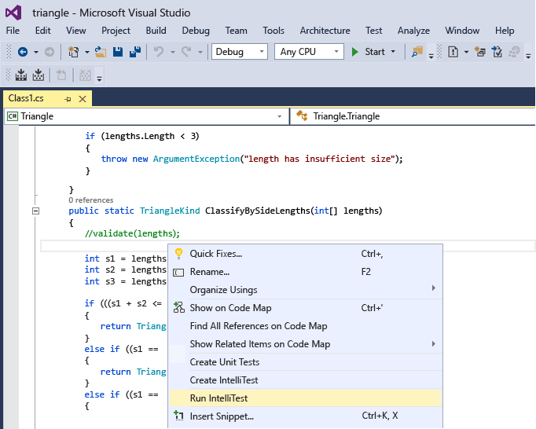
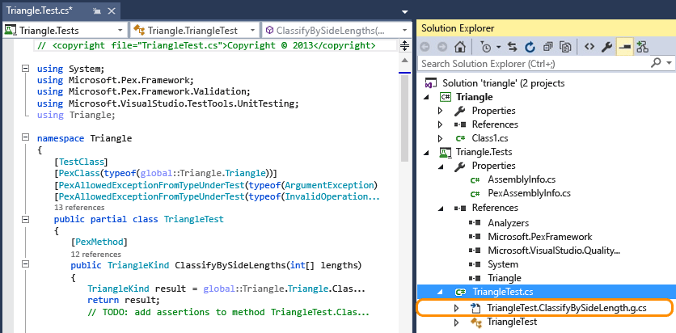
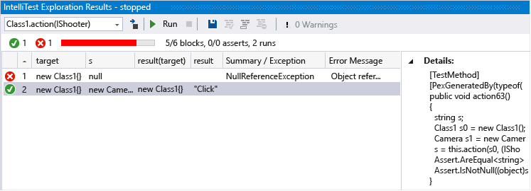

# Generate unit tests for your code with IntelliTest
[!INCLUDE[vs2017banner](../includes/vs2017banner.md)]

The latest version of this topic can be found at [Generate unit tests for your code with IntelliTest](https://docs.microsoft.com/visualstudio/test/generate-unit-tests-for-your-code-with-intellitest).  
  
IntelliTest explores your .NET code to generate test data and a suite of unit tests. For every statement in the code, a test input is generated that will execute that statement. A case analysis is performed for every conditional branch in the code. For example, if statements, assertions, and all operations that can throw exceptions are analyzed. This analysis is used to generate test data for a parameterized unit test for each of your methods, creating unit tests with high code coverage.  
  
 When you run IntelliTest, you can easily see which tests are failing and add any necessary code to fix them. You can select which of the generated tests to save into a test project to provide a regression suite. As you change your code, rerun IntelliTest to keep the generated tests in sync with your code changes.  
  
 IntelliTest is available for C# only and does not support x64 configuration.  
  
## Get started with IntelliTest  
 You'll need Visual Studio Enterprise.  
  
### Explore: Use IntelliTest to explore your code and generate unit tests  
 To generate unit tests, your types must be public. Otherwise, [create unit tests](#NoRun) first before you generate them.  
  
1.  Open your solution in Visual Studio. Then open the class file that has methods you want to test.  
  
2.  Right-click in a method in your code and choose **Run IntelliTest** to generate unit tests for the code in your method.  
  
       
  
     IntelliTest runs your code many times with different inputs. Each run is represented in the table showing the input test data and the resulting output or exception.  
  
       
  
     To generate unit tests for all the public methods in a class, simply right-click in the class rather than a specific method. Then choose **Run IntelliTest**. Use the drop-down list in the Exploration Results window to display the unit tests and the input data for each method in the class.  
  
       
  
     For tests that pass, check that the reported results in the result column match your expectations for your code. For tests that fail, fix your code as appropriate. Then rerun IntelliTest to validate the fixes.  
  
### Persist: Save the unit tests as a regression suite  
  
1.  Select the data rows that you want to save with the parameterized unit test into a test project.  
  
       
  
     You can view the test project and the parameterized unit test that has been created - the individual unit tests, corresponding to each of the rows, are saved in the .g.cs file in the test project, and a parameterized unit test is saved in its corresponding .cs file. You can run the unit tests and view the results from Test Explorer just as you would for any unit tests that you created manually.  
  
       
  
     Any necessary references are also added to the test project.  
  
     If the method code changes, rerun IntelliTest to keep the unit tests in sync with the changes.  
  
### Assist: Use IntelliTest to focus code exploration  
  
1.  If you have more complex code, IntelliTest assists you with focusing exploration of your code. For example, if you have a method that has an interface as a parameter, and there is more than one class that implements that interface, IntelliTest discovers those classes and reports a warning.  
  
     View the warnings to decide what you want to do.  
  
       
  
2.  After you investigate the code and understand what you want to test, you can fix the warning to choose which classes to use to test the interface.  
  
       
  
     This choice is added into the PexAssemblyInfo.cs file.  
  
     `[assembly: PexUseType(typeof(Camera))]`  
  
3.  Now you can rerun IntelliTest to generate a parameterized unit test and test data just using the class that you fixed.  
  
       
  
### Specify: Use IntelliTest to validate correctness properties that you specify in code  
 Specify the general relationship between inputs and outputs that you want the generated unit tests to validate. This specification is encapsulated in a method that looks like a test method but is universally quantified. This is the parameterized unit test method, and any assertions you make must hold for all possible input values that IntelliTest can generate.  
  
##   Q & A  
  
### Q: Can you use IntelliTest for unmanaged code?  
 **A:** No, IntelliTest only works with managed code.  
  
### Q: When does a generated test pass or fail?  
 **A:** It passes like any other unit test if no exceptions occur. It fails if any assertion fails, or if the code under test throws an unhandled exception.  
  
 If you have a test that can pass if certain exceptions are thrown, you can set one of the following attributes based on your requirements at the test method, test class or assembly level:  
  
-   **PexAllowedExceptionAttribute**  
  
-   **PexAllowedExceptionFromTypeAttribute**  
  
-   **PexAllowedExceptionFromTypeUnderTestAttribute**  
  
-   **PexAllowedExceptionFromAssemblyAttribute**  
  
### Q: Can I add assumptions to the parameterized unit test?  
 **A:** Yes, use assumptions to specify which test data is not required for the unit test for a specific method. Use the <xref:Microsoft.Pex.Framework.PexAssume> class to add assumptions. For example, you can add an assumption that the lengths variable is not null like this.  
  
 `PexAssume.IsNotNull(lengths);`  
  
 If you add an assumption and rerun IntelliTest, the test data that is no longer relevant will be removed.  
  
### Q: Can I add assertions to the parameterized unit test?  
 **A:** Yes, IntelliTest will check that what you are asserting in your statement is in fact correct when it runs the unit tests. Use the <xref:Microsoft.Pex.Framework.PexAssert> class or the assertion API that comes with the test framework to add assertions. For example, you can add an assertion that two variables are equal.  
  
 `PexAssert.AreEqual(a, b);`  
  
 If you add an assertion and rerun IntelliTest, it will check that your assertion is valid and the test fails if it is not.  
  
###   Q: Can I generate parameterized unit tests without running IntelliTest first?  
 **A:** Yes, right-click in the class or method, then choose **Create IntelliTest**.  
  
   
  
 Accept the default format to generate your tests, or change how your project and tests are named. You can create a new test project or save your tests to an existing project.  
  
   
  
### Q: Can I use other unit test frameworks with IntelliTest?  
 **A:** Yes, follow these steps to [find and install other frameworks](../test/install-third-party-unit-test-frameworks.md). After you restart Visual Studio and reopen your solution, right-click in the class or method, then choose **Create IntelliTest**. Select your installed framework here:  
  
   
  
 Then run IntelliTest to generate individual unit tests in their corresponding .g.cs files.  
  
### Q: Can I learn more about how the tests are generated?  
 **A:** Yes, to get a high-level overview, read this [blog post](http://blogs.msdn.com/b/visualstudioalm/archive/2015/07/05/intellitest-one-test-to-rule-them-all.aspx).

