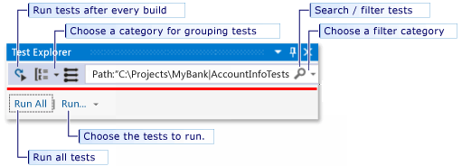
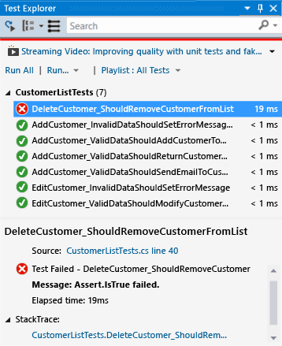
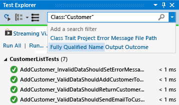

# Run unit tests with Test Explorer
[!INCLUDE[vs2017banner](../includes/vs2017banner.md)]

Use Test Explorer to run unit tests from Visual Studio or third-party unit test projects, group tests into categories, filter the test list, and create, save, and run playlists of tests. You can also debug tests and analyze test performance and code coverage.  
  
##  <a name="BKMK_Contents"></a> Contents  
 [Unit test frameworks and test projects](#BKMK_Unit_test_frameworks_and_test_projects)  
  
 [Run tests in Test Explorer](#BKMK_Run_tests_in_Test_Explorer)  
  
 [View test results](#BKMK_View_test_results)  
  
 [Group and filter the test list](#BKMK_Group_and_filter_the_test_list)  
  
 [Create custom playlists](#BKMK_Create_custom_playlists)  
  
 [Debug and analyze unit tests](#BKMK_Debug_and_analyze_unit_tests)  
  
 [External resources](#BKMK_External_resources)  
  
##  <a name="BKMK_Unit_test_frameworks_and_test_projects"></a> Unit test frameworks and test projects  
 Visual Studio includes the Microsoft unit testing frameworks for both managed and native code. However, Test Explorer can also run any unit test framework that has implemented a Test Explorer adapter. For more information about installing third-party unit test frameworks, see [Install third-party unit test frameworks](../test/install-third-party-unit-test-frameworks.md)  
  
 Test Explorer can run tests from multiple test projects in a solution and from test classes that are part of the production code projects. Test projects can use different unit test frameworks. When the code under test is written for the .NET Framework, the test project can be written in any language that also targets the .NET Framework, regardless of the language of the target code. Native C/C++ code projects must be tested by using a C++ unit test framework.  
  
  [Contents](#BKMK_Contents)  
  
##  <a name="BKMK_Run_tests_in_Test_Explorer"></a> Run tests in Test Explorer  
 [Run tests](#BKMK_Run_tests) **&#124;** [Run tests after every build](#BKMK_Run_tests_after_every_build)  
  
 When you build the test project, the tests appear in Test Explorer. If Test Explorer is not visible, choose **Test** on the Visual Studio menu, choose **Windows**, and then choose **Test Explorer**.  
  
   
  
 As you run, write, and rerun your tests, Test Explorer displays the results in default groups of **Failed Tests**, **Passed Tests**, **Skipped Tests** and **Not Run Tests**. You can change the way Test Explorer groups your tests.  
  
 You can perform much of the work of finding, organizing and running tests from the Test Explorer toolbar.  
  
   
  
  [Contents](#BKMK_Contents)  
  
###  <a name="BKMK_Run_tests"></a> Run tests  
 You can run all the tests in the solution, all the tests in a group, or a set of tests that you select. Do one of the following:  
  
-   To run all the tests in a solution, choose **Run All**.  
  
-   To run all the tests in a default group, choose **Run...** and then choose the group on the menu.  
  
-   Select the individual tests that you want to run, open the context menu for a selected test and then choose **Run Selected Tests**.  
  
-   If individual tests have no dependencies that prevent them from being run in any order, turn on parallel test execution with the  toggle button on the toolbar. This can noticeably reduce the time taken to run all the tests.  
  
 The pass/fail bar at the top of the Test Explorer window is animated as the tests run. At the conclusion of the test run, the pass/fail bar turns green if all tests passed or turns red if any test failed.  
  
  [Contents](#BKMK_Contents)  
  
###  <a name="BKMK_Run_tests_after_every_build"></a> Run tests after every build  
  
> [!WARNING]
>  Running unit tests after every build is supported in Visual Studio Enterprise.  
  
|||  
|-|-|  
||To run your unit tests after each local build, choose **Test** on the standard menu, and then choose **Run Tests After Build** on the Test Explorer toolbar.|  
  
  [Contents](#BKMK_Contents)  
  
##  <a name="BKMK_View_test_results"></a> View test results  
 [View test details](#BKMK_View_test_details) **&#124;** [View the source code of a test method](#BKMK_View_the_source_code_of_a_test_method)  
  
 As you run, write, and rerun your tests, Test Explorer displays the results in groups of **Failed Tests**, **Passed Tests**, **Skipped Tests** and **Not Run Tests**. The details pane at the bottom of Test Explorer displays a summary of the test run.  
  
###  <a name="BKMK_View_test_details"></a> View test details  
 To view the details of an individual test, select the test.  
  
   
  
 The test details pane displays the following information:  
  
-   The source file name and the line number of the test method.  
  
-   The status of the test.  
  
-   The elapsed time that the test method took to run.  
  
 If the test fails, the details pane also displays:  
  
-   The message returned by the unit test framework for the test.  
  
-   The stack trace at the time the test failed.  
  
  [Contents](#BKMK_Contents)  
  
###  <a name="BKMK_View_the_source_code_of_a_test_method"></a> View the source code of a test method  
 To display the source code for a test method in the Visual Studio editor, select the test and then choose **Open Test** on the context menu (Keyboard: F12).  
  
  [Contents](#BKMK_Contents)  
  
##  <a name="BKMK_Group_and_filter_the_test_list"></a> Group and filter the test list  
 [Grouping the test list](#BKMK_Grouping_the_test_list) **&#124;** [Group by traits](#BKMK_Group_by_traits) **&#124;** [Search and filter the test list](#BKMK_Search_and_filter_the_test_list)  
  
 Test Explorer lets you group your tests into predefined categories. Most unit test frameworks that run in Test Explorer let you define your own categories and category/value pairs to group your tests. You can also filter the list of tests by matching strings against test properties.  
  
###  <a name="BKMK_Grouping_the_test_list"></a> Grouping the test list  
 To change the way that tests are organized, choose the down arrow next to the **Group By** button  and select a new grouping criteria.  
  
   
  
### Test Explorer groups  
  
|Group|Description|  
|-----------|-----------------|  
|**Duration**|Groups test by execution time: **Fast**, **Medium**, and **Slow**.|  
|**Outcome**|Groups tests by execution results: **Failed Tests**, **Skipped Tests**, **Passed Tests**.|  
|**Traits**|Groups test by category/value pairs that you define. The syntax to specify trait categories and values is defined by the unit test framework.|  
|**Project**|Groups test by the name of the projects.|  
  
  [Contents](#BKMK_Contents)  
  
###  <a name="BKMK_Group_by_traits"></a> Group by traits  
 A trait is usually a category name/value pair, but it can also be a single category. Traits can be assigned to methods that are identified as a test method by the unit test framework. A unit test framework can define trait categories. You can add values to the trait categories to define your own category name/value pairs. The syntax to specify trait categories and values is defined by the unit test framework.  
  
 **Traits in the Microsoft Unit Testing Framework for Managed Code**  
  
 In the Microsoft unit test framework for managed apps, you define a trait name/ value pair in a  <xref:Microsoft.VisualStudio.TestTools.UnitTesting.TestPropertyAttribute> attribute. The test framework also contains these predefined traits:  
  
|Trait|Description|  
|-----------|-----------------|  
|<xref:Microsoft.VisualStudio.TestTools.UnitTesting.OwnerAttribute>|The Owner category is defined by the unit test framework and requires you to provide a string value of the owner.|  
|<xref:Microsoft.VisualStudio.TestTools.UnitTesting.PriorityAttribute>|The Priority category is defined by the unit test framework and requires you to provide an integer value of the priority.|  
|<xref:Microsoft.VisualStudio.TestTools.UnitTesting.TestCategoryAttribute>|The TestCategory attribute enables you to provide a category without a value. A category defined by the TestCategory attribute can also be the category of a TestProperty attribute.|  
|<xref:Microsoft.VisualStudio.TestTools.UnitTesting.TestPropertyAttribute>|The TestProperty attribute enables you to define trait category/value pair.|  
  
 **Traits in the Microsoft Unit Testing Framework for C++**  
  
 To define a trait, use the `TEST_METHOD_ATTRIBUTE` macro. For example, to define a trait named `TEST_MY_TRAIT`:  
  
```cpp  
#define TEST_MY_TRAIT(traitValue) TEST_METHOD_ATTRIBUTE(L"MyTrait", traitValue)  
```  
  
 To use the defined trait in your unit tests:  
  
```  
BEGIN_TEST_METHOD_ATTRIBUTE(Method1)  
    TEST_OWNER(L"OwnerName")  
    TEST_PRIORITY(1)  
    TEST_MY_TRAIT(L"thisTraitValue")  
END_TEST_METHOD_ATTRIBUTE()  
  
TEST_METHOD(Method1)  
{     
    Logger::WriteMessage("In Method1");  
    Assert::AreEqual(0, 0);  
}  
```  
  
### C++ trait attribute macros  
  
|Macro|Description|  
|-----------|-----------------|  
|`TEST_METHOD_ATTRIBUTE(attributeName, attributeValue)`|Use the TEST_METHOD_ATTRIBUTE macro to define a trait.|  
|`TEST_OWNER(ownerAlias)`|Use the predefined Owner trait to specify an owner of the test method.|  
|`TEST_PRIORITY(priority)`|Use the predefined Priority trait to assign relative priorities to your test methods.|  
  
  [Contents](#BKMK_Contents)  
  
###  <a name="BKMK_Search_and_filter_the_test_list"></a> Search and filter the test list  
 You can use Test Explorer filters to limit the test methods in your projects that you view and run.  
  
 When you type a string in the Test Explorer search box and choose ENTER, the test list is filtered to display only those tests whose fully qualified names contain the string.  
  
 To filter by a different criteria:  
  
1.  Open the drop-down list to the right of the search box.  
  
2.  Choose a new criteria.  
  
3.  Enter the filter value between the quotation marks.  
  
   
  
> [!NOTE]
>  Searches are case insensitive and match the specified string to any part of the criteria value.  
  
|Qualifier|Description|  
|---------------|-----------------|  
|**Trait**|Searches both trait category and value for matches. The syntax to specify trait categories and values are defined by the unit test framework.|  
|**Project**|Searches the test project names for matches.|  
|**Error Message**|Searches the user-defined error messages returned by failed asserts for matches.|  
|**File Path**|Searches the fully qualified file name of test source files for matches.|  
|**Fully Qualified Name**|Searches the fully qualified file name of test namespaces, classes, and methods for matches.|  
|**Output**|Searches the user-defined error messages that are written to standard output (stdout) or standard error (stderr). The syntax to specify output messages are defined by the unit test framework.|  
|**Outcome**|Searches the Test Explorer category names for matches: **Failed Tests**, **Skipped Tests**, **Passed Tests**.|  
  
 To exclude a subset of the results of a filter, use the following syntax:  
  
```  
FilterName:"Criteria" -FilterName:"SubsetCriteria"  
```  
  
 For example,  
  
```  
FullName:"MyClass" - FullName:"PerfTest"  
```  
  
 returns all tests that include "MyClass" in their name except those tests that also include "PerfTest" in their name.  
  
  [Contents](#BKMK_Contents)  
  
##  <a name="BKMK_Create_custom_playlists"></a> Create custom playlists  
 You can create and save a list of tests that you want to run or view as a group. When you select a playlist, the tests in the list are displayed Test Explorer. You can add a test to more than one playlist, and all tests in your project are available when you choose the default **All Tests** playlist.  
  
   
  
 **To create a playlist**, choose one or more tests in Test Explorer. On the context menu, choose **Add to Playlist**, **NewPlaylist**. Save the file with the name and location that you specify in the **Create New Playlist** dialog box.  
  
 **To add tests to a playlist**, choose one or more tests in Test Explorer. On the context menu, choose **Add to Playlist**, and then choose the playlist that you want to add the tests to.  
  
 **To open a playlist**, choose Test, Playlist from the Visual Studio menu, and either choose from the list of recently used playlists, or choose Open Playlist to specify the name and location of the playlist.  
  
 If individual tests have no dependencies that prevent them from being run in any order, turn on parallel test execution with the  toggle button on the toolbar. This can noticeably reduce the time taken to run all the tests.  
  
  [Contents](#BKMK_Contents)  
  
##  <a name="BKMK_Debug_and_analyze_unit_tests"></a> Debug and analyze unit tests  
 [Debug unit tests](#BKMK_Debug_unit_tests) **&#124;** [Diagnose test method performance issues](#BKMK_Diagnose_test_method_performance_issues) **&#124;** [Analyze unit test code coverage](#BKMK_Analyzeunit_test_code_coverage)  
  
###  <a name="BKMK_Debug_unit_tests"></a> Debug unit tests  
 You can use Test Explorer to start a debugging session for your tests. Stepping through your code with the Visual Studio debugger seamlessly takes you back and forth between the unit tests and the project under test. To start debugging:  
  
1.  In the Visual Studio editor, set a breakpoint in one or more test methods that you want to debug.  
  
    > [!NOTE]
    >  Because test methods can run in any order, set breakpoints in all the test methods that you want to debug.  
  
2.  In Test Explorer, select the test methods and then choose **Debug Selected Tests** on the context menu.  
  
 For more information, about the debugger, see [Debugging in Visual Studio](../debugger/debugging-in-visual-studio.md).  
  
  [Contents](#BKMK_Contents)  
  
###  <a name="BKMK_Diagnose_test_method_performance_issues"></a> Diagnose test method performance issues  
 To diagnose why a test method is taking too much time, select the method in Test Explorer and then choose Profile on the context menu. See [Performance Explorer](../profiling/performance-explorer.md).  
  
###  <a name="BKMK_Analyzeunit_test_code_coverage"></a> Analyze unit test code coverage  
  
> [!NOTE]
>  Unit test code coverage is available only in Visual Studio Enterprise.  
  
 You can determine the amount of your product code that is actually being tested by your unit tests by using the Visual Studio code coverage tool. You can run code coverage on selected tests or on all tests in a solution.  
  
 To run code coverage for test methods in a solution:  
  
1.  Choose **Tests** on the Visual Studio menu and then choose **Analyze code coverage**.  
  
2.  Choose one of the following commands from the sub-menu:  
  
    -   **Selected tests** runs the test methods that you have selected in Test Explorer.  
  
    -   **All tests** runs all the test methods in the solution.  
  
 The Code Coverage Results window displays the percentage of the blocks of product code that were exercised by line, function, class, namespace and module.  
  
 For more information, see [Using Code Coverage to Determine How Much Code is being Tested](../test/using-code-coverage-to-determine-how-much-code-is-being-tested.md).  
  
  [Contents](#BKMK_Contents)  
  
##  <a name="BKMK_External_resources"></a> External resources  
  
###  <a name="BKMK_Guidance"></a> Guidance  
 [Testing for Continuous Delivery with Visual Studio 2012 – Chapter 2: Unit Testing: Testing the Inside](http://go.microsoft.com/fwlink/?LinkID=255188)  
  
## See Also  
 [Unit Test Your Code](../test/unit-test-your-code.md)   
 [Run a unit test as a 64-bit process](../test/run-a-unit-test-as-a-64-bit-process.md)


