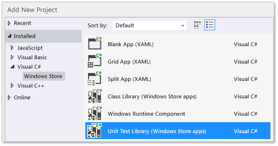
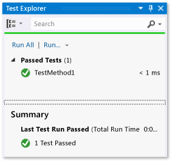
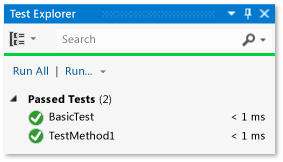
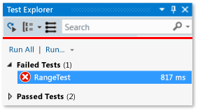

# Unit testing Visual C# code in a Store app
[!INCLUDE[vs2017banner](../includes/vs2017banner.md)]

The latest version of this topic can be found at [Unit testing Visual C# code in a Store app](https://docs.microsoft.com/visualstudio/test/unit-testing-visual-csharp-code-in-a-store-app).  
  
This topic describes one way to create unit tests for a Visual C# class in a Windows Store app. The Rooter class demonstrates vague memories of limit theory from calculus by implementing a function that calculates an estimate of the square root of a given number. The Maths app can then use this function to show a user the fun things that can be done with math.  
  
 This topic demonstrates how to use unit testing as the first step in development. In this approach, you first write a test method that verifies a specific behavior in the system that you are testing and then you write the code that passes the test. By making changes in the order of the following procedures, you can reverse this strategy to first write the code that you want to test and then write the unit tests.  
  
 This topic also creates a single Visual Studio solution and separate projects for the unit tests and the DLL that you want to test. You can also include the unit tests directly in the DLL project, or you can create separate solutions for the unit tests and the DLL.  
  
> [!NOTE]
>  Visual Studio Community, Enterprise. and Professional provide additional features for unit testing.  
>   
>  -   Use any third-party and open source unit test framework that has created an add-on adapter for the Microsoft Test Explorer. You can also analyze and display code coverage information for the tests.  
> -   Run your tests after every build.  
> -   VS Enterprise also contains Microsoft Fakes, an isolation framework for managed code that helps you to focus your tests on your own code by substituting test code for system and third-party functionality.  
>   
>  For more information, see [Verifying Code by Using Unit Tests](http://msdn.microsoft.com/library/dd264975.aspx) in the MSDN Library.  
  
##  <a name="BKMK_In_this_topic"></a> In this topic  
 [Create the solution and the unit test project](#BKMK_Create_the_solution_and_the_unit_test_project)  
  
 [Verify that the tests run in Test Explorer](#BKMK_Verify_that_the_tests_run_in_Test_Explorer)  
  
 [Add the Rooter class to the Maths project](#BKMK_Add_the_Rooter_class_to_the_Maths_project)  
  
 [Couple the test project to the app project](#BKMK_Couple_the_test_project_to_the_app_project)  
  
 [Iteratively augment the tests and make them pass](#BKMK_Iteratively_augment_the_tests_and_make_them_pass)  
  
 [Debug a failing test](#BKMK_Debug_a_failing_test)  
  
 [Refactor the code](#BKMK_Refactor_the_code_)  
  
##  <a name="BKMK_Create_the_solution_and_the_unit_test_project"></a> Create the solution and the unit test project  
  
1.  On the **File** menu, choose **New**, and then choose **New Project**.  
  
2.  In the **New Project** dialog box, expand **Installed**, then expand **Visual C#** and choose **Windows Store**. Then choose **Blank App** from the list of project templates.  
  
3.  Name the project `Maths` and make sure **Create directory for solution** is selected.  
  
4.  In Solution Explorer, choose the solution name, choose **Add** from the shortcut menu, and then choose **New Project**.  
  
5.  In the **New Project** dialog box, expand **Installed**, then expand **Visual C#** and choose **Windows Store** . Then choose **Unit Test Library (Windows Store apps)** from the list of project templates.  
  
       
  
6.  Open UnitTest1.cs in the Visual Studio editor.  
  
    ```csharp  
  
    using System;  
    using System.Collections.Generic;  
    using System.Linq;  
    using System.Text;  
    using Microsoft.VisualStudio.TestPlatform.UnitTestFramework;  
    using Maths;  
  
    namespace RooterTests  
    {  
        [TestClass]  
        public class UnitTest1  
  
            [TestMethod]  
            public void TestMethod1()  
            {  
  
            }  
  
    ```  
  
     Note that:  
  
    1.  Each test is defined by using the `[TestMethod]`. A test method must return void and can't have any parameters.  
  
    2.  Test methods must be in a class decorated with the `[TestClass]` attribute.  
  
         When the tests are run, an instance of each test class is created. The test methods are called in an unspecified order.  
  
    3.  You can define special methods that are invoked before and after each module, class, or method. For more information, see [Using Microsoft.VisualStudio.TestTools.UnitTesting Members in Unit Tests](../test/using-microsoft-visualstudio-testtools-unittesting-members-in-unit-tests.md) in the MSDN Library.  
  
##  <a name="BKMK_Verify_that_the_tests_run_in_Test_Explorer"></a> Verify that the tests run in Test Explorer  
  
1.  Insert some test code in `TestMethod1` of the **UnitTest1.cs** file:  
  
    ```csharp  
  
    [TestMethod]  
    public void TestMethod1()  
    {  
        Assert.AreEqual(0, 0);  
    }  
  
    ```  
  
     Notice that the `Assert` class provides several static methods that you can use to verify results in test methods.  
  
2.  On the **Test** menu, choose **Run** and then choose **Run All**.  
  
     The test project builds and runs. The Test Explorer window appears, and the test is listed under **Passed Tests**. The Summary pane at the bottom of the window provides additional details about the selected test.  
  
       
  
##  <a name="BKMK_Add_the_Rooter_class_to_the_Maths_project"></a> Add the Rooter class to the Maths project  
  
1.  In Solution Explorer, choose the **Maths** project name. From the shortcut menu, choose **Add**, and then **Class**.  
  
2.  Name the class file `Rooter.cs`  
  
3.  Add the following code to the Rooter class **Rooter.cs** file:  
  
    ```csharp  
  
    public Rooter()  
    {  
    }  
  
    // estimate the square root of a number  
    public double SquareRoot(double x)  
    {  
        return 0.0;  
    }  
  
    ```  
  
     The `Rooter` class declares a constructor and the `SqareRoot` estimator method.  
  
4.  The `SqareRoot` method is only a minimal implementation, just enough to test the basic structure of the testing setup.  
  
##  <a name="BKMK_Couple_the_test_project_to_the_app_project"></a> Couple the test project to the app project  
  
1.  Add a reference to the Maths app to the RooterTests project.  
  
    1.  In Solution Explorer, choose the **RooterTests** project and then choose **Add Reference...** on the shortcut menu.  
  
    2.  On the **Add Reference - RooterTests** dialog box, expand **Solution** and choose **Projects**. Then select the **Maths** item.  
  
           
  
2.  Add a using statement to the UnitTest1.cs file:  
  
    1.  Open **UnitTest1.cs**.  
  
    2.  Add this code below the `using Microsoft.VisualStudio.TestPlatform.UnitTestFramework;` line:  
  
        ```csharp  
        using Maths;  
        ```  
  
3.  Add a test that uses the Rooter function. Add the following code to **UnitTest1.cpp**:  
  
    ```csharp  
    [TestMethod]  
    public void BasicTest()  
    {  
        Maths.Rooter rooter = new Rooter();  
        double expected = 0.0;  
        double actual = rooter.SquareRoot(expected * expected);  
        double tolerance = .001;  
        Assert.AreEqual(expected, actual, tolerance);  
    }  
  
    ```  
  
4.  Build the solution.  
  
     The new test appears in Test Explorer in the **Not Run Tests** node.  
  
5.  In Test Explorer, choose **Run All**.  
  
       
  
 You have set up the test and the code projects, and verified that you can run tests that run functions in the code project. Now you can begin to write real tests and code.  
  
##  <a name="BKMK_Iteratively_augment_the_tests_and_make_them_pass"></a> Iteratively augment the tests and make them pass  
  
1.  Add a new test:  
  
    ```csharp  
    [TestMethod]  
    public void RangeTest()  
    {  
        Rooter rooter = new Rooter();  
        for (double v = 1e-6; v < 1e6; v = v * 3.2)  
        {  
            double expected = v;  
            double actual = rooter.SquareRoot(v*v);  
            double tolerance = ToleranceHelper(expected);  
            Assert.AreEqual(expected, actual, tolerance);  
        }  
    }  
  
    ```  
  
    > [!TIP]
    >  We recommend that you do not change tests that have passed. Instead, add a new test, update the code so that the test passes, and then add another test, and so on.  
    >   
    >  When your users change their requirements, disable the tests that are no longer correct. Write new tests and make them work one at a time, in the same incremental manner.  
  
2.  In Test Explorer, choose **Run All**.  
  
3.  The test fails.  
  
       
  
    > [!TIP]
    >  Immediately after you have written it, verify that each test fails. This helps you avoid the easy mistake of writing a test that never fails.  
  
4.  Enhance the code under test so that the new test passes. Change the `SqareRoot` function in **Rooter.cs** to this:  
  
    ```csharp  
    public double SquareRoot(double x)  
    {  
        double estimate = x;  
        double diff = x;  
        while (diff > estimate / 1000)  
        {  
            double previousEstimate = estimate;  
            estimate = estimate - (estimate * estimate - x) / (2 * estimate);  
            diff = Math.Abs(previousEstimate - estimate);  
        }  
        return estimate;  
    }  
  
    ```  
  
5.  Build the solution and then in Test Explorer, choose **Run All**.  
  
     All three tests now pass.  
  
> [!TIP]
>  Develop code by adding tests one at a time. Make sure that all the tests pass after each iteration.  
  
##  <a name="BKMK_Debug_a_failing_test"></a> Debug a failing test  
  
1.  Add another test to **UnitTest1.cs**:  
  
    ```csharp  
    // Verify that negative inputs throw an exception.  
    [TestMethod]  
    public void NegativeRangeTest()  
    {  
        string message;  
        Rooter rooter = new Rooter();  
        for (double v = -0.1; v > -3.0; v = v - 0.5)  
        {  
            try  
            {  
                // Should raise an exception:  
                double actual = rooter.SquareRoot(v);  
  
                message = String.Format("No exception for input {0}", v);  
                Assert.Fail(message);  
            }  
            catch (ArgumentOutOfRangeException ex)  
            {  
                continue; // Correct exception.  
            }  
            catch (Exception e)  
            {  
                message = String.Format("Incorrect exception for {0}", v);  
                Assert.Fail(message);  
            }  
        }  
    }  
  
    ```  
  
2.  In Test Explorer, choose **Run All**.  
  
     The test fails. Choose the test name in Test Explorer. The failed assertion is highlighted. The failure message is visible in the detail pane of Test Explorer.  
  
       
  
3.  To see why the test fails, step through the function:  
  
    1.  Set a breakpoint at the start of the `SquareRoot` function.  
  
    2.  On the shortcut menu of the failed test, choose **Debug Selected Tests**.  
  
         When the run stops at the breakpoint, step through the code.  
  
    3.  Add code to the Rooter method to catch the exception:  
  
        ```csharp  
        public double SquareRoot(double x)  
        {  
            if (x < 0.0)  
            {  
                throw new ArgumentOutOfRangeException();  
        }  
  
        ```  
  
    1.  In Test Explorer, choose **Run All** to test the corrected method and make sure that you haven't introduced a regression.  
  
 All tests now pass.  
  
   
  
##  <a name="BKMK_Refactor_the_code_"></a> Refactor the code  
 **Simplify the central calculation in the SquareRoot function.**  
  
1.  Change the result implementation  
  
    ```csharp  
    // old code  
    //result = result - (result*result - v)/(2*result);  
    // new code  
    result = (result + v/result) / 2.0;  
  
    ```  
  
2.  Choose **Run All** to test the refactored method and make sure that you haven't introduced a regression.  
  
> [!TIP]
>  A stable set of good unit tests gives confidence that you have not introduced bugs when you change the code.  
  
 **Refactor the test code to eliminate duplicated code.**  
  
 Note that the `RangeTest` method hard codes the denominator of the tolerance variable that is used in the `Assert` method. If you plan to add additional tests that use the same tolerance calculation, the use of a hard-coded value in multiple locations could lead to errors.  
  
1.  Add a private method to the Unit1Test class to calculate the tolerance value and then call that method instead.  
  
    ```csharp  
    private double ToleranceHelper(double expected)  
    {  
        return expected / 1000;  
    }  
  
    ...  
  
    [TestMethod]  
    public void RangeTest()  
    {  
        ...  
        // old code  
        // double tolerance = expected/1000;  
        // new code  
        double tolerance = ToleranceHelper(expected);  
        Assert.AreEqual(expected, actual, tolerance);  
    }  
    ...  
  
    ```  
  
2.  Choose **Run All** to test the refactored method and make sure that you haven't introduced an error.  
  
> [!NOTE]
>  To add a helper method to a test class, do not add the `[TestMethod]` attribute to the method. Test Explorer does not register the method to be run.


