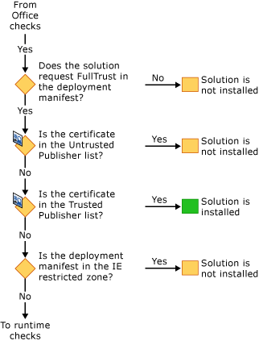
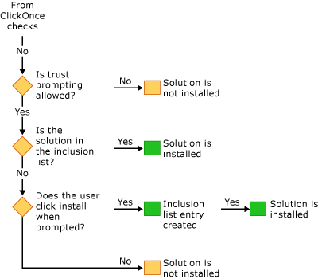

# Securing Office Solutions
  The security model for Office solutions involves several technologies: the [!INCLUDE[vsto_runtime](../vsto/includes/vsto-runtime-md.md)], [!INCLUDE[ndptecclick](../vsto/includes/ndptecclick-md.md)], the Trust Center in Microsoft Office, and the Internet Explorer restricted sites zone. The following sections describe how the different security features work:  
  
-   [Granting Trust to Office Solutions](#GrantingTrustToSolutions)  
  
-   [Granting Trust To Documents](#GrantingTrustToDocuments)  
  
-   [Granting Trust when using Windows Installer](#GrantingTrustWindowsInstaller)  
  
-   [Specific Security Considerations for Office Solutions](#Security)  
  
-   [Security During Development](#SecurityDuringDeployment)  
  
-   [Visual Studio Tools for Office Runtime](#VisualStudioToolsForOfficeRuntime)  
  
 [!INCLUDE[appliesto_all](../vsto/includes/appliesto-all-md.md)]  
  
##   Granting Trust to Office Solutions  
 Granting trust to Office solutions means modifying the security policy of each end user to trust the Office solution based on the following evidence:  
  
-   The certificate used to sign the deployment manifest.  
  
-   The URL of the deployment manifest.  
  
 For more information, see [Granting Trust to Office Solutions](../vsto/granting-trust-to-office-solutions.md).  
  
##   Granting Trust to Documents  
 A document-level customization requires that the document be in a directory that is designated as a trusted location. For more information, see [Granting Trust to Documents](../vsto/granting-trust-to-documents.md).  
  
##   Granting Trust when using Windows Installer  
 You can use Windows Installer to create an MSI file to install Office solutions into the Program Files directory, which requires administrator rights. For Office solutions in the Program Files directory, the Visual Studio 2010 Tools for Office Runtime considers these Office solutions to be trusted and does not show the ClickOnce trust prompt.  
  
##   Specific Security Considerations for Office Solutions  
 The security features provided by the [!INCLUDE[net_v40_short](../sharepoint/includes/net-v40-short-md.md)], the [!INCLUDE[net_v45](../vsto/includes/net-v45-md.md)], and Microsoft Office can help to protect against a variety of possible security threats in Office solutions. For more information, see [Specific Security Considerations for Office Solutions](../vsto/specific-security-considerations-for-office-solutions.md).  
  
##   Security During Development  
 To make your development process easier, Visual Studio sets the security policy that is required to run and debug your solution on your computer every time that you build a project. In some scenarios, you might need to take additional security steps to develop the project.  
  
### Document-Level Solutions  
 The fully qualified path of a document must be added to the list of trusted locations in the Microsoft Office application if you are developing the following types of projects:  
  
-   Document-level solutions that are on a network file share such as *\\\servername\sharename*.  
  
-   Document-level solutions for Word that use .doc or .docm files.  
  
 Include the subdirectories when you add the document location to the trusted locations list, or specifically include the debug and build folders. For more information, see the Microsoft Office Online Help article [Create, remove, or change a trusted location for your files](https://support.office.com/en-au/article/Create-remove-or-change-a-trusted-location-for-your-files-f5151879-25ea-4998-80a5-4208b3540a62).  
  
### Temporary Certificates  
 Visual Studio creates a temporary certificate if a signing certificate does not already exist. You should use this temporary certificate only during development, and purchase an official certificate for deployment.  
  
 The temporary certificate is generated after an Office project is first built. The next time you press F5, the project is rebuilt because the project is marked as changed when the certificate is added.  
  
 There can be many temporary certificates after a while, so you should clear the temporary certificates occasionally.  
  
##   Visual Studio Tools for Office Runtime  
 The [!INCLUDE[vsto_runtime](../vsto/includes/vsto-runtime-md.md)] has features to verify the identity of the publisher and the permissions that are granted to a customization. It verifies these permissions through a sequence of security checks.  
  
### Security During Customization Loading  
 When a document-level customization is loaded, the [!INCLUDE[vsto_runtime](../vsto/includes/vsto-runtime-md.md)] always checks whether the document is in the trusted locations list. In addition, the runtime checks whether the solution requests FullTrust in the application manifest. It performs no additional security checks while the customization is loading.  
  
### Sequence of Security Checks During Installation  
 When an Office solution is installed or updated, the [!INCLUDE[vsto_runtime](../vsto/includes/vsto-runtime-md.md)] performs a set of security checks in a specific sequence to make a trust decision. A solution is installed or updated only if the runtime determines that the solution is trusted.  
  
 You can start the installation process in one of four ways: by running the Setup program, by opening the deployment manifest, by opening the Microsoft Office application host, or by running VSTOInstaller.exe.  
  
 The first security check applies only to document-level solutions. The document of a document-level solution must be in a trusted location. If the document is on a remote network file share or has a .doc or .docm file name extension, the document's location must be added to the trusted locations list. For more information, see [Granting Trust to Documents](../vsto/granting-trust-to-documents.md).  
  
   
  
 The next set of security checks are from the [!INCLUDE[vsto_runtime](../vsto/includes/vsto-runtime-md.md)] and ClickOnce. To pass these checks, Office solutions must request FullTrust permissions, be signed with a certificate that is not listed in the Untrusted Publisher list, and be in a location that is not in the Internet Explorer restricted zone. If the certificate is in the Trusted Publisher list, then the solution is installed immediately. Otherwise, if it did not fail one of the checks, the solution continues to the final set of checks.  
  
   
  
 If the [!INCLUDE[ndptecclick](../vsto/includes/ndptecclick-md.md)] trust prompt is allowed and the solution has not yet been granted trust, the runtime will allow the trust decision to be made by the end user. If the user grants trust to the solution, an entry is added to the user inclusion list. All solutions in the user inclusion list have full trust and can be installed and run.  
  
 Starting in Visual Studio 2010, the inclusion list is bypassed if the Office solution is installed by using Windows Installer (MSI) into the Program Files directory. For more information, see [Trusting Office Solutions by Using Inclusion Lists](../vsto/trusting-office-solutions-by-using-inclusion-lists.md).  
  
   
  
## See Also  
 [Granting Trust to Office Solutions](../vsto/granting-trust-to-office-solutions.md)   
 [Granting Trust to Documents](../vsto/granting-trust-to-documents.md)   
 [Trusting Office Solutions by Using Inclusion Lists](../vsto/trusting-office-solutions-by-using-inclusion-lists.md)   
 [How to: Configure Inclusion List Security](../vsto/how-to-configure-inclusion-list-security.md)   
 [How to: Sign Office Solutions](../vsto/how-to-sign-office-solutions.md)   
 [Troubleshooting Office Solution Security](../vsto/troubleshooting-office-solution-security.md)   
 [Application Manifests for Office Solutions](../vsto/application-manifests-for-office-solutions.md)   
 [Deployment Manifests for Office Solutions](../vsto/deployment-manifests-for-office-solutions.md)   
 [ClickOnce Reference](/visualstudio/deployment/clickonce-reference)   
 [Deploying an Office Solution](../vsto/deploying-an-office-solution.md)  
  
  