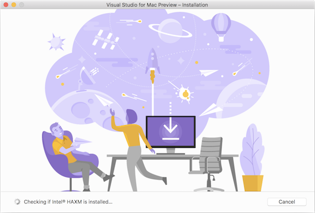
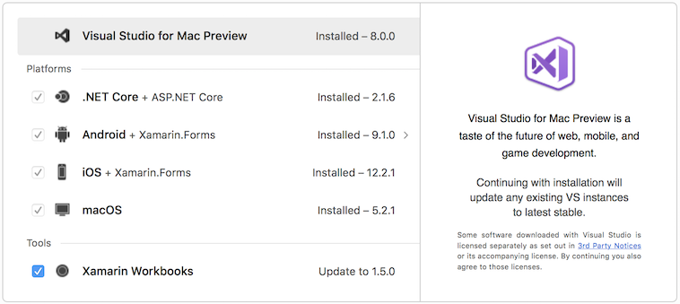
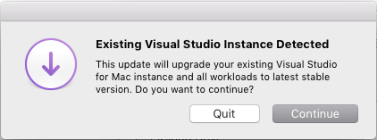
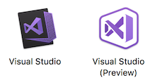

# Set up and install Visual Studio 2019 for Mac Preview

> [!TIP]
> Visual Studio 2019 for Mac preview is available to install side-by-side with the latest stable release of Visual Studio for Mac. During installation you will be prompted to update your existing Visual Studio if it is not the latest stable version.

## Requirements for the Visual Studio 2019 for Mac preview

- A Mac with macOS High Sierra 10.13 or above.

To build Xamarin apps for iOS or macOS, you'll also need:

- Xcode 10.0 or above. The latest stable version is usually recommended.
- An Apple ID. If you don't have an Apple ID already you can create a new one at https://appleid.apple.com. It's necessary to have an Apple ID for installing and signing into Xcode.

## Installing the preview

1. Download the preview installer from the [Visual Studio for Mac preview page](https://aka.ms/vs4mac-preview).
2. Once the download is complete, click the **VisualStudioforMacPreviewInstaller.dmg** to mount the installer, then run it by double-clicking the arrow logo:

    

3. You may be presented with a warning about the application being downloaded from the Internet. Click **Open**.
4. Wait while the installer checks your system:

    

5. An alert will appear asking you to acknowledge the privacy and license terms. Follow the links to read them, then press **Continue** if you agree:

    

6. The list of available workloads is displayed. Select the ones you wish to use:

    

    If your current Visual Studio for Mac 2017 is older than version 7.7, you will be asked to approve an upgrade to the latest stable version (which is required to support side-by-side installation). Press **Continue** to approve the upgrade:

    

7. After you have made your selections, press the **Install** button.
8. The installer will display progress as it downloads and installs Visual Studio for Mac and the selected workloads. You might be prompted to enter your password to grant the privileges necessary for installation.
9. Use the **Visual Studio (Preview)** anytime you want to test the preview version, or switch back to the latest stable Visual Studio for your production work. The two icons are shown here:

    

If you have network trouble while installing in a corporate environment, review the [installing behind a firewall or proxy](https://docs.microsoft.com/visualstudio/mac/installation#install-visual-studio-for-mac-behind-a-firewall-or-proxy-server) instructions.

Learn more about the changes in the [release notes](https://docs.microsoft.com/visualstudio/releasenotes/vs2019-mac-preview-relnotes).

> [!NOTE]
> If you chose not install a platform or tool during the original installation (by unselecting it in step #6), you must run the installer again if you wish to add the components later.

## Install Visual Studio for Mac behind a firewall or proxy server

To install Visual Studio for Mac behind a firewall, certain endpoints must be made accessible in order to allow downloads of the required tools and updates for your software.

Configure your network to allow access to the following locations:

- [Visual Studio endpoints](/visualstudio/install/install-visual-studio-behind-a-firewall-or-proxy-server)

## Next steps

Installing Visual Studio for Mac allows you to start writing code for your apps. The following guides are provided to guide you through the next steps of writing and deploying your projects.

### iOS

1. [Hello, iOS](https://developer.xamarin.com/guides/ios/getting_started/hello,_iOS/)
2. [Device Provisioning](https://developer.xamarin.com/guides/ios/getting_started/installation/device_provisioning)(To run your application on device).

### Android

1. [Using the Xamarin Android SDK Manager](https://developer.xamarin.com/guides/android/getting_started/installation/android-sdk/?ide=xs)
2. [Android SDK Emulator](https://developer.xamarin.com/guides/android/getting_started/installation/android-emulator/)
4. [Set Up Device for Development](https://developer.xamarin.com/guides/android/getting_started/installation/set_up_device_for_development/)

### .NET Core apps, ASP.NET Core web apps, Unity game development

For other Workloads, refer to the [Workloads](/visualstudio/mac/workloads) page.

## See also

- [Install Visual Studio 2017 (on Windows)](/visualstudio/install/install-visual-studio)