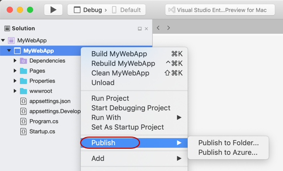
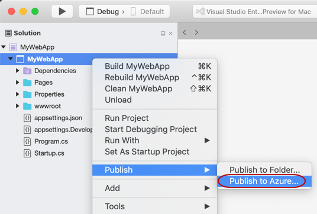
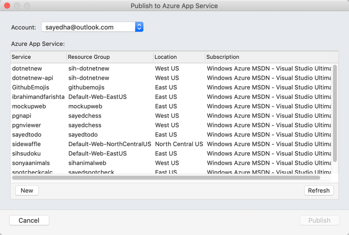
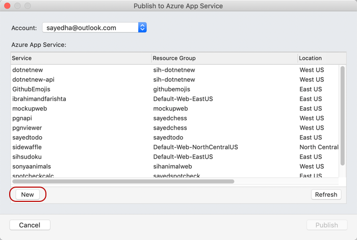
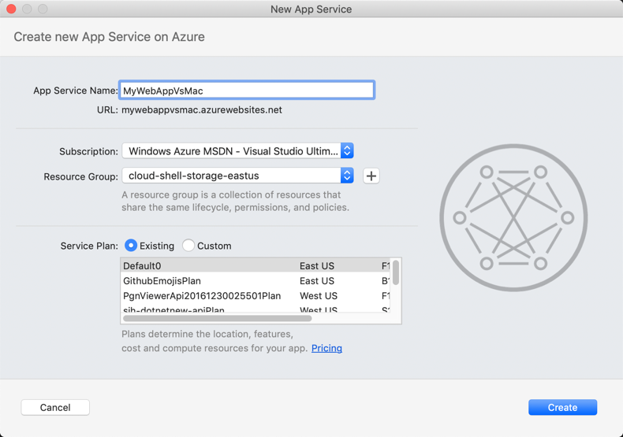

# Publish a Web app to Azure App Service using Visual Studio for Mac

You can use the Publish tool to publish ASP.NET Core apps to Azure App Service.

## Prerequisites

 - [Visual Studio 2017 for Mac](https://visualstudio.microsoft.com/downloads/?utm_medium=microsoft&utm_source=docs.microsoft.com&utm_campaign=button+cta&utm_content=download+vs4mac2017) installed with ASP.NET Core enabled.
 - An Azure Subscription. If you do not already have a subscription, [sign up for free](https://azure.microsoft.com/free/dotnet/), which includes $200 in credit for 30 days and 12 months of popular free services.
 - An ASP.NET Core project. If you don’t already have a project, you can [create a new one](https://docs.microsoft.com/en-us/visualstudio/mac/create-new-projects?view=vsmac-2017).

## Publish to Azure App Service

 1. In the Solution Pad, right-click the project and choose **Publish**.

    

 2. If you have previously published this project to Azure App Service, you'll see the publish profile in the menu. Select that publish profile to start the publish process.

 3. To publish this project to App Service for the first time, select **Publish to Azure**

    

 4. The **Publish to Azure App Service** dialog appears, and any existing App Services are shown. To publish to an existing App Service, select the App Service in the list and then click **Publish**.

    

 5. To create a new App Service, click the **New** button. 

    

 6. The **New App Service** dialog appears. In this dialog you can configure the settings for your new App Service.

    

    There are a few options to consider customizing here. The name of the App Service will default to the project name. If the name is not available a warning sign will appear on the right hand side of the input field. The name of the App Service will be used in the URL of your website, so the name must be valid to be used in a URL.

    You can change the subscription that the App Service will be associated with using the **Subscription** dropdown.

    You can select an existing **Resource Group** using the dropdown or you can create a new one with the **+** button.

    For the App Service plan, select and existing one, or create a new one by selecting the **Custom** radio button.

    To create your new App Service, and publish your project to it, click Create.

    After clicking **Create** the **New App Service** dialog will be dismissed, and you should see the following message indicating that creating the App Service has started.

      

    After clicking **OK** the message is dismissed, and you can continue working on your project. You can watch the status of the publish process with the status bar at the top of the IDE. Once your web app is successfully published, the site is opened with your default browser.