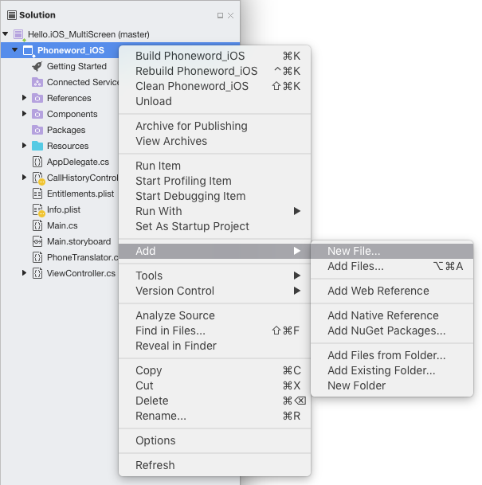
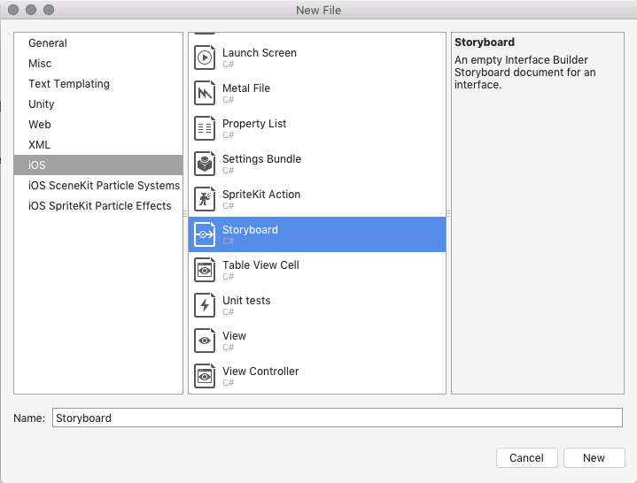
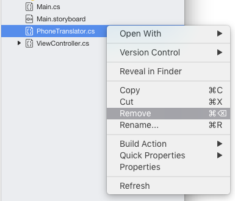

# Adding and Removing Project Items

You can add new project items to your project by right-clicking on the Project node in the **Solution Pad** and browsing to **Add > New File**:

This displays the New File Dialog, which provides file templates based on the type of application that you are creating in addition to the default templates, such as Empty Classes or Empty Enumerations. For example, if you are writing an iOS application, you can select **Storyboard** to create a new empty Storyboard file:

## Adding existing files

You can add existing files to your project by right-clicking on the Project node and selecting **Add > Add Files…**. Alternatively, to add an entire folder, select **Add > Add Existing Folder…**. This displays the file browser, which lets you search your system for the required item to add.

## Removing items

To remove an item from your current project, right-click the item and select **Remove**

This displays the delete item dialog. Select one of the options to remove it from the project:

* **Delete** – Removes item from project and from disk.
* **Remove from Project** – Removes item from project, but will not remove it from disk 