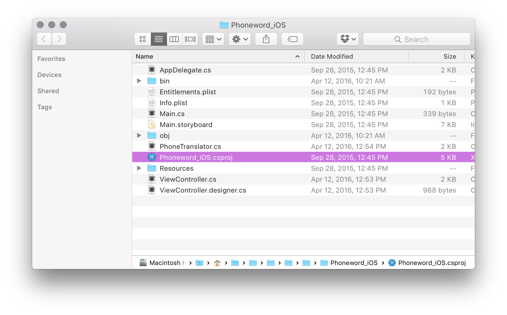
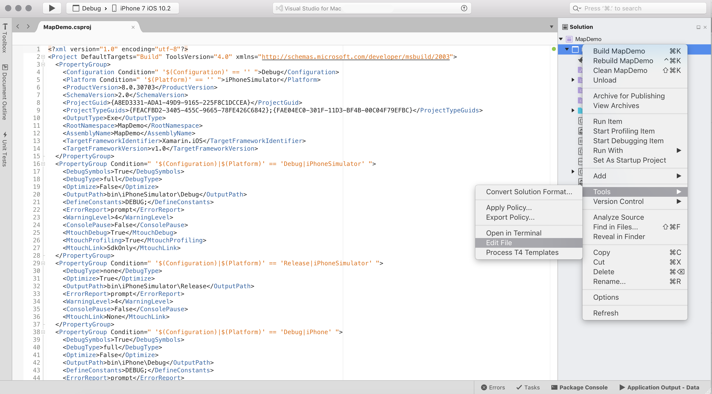

# Customizing the build system

MSbuild is a build engine, developed by Microsoft, that allows for the building of primarily .NET applications. The Mono framework also has its own implementation of Microsoft's Build Engine, called **xbuild**. However, xbuild has been phased out, in favor of using MSBuild on all operating systems.

**MSbuild** is primarily used for as the build system for projects in Visual Studio for Mac. 

MSBuild works by taking a set of inputs, such as source files, and transforms them to outputs, such as executables. It achieves this output by invoking tools such as the compiler. 


## MSBuild file

MSBuild uses an XML file, called a project file, that defines the *Items* that are part of your project (such as image resources), and the *Properties* required to build your project. This project file will always have a file extension ending in `proj`, such as `.csproj` for C# projects. 

### Viewing the MSBuild file

Locate the MSBuild file by right-clicking on your project name and selecting **Reveal in Finder**. The finder window displays all the files and folders related to your project, including the `.csproj` file, as illustrated in the following image:



To display the `.csproj` in a new tab in Visual Studio for Mac, right-click on your project name and browse to **Tools > Edit File**:



### Composition of the MSBuild file

All MSBuild files contain a mandatory root `Project` element, like so:

```xml
<?xml version="1.0" encoding="utf-8"?>
<Project ToolsVersion="14.0" xmlns="http://schemas.microsoft.com/developer/msbuild/2003">
</Project>
```

Typically, the project will also import a `.targets` file. This file contains many of the rules that describe how to process and build the various files. The import usually appear towards the bottom of your `proj` file, and for C# projects look something like this:

```xml
<Import Project="$(MSBuildBinPath)\Microsoft.CSharp.targets" />
```

The targets file is another MSBuild file. This file contains MSBuild code that is reusable by multiple projects. For example, the `Microsoft.CSharp.targets` file, which is found in a directory represented by the `MSBuildBinPath` property (or variable), contains the logic for building C# assemblies from C# source files.

### Items and properties

There are two fundamental data types in MSBuild: *items* and *properties*, which are explained in more detail in the following sections.

#### Properties

Properties are key/value pairs, which are used to store settings that affect compilation, such as compiler options.

They are set using a PropertyGroup and can contain any number of PropertiesGroups, which can contain any number of properties. 

For example, the PropertyGroup for a simple console application might look like the following XML:

```xml
<PropertyGroup>
		<Configuration Condition=" '$(Configuration)' == '' ">Debug</Configuration>
		<Platform Condition=" '$(Platform)' == '' ">x86</Platform>
		<ProjectGuid>{E248730E-1393-43CC-9183-FFA42F63BE81}</ProjectGuid>
		<OutputType>Exe</OutputType>
		<RootNamespace>refactoring</RootNamespace>
		<AssemblyName>refactoring</AssemblyName>
		<TargetFrameworkVersion>v4.5</TargetFrameworkVersion>
	</PropertyGroup>
```

Properties can be referred to from expressions using the `$()` syntax. For example, `$(Foo)` will be evaluated as the value of the `Foo` property. If the property has not been set, it will evaluate as an empty string, without any error.

#### Items

Items provide a way of dealing with inputs into the build system as lists or sets, and typically represent files. Each item has an item *type*, an item *spec*, and optional arbitrary *metadata*. Note that MSBuild doesn't operate on individual items, it takes on all the items of a given type-called an item *set*

Items are created by declaring an `ItemGroup`. There can be any number of ItemGroups, which can contain any number of items. 

For example, the following code snippet creates the iOS Launch Screens. The Launch Screens have the build type `BundleResource`, with the spec as the path to the image:

```xml
 <ItemGroup>
    <BundleResource Include="Resources\Default-568h%402x.png" />
    <BundleResource Include="Resources\Default%402x.png" />
    <BundleResource Include="Resources\Default.png" />
    <BundleResource Include="Resources\Default-Portrait.png" />
    <BundleResource Include="Resources\Default-Portrait%402x.png" />
    <BundleResource Include="Resources\Default-Landscape%402x.png" />
  </ItemGroup>
 ```

 Item sets can be referred to from expressions using the `@()` syntax. For example, `@(BundleResource)` will be evaluated as the BundleResource item set, which means all of the BundleResource items. If there are no items of this type, it will be empty, without any error.

## Resources for learning MSBuild

The following resources can be used to learn about MSBuild in more detail:

* [MSDN - Overview](https://msdn.microsoft.com/library/dd393574.aspx)
* [MSDN - Concepts](https://msdn.microsoft.com/library/dd637714.aspx)
