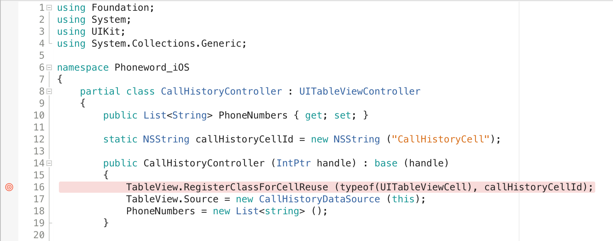
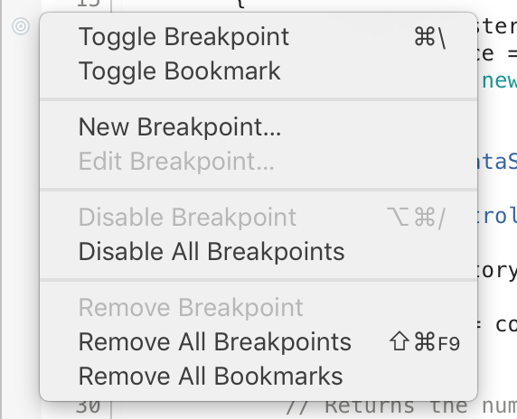
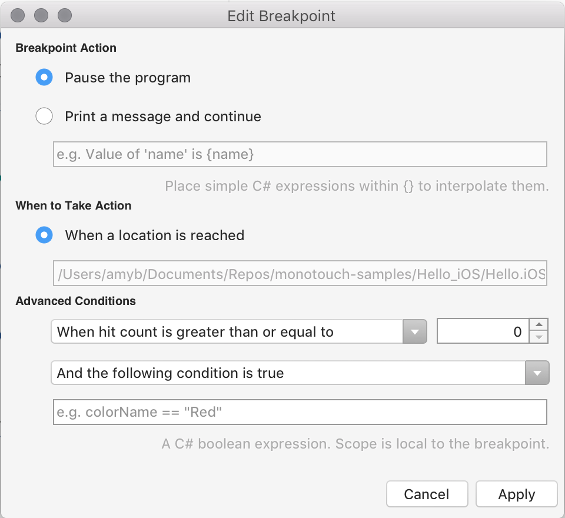
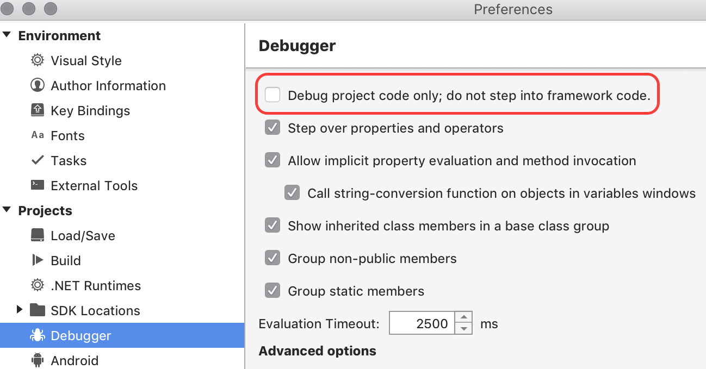

# Debugging with Xamarin

Visual Studio for Mac has a native debugger allowing debugging support for Xamarin.iOS, Xamarin.Mac, and Xamarin.Android applications.

Visual Studio for Mac uses the [*Mono Soft Debugger*](http://www.mono-project.com/docs/advanced/runtime/docs/soft-debugger/), which is implemented into the Mono runtime, allowing Visual Studio for Mac to debug managed code across all platforms.

## The Debugger

Visual Studio for Mac uses the Mono Soft Debugger to debug managed (C# or F#) code in all Xamarin applications. The Mono Soft debugger is different from regular debuggers in that it is a co-operative debugger that is built into the Mono runtime; the generated code and Mono runtime co-operate with the IDE to provide a debugging experience. The Mono runtime exposes the debugging functionality through a wire protocol, which you can read more about [in the Mono documentation](http://www.mono-project.com/docs/advanced/runtime/docs/soft-debugger-wire-format/).

Hard debuggers, such as [LLDB]( http://lldb.llvm.org/index.html) or [GDB]( https://www.gnu.org/software/gdb/), control a program without the knowledge or cooperation from the debugged program, but can still be useful when debugging Xamarin applications in the event that you need to debug native iOS or Android code.

## Using the debugger

To start debugging any application, always ensure that the configuration is set to  **Debug**. The debug configuration provides a helpful set of tools to support debugging, such as breakpoints, using data visualizers, and viewing the call stack:

## Setting a breakpoint

To set a breakpoint in your IDE, click on the margin area of your editor, next to the line number of the code where you wish to break:

You can view all the breakpoints that have been set in your code by going to the  **Breakpoints pad**:

## Start debugging

To start debugging, select the target device or similar/emulator in your IDE:

Then deploy your application by pressing the  **Play** button, or  **Cmd + return**. When you hit a breakpoint, the code will be highlighted yellow:

Debugging tools, such as the one used to inspect the values of objects, can be used at this point to get more information about what is happening in your code:

## Conditional breakpoints

You can also set rules dictating the circumstances under which a breakpoint should occur, this is known as adding a *conditional breakpoint*. To set a conditional breakpoint, access the  **Breakpoint Properties window**, which can be done in two ways:

* To add a new conditional breakpoint, right-click on the editor margin, to the left of the line number for the code you wish to set a breakpoint on, and select New Breakpoint:

 

* To add a condition to an existing breakpoint, right-click on the breakpoint and select  **Breakpoint Properties**, or, in the  **Breakpoints Pad**, select the Edit Breakpoint button illustrated below:

 

You can then enter the condition under which you want the breakpoint to occur:

 

## Stepping through code

When a breakpoint has been reached, the Debug tools enable you to get control over the program's execution. Visual Studio for Mac will display four buttons, allowing you to run and step through the code. In Visual Studio for Mac, they will look like the following:

 

Here are the four buttons:

*	**Play** - This will begin executing the code, until the next breakpoint.
*	**Step Over** - This will execute the next line of code. If the next line is a function call, Step Over will execute the function, and will stop at the next line of code *after* the function.
*	**Step Into** - This will also execute the next line of code. If the next line is a function call, Step Into will stop at the first line of the function, allowing you to continue line-by-line debugging of the function. If the next line is not a function, it will behave the same as Step Over.
*	**Step Out** - This will return to the line where the current function was called.

## Debugging Mono's class libraries

Xamarin products ship with the source code for Mono's class libraries, and you can use this to single step from the debugger to inspect how things are working under the hood.

Since this feature consumes more memory during debugging, it is turned off by default.

To enable this feature, browse to  **Visual Studio for Mac > Preferences > Debugger** and ensure that the "**Debug project code only; do not step into framework code.**" option is **unselected**, as illustrated below:

## See also

- [Debugging in Visual Studio (Windows)](/visualstudio/debugger/)