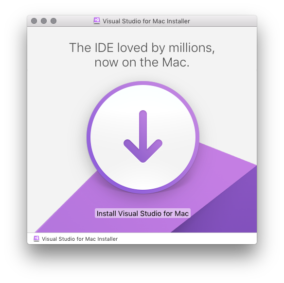
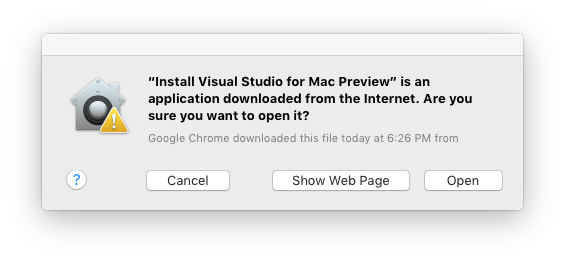
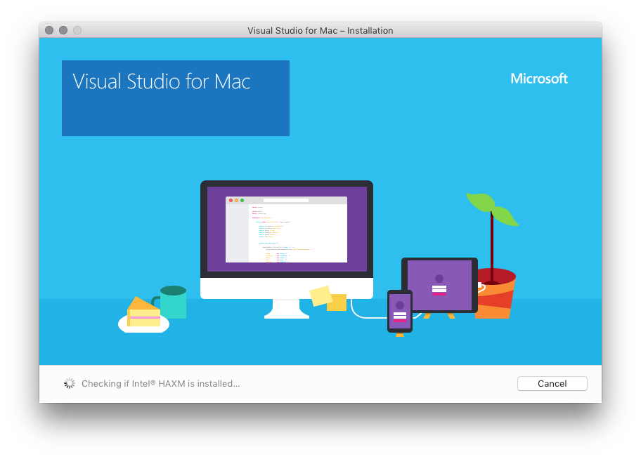
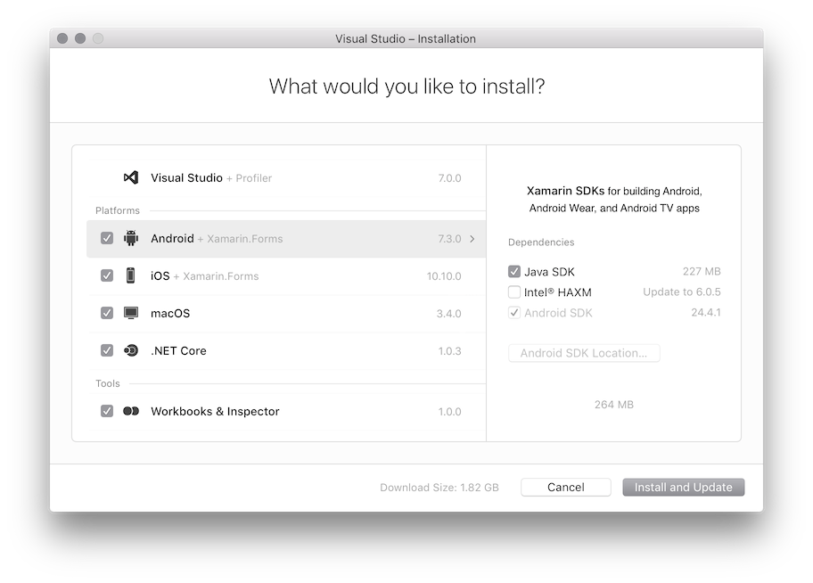
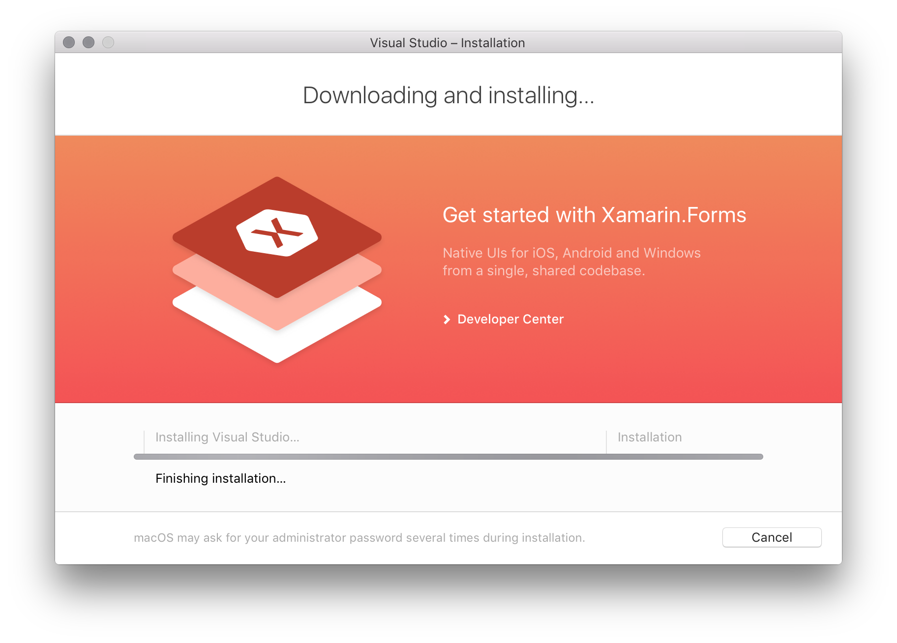
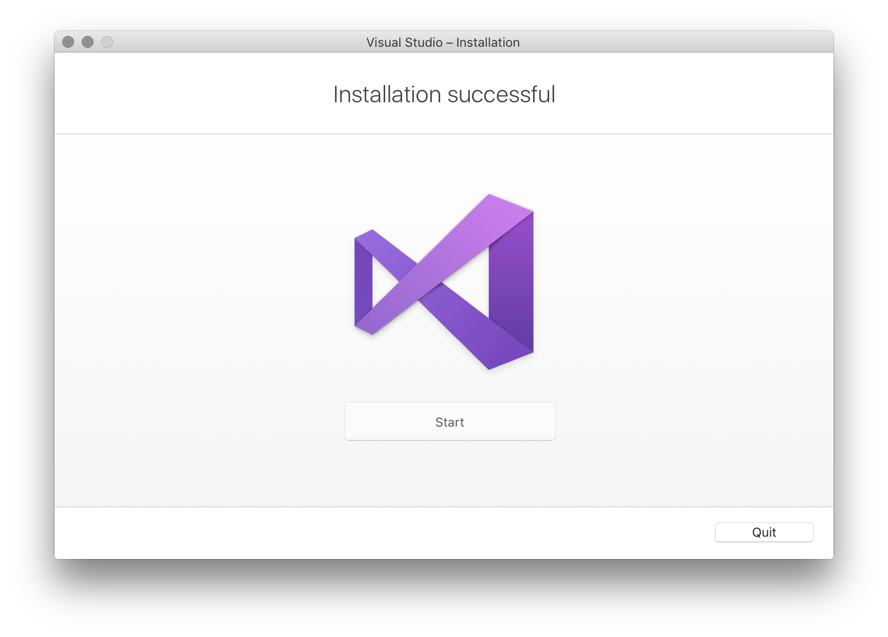

# Setup and Install Visual Studio for Mac

## Setup

To start developing native, cross-platform apps when you download Visual Studio for Mac there are a couple of things that you must install and set up in preparation.

For working with iOS in Visual Studio you need the following pieces:

* a Mac with macOS Sierra 10.12 or above
* Xcode 8.3
* An Apple ID. If you don't have an Apple ID already you can create a new one at https://appleid.apple.com. It's necessary yo have an Apple ID for installing and signing into Xcode.

## Install

1. Download Visual Studio for Mac from [https://www.visualstudio.com/](https://www.visualstudio.com/)

2. Once the installer package is downloaded, click the **VisualStudioInstaller.dmg** file to mount the installer and then run it by double-clicking the logo, as illustrated by the following image:

  

3. You might be prompted with an alert dialog similar to the following image. In this case, click **Open**:

  

4. The installer inspects your system to verify which components need to be installed or updated:

  

5. You'll then be presented with an alert dialog asking you to acknowledge the Privacy and License terms. Press the **Continue** button to acknowledge the terms:

  

6. The installer presents a list of required components that are missing and that need to be downloaded and installed. Select the products you wish to download here:

  

  This installation screen displays the version and size of each individual component. You can click each component to display a list of dependencies for that component (for Android), see additional packages that it downloads (for .NET Core), or view any additional applications required (for iOS and macOS):

  

7. Once you are happy with your selection, select the **Install and Update** button to start the installation process.

8. The installer starts the download and install process of the selected items:

  

  

  

9. You might be prompted to elevate the permissions necessary for individual components that are needed to complete installation. Enter your administrator credentials here to continue the installation process:

  

10. Once the installation is successful, you can start developing apps in Visual Studio by pressing **Start**:

  

> [!NOTE]
If you chose not install a platform or tool during the original installation (by unselecting it in step #6), you must run the [installer](https://www.visualstudio.com/vs/) again if you wish to add the components later.