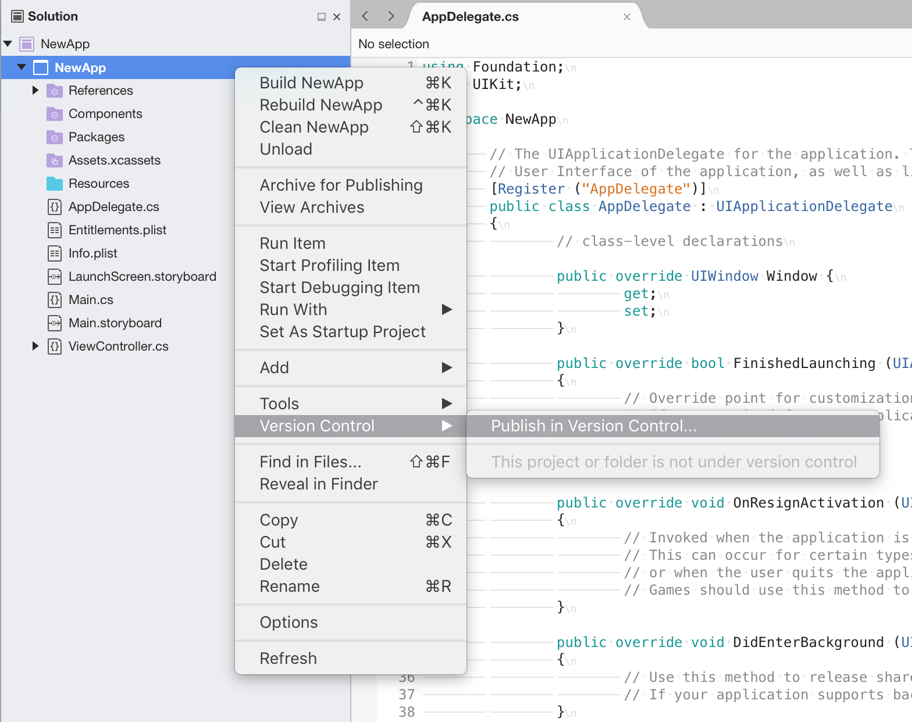
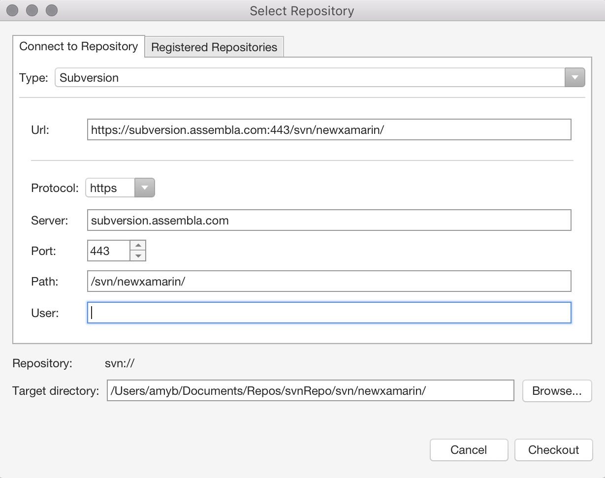
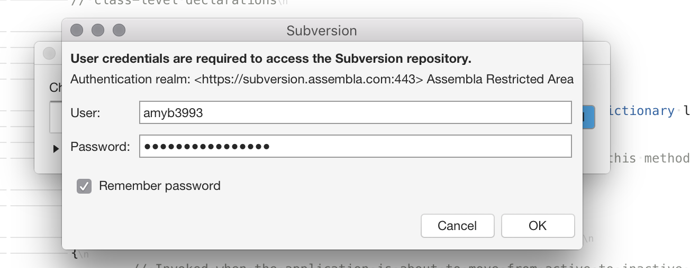

---
<<<<<<< HEAD
title: Setting Up a Subversion Repository
=======
title: Setting Up a Subversion Repository in Visual Studio for Mac
>>>>>>> MicrosoftDocs/master
description: Using Git and Subversion in Visual Studio for Mac.
author: asb3993
ms.author: amburns
ms.date: 04/14/2017
ms.assetid: 0D58FB37-530E-495B-BED6-FD499477A9B6
---

# Setting up a Subversion repository

Subversion is a centralized version control system. This means that there is a single server that contains all files and revisions from which users can check out any version of any file. When files are checked out from a remote Subversion repository, the user will get a snapshot of the repository at that point in time.

Before starting to use Subversion, the Xcode command line tools must be installed as they include the correct svn packages. You can check that SVN is installed in Terminal with the following command:

`svn h`

1. Create a free SVN repository online. For this example, [Assembla](https://app.assembla.com/) was used. Once created, a URL will be provided, which will be used to connect to the repository: 

    

2. Open or create a Visual Studio for Mac Project.

3. Right click on the Project and select **Version Control > Publish in Version Control...**: 

    

4. In the **Connect to Repository** tab, select **Subversion** from the top drop down.

5. Enter the URL from step 1. This should populate the other fields by default: 

    

7. Click **OK** and then confirm by pressing **Publish**.

7. You might be prompted to enter your credentials for the site on which you create the repository. Enter these as illustrated below:

    

8.	All the version control commands available should now be visible in the version control menu.

