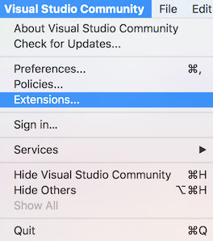
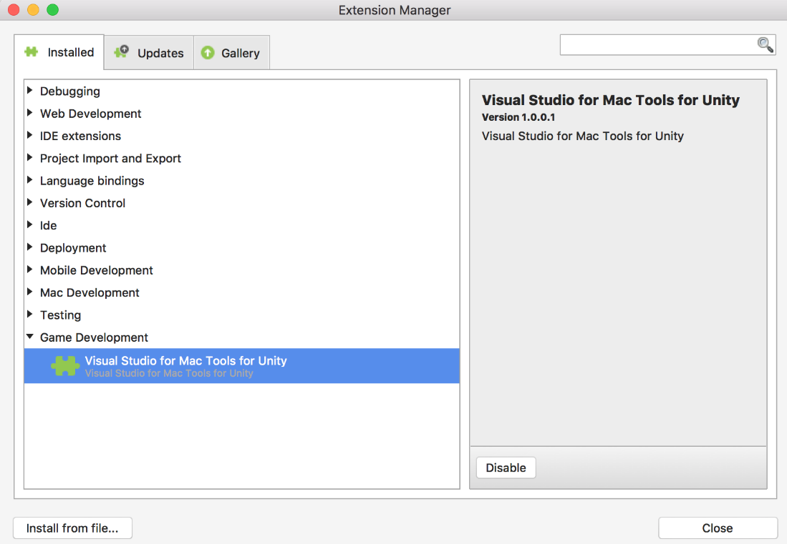
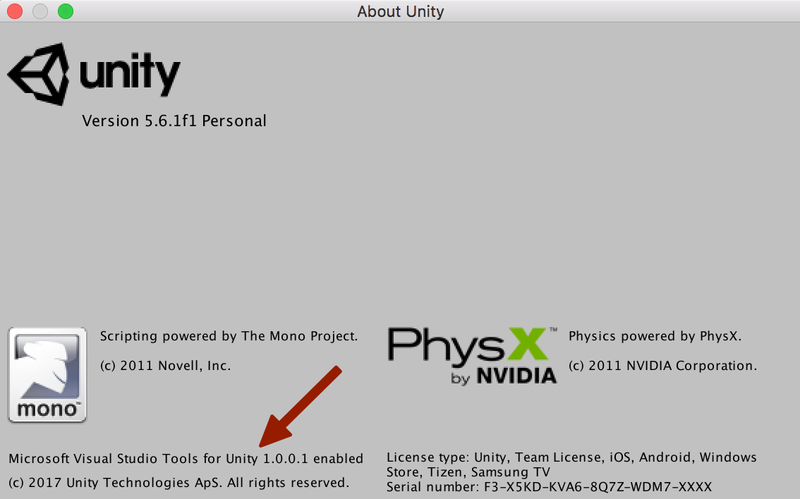
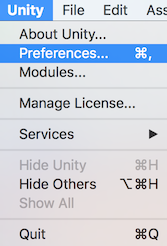
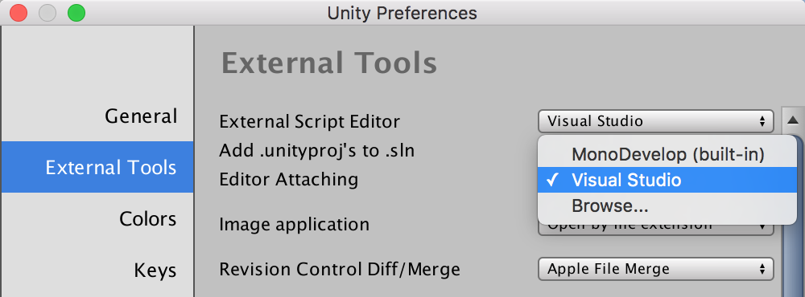
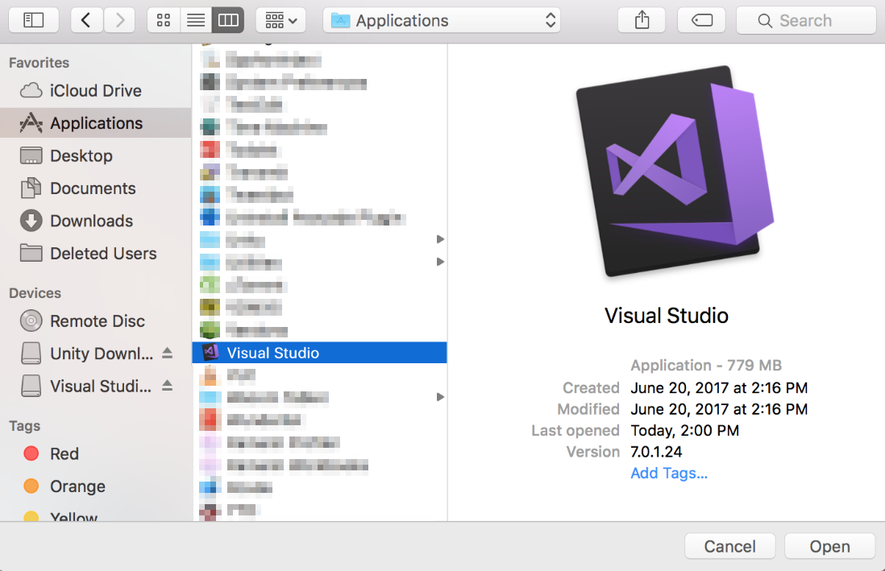

# Setup Visual Studio for Mac Tools for Unity

This section explains how to get started using Visual Studio for Mac Tools for Unity.

## Install Visual Studio for Mac

Download and install Visual Studio for Mac. All editions of Visual Studio for Mac support Visual Studio for Mac Tools for Unity, including the free Community edition:

* Download Visual Studio for Mac from [visualstudio.com](https://www.visualstudio.com/).
* Visual Studio for Mac Tools for Unity are installed automatically during the installation process.
* Follow the steps in the [installation guide](/visualstudio/mac/installation) for additional installation help.

## Confirm that the Visual Studio for Mac Tools for Unity extension is enabled

While the Visual Studio for Mac Tools for Unity extension should be enabled by default, you can confirm this and check the installed version number:

1.  From the Visual Studio menu, select **Extensions...**.

  

2.  Expand the Game Development section and confirm the Visual Studio for Mac Tools for Unity entry.

  

## Install Unity

Visual Studio for Mac Tools for Unity requires Unity version 5.6.1 or above. All Unity plans work with Visual Studio Tools for Unity, including the free Personal plan. Download Unity from [store.unity.com](https://store.unity.com/).

> [!NOTE]
> To verify that Visual Studio Tools for Unity are enabled in your version of Unity, select **About Unity** from the Unity menu and look for the text "Microsoft Visual Studio Tools for Unity enabled" in the bottom-left of the dialog.
>
>   

## Configure Unity for use with Visual Studio for Mac

Visual Studio must be set as the external script editor in Unity:

1.	Select **Preferences...** from the Unity menu.

  

2.	In the Preferences dialog, select the **External Tools** tab.

3.	From the External Script Editor dropdown list, choose **Visual Studio** if it is listed, otherwise select **Browse...**.

  

4.	If **Browse...** was selected, navigate to the Applications directory and select Visual Studio and then click **Open**.

  

5.	Once Visual Studio is selected in the **External Script Editor** list, close the Preferences dialog to complete the configuration process.
