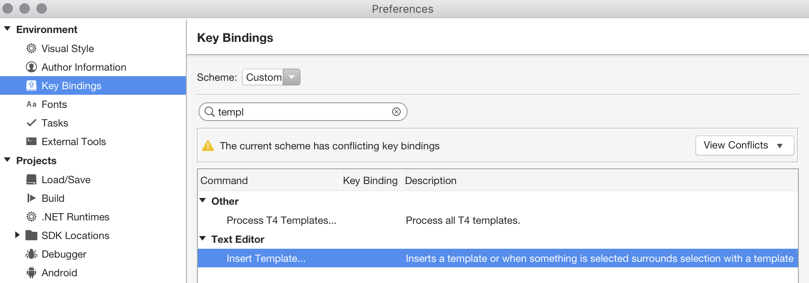
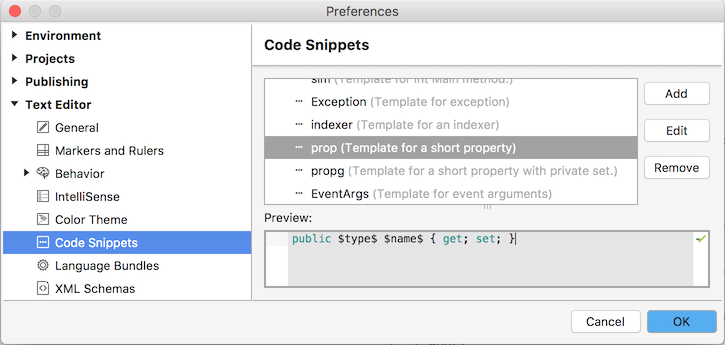

# Code Snippets 

Code snippets, often referred to as _code templates_, are useful for efficient programming as they allow the insertion and editing of pre-written blocks of code. Using code snippets can be particularly convenient for quickly adding common patterns, or even for learning new patterns when you the developer is unsure of syntax. There are templates provided for C#, F#, HTML XML, Python, and Razor.

This section will explain how to create, insert, and use snippets in code.

## Inserting a Snippet

There are some different ways to add code snippets, which are described below:
 
* **Tab Expansion** – Start typing the template name, select it from the list and press **TAB TAB** to add it:
 
  

* **Toolbox** – Use the toolbox pad to display a list of all code snippets. Drag any template from the toolbox into the correct position in the source code:

 

* **Insert Templates command** – There is currently no default keybinding set for inserting a template. To create one, browse to **Preferences > Key Bindings** and search for `template`. This allows adding the desired key binding into the Edit Binding field, then click **Apply**:

 

## Creating a new template

While there are many existing templates in a variety of languages that you can use and edit, new templates can also be added by navigating to **Visual Studio > Preferences > Text Editor > Code Snippets**:

