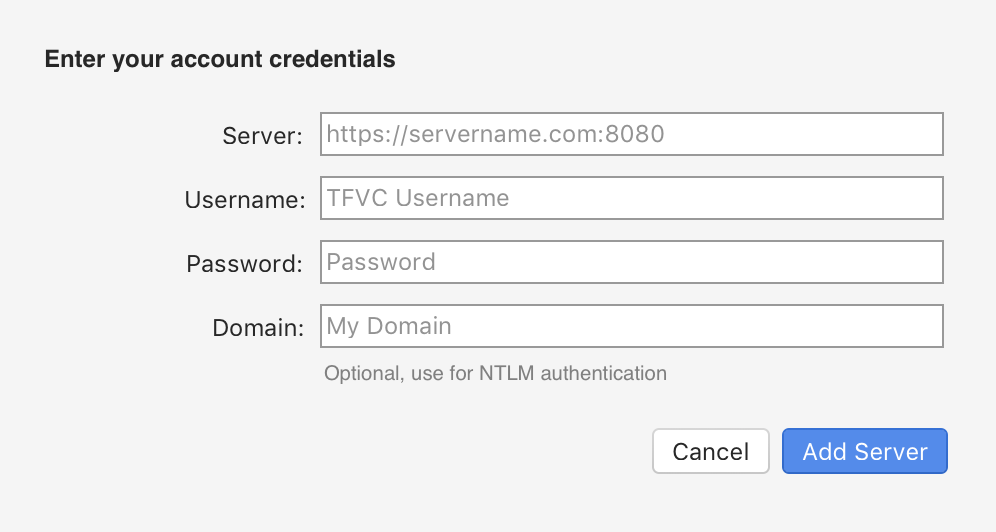
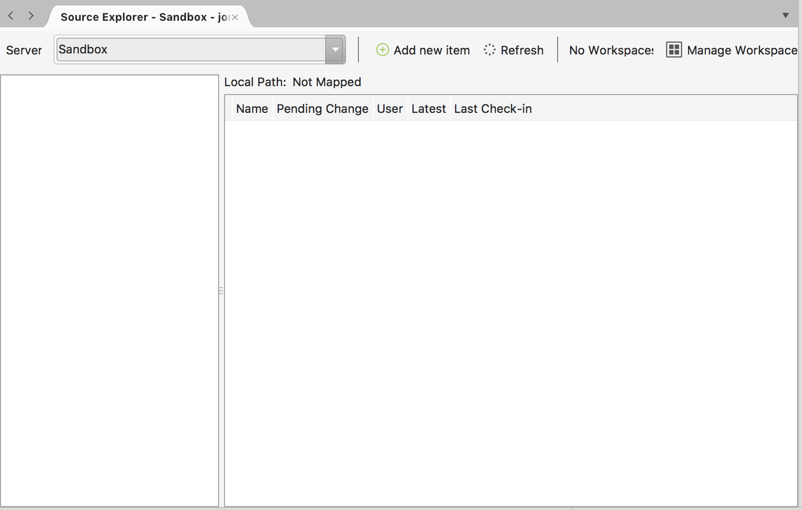
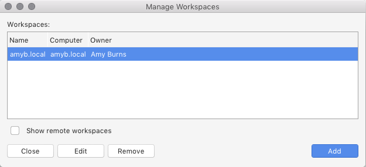
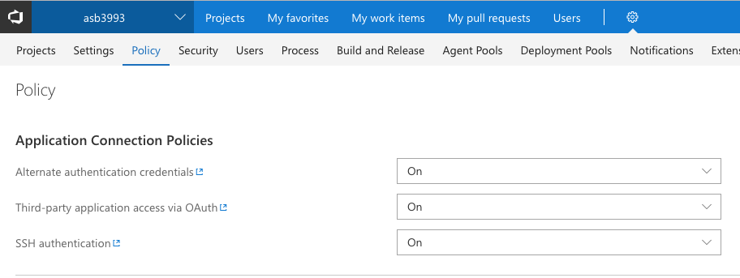

# Connecting to Team Foundation version control 

> [!NOTE]
> **Note**: Team Foundation Version Control support is currently in preview and some functionality is not yet fully working. We'd love feedback from you on any issues at [Developer Community](https://developercommunity.visualstudio.com/spaces/41/index.html). More changes are still to come!

Visual Studio Team Services (VSTS) and Team Foundation Server (TFS) provide two models of version control: Git, which is distributed version control, and Team Foundation Version Control (TFVC), which is centralized version control. This article provides an overview and a starting point for using Team Foundation Version Control with Visual Studio for Mac.

## Requirements

* Visual Studio for Mac version 7.5 or later.
* Visual Studio Team Services, or Team Foundation Server 2013 and later
* A Project in Visual Studio Team Services or Team Foundation Server, configured to use Team Foundation Version Control.

## Installation

In Visual Studio for Mac, choose **Visual Studio > Extensions...** from the menu. In the **Gallery** tab, select **Version Control > Team Foundation Version Control for TFS and VSTS** and click **Install…**:

   

Follow the prompts to install the extension. Once it's installed, restart the IDE.

## Using the add-in

Once the extension is installed, select the **Version Control > TFS/VSTS > Connect to Team Foundation Version Control...** menu item. Click **Add** to add a new account: 

Choose either Visual Studio Team Services or Team Foundation Server to get started:

Enter your credentials and click **Log in**: 

Once you've successfully logged in, select the projects that you want to access and press **OK**: 

Select the **Version Control > TFS/VSTS > Source Control Explorer** menu item to open the source control explorer allowing you to browse the source.

> [!IMPORTANT]
> **Known issue**: In this preview release, the first time you open source control explorer, you'll have to [create a new workspace](#creating-a-new-workspace).

From the Source Code Explorer, you can browse your source code on the server and perform the following actions:

- Manage Workspaces (Create, edit, or delete).
- Navigate between project structure.
- Map projects.
- Get projects.
- Lock & Unlock files.
- Rename files.
- Delete files.
- Add new file.
- Check out.
- Check in.
- View history changes.
- Compare changes.

## Creating a new workspace

In the Source Control Explorer, click on the **Manage Workspaces** button. 

Click the **Add**  button to create a new workspace.

Provide a name for the workspace and then click **Add Working Folder** to map the project to a local folder on your computer.

When done, click **OK**, then close the Manage Workspaces dialog. You're now ready to get files though the Source Code Explorer and get started.

## Troubleshooting

### Problems using basic authentication

There are a number of different options available to perform authentication with a server:

- Oauth
- Basic
- Ntlm

To be able to use basic authentication it is necessary to Enable **Alternative authentication credentials** in VSTS, by following the steps below:

1. Sign in as the account owner to your VSTS account (https://{youraccount}.visualstudio.com).
2. From your account toolbar, select the gear icon and select **Policy**:
     
3. Review your application connection settings. Change these settings, based on your security policies:
      

### I do not see anything in TFVC

To set up Team Foundation Version Control (TFVC) on your dev machine, you **must** create a workspace, as described in the [Creating a new workspace](#creating-a-new-workspace) section.

In Source Control Explorer, press the **Manage Workspaces** Button. Follow the steps to map the team project to a folder on your dev machine.

### I do not see any / all of my projects

After authenticating you should see the list of projects. By default, only TFS projects to  are shown. To see other types of projects, check the "See all projects" box.

Keep in mind that projects that are on the server will not appear if you don't have the correct privileges.

## I am getting the error "Cannot create the workspace. Please, try again"

When trying to [create a new workspace](#creating-a-new-workspace), you should make sure the following conditions are met:

- No use of invalid characters in the workspace name.
- The name must be less than 64 characters.
- The local path cannot be used by any other workspaces.