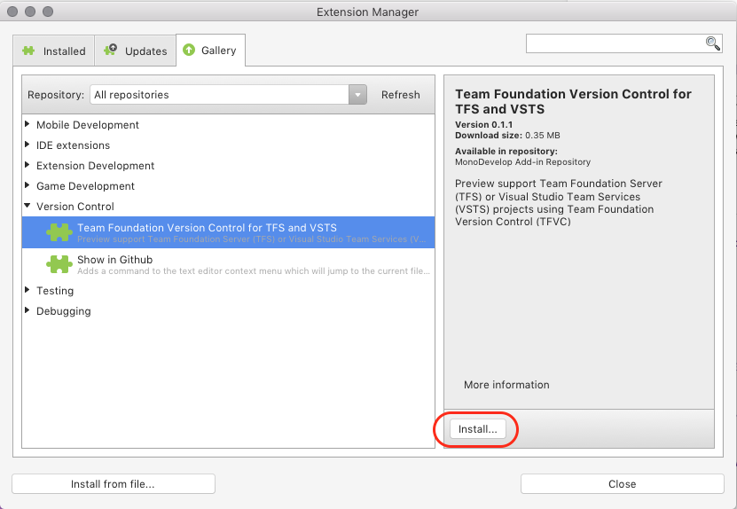
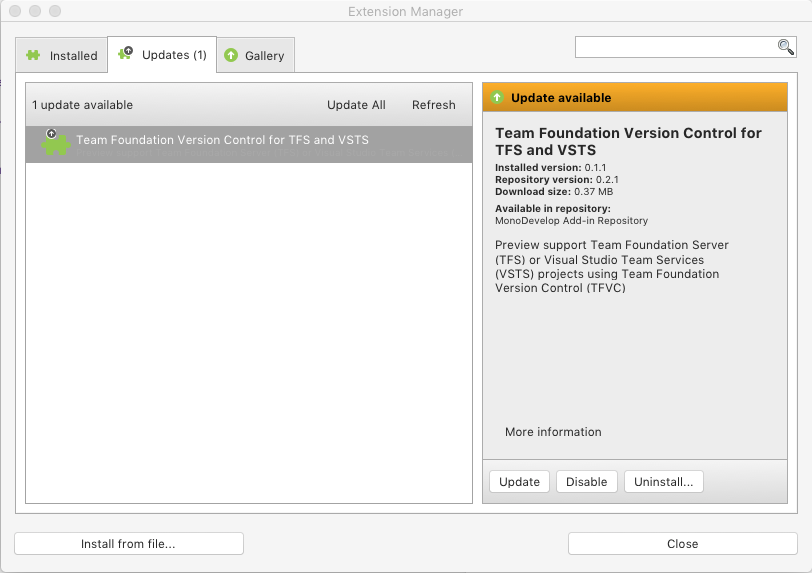
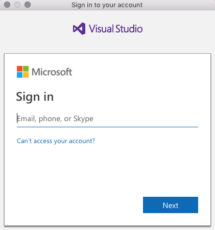
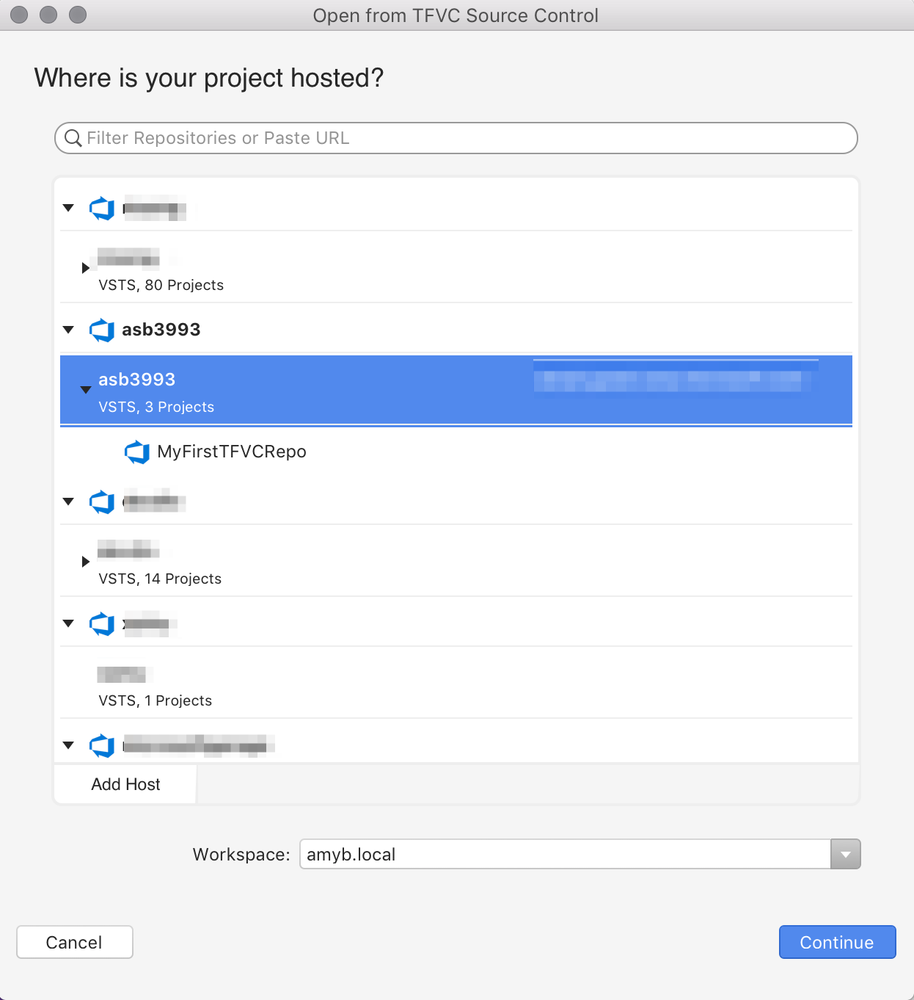
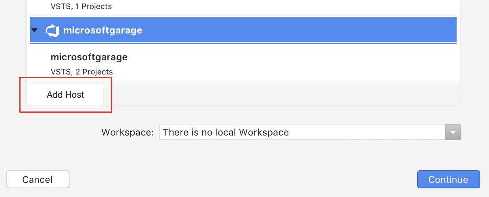
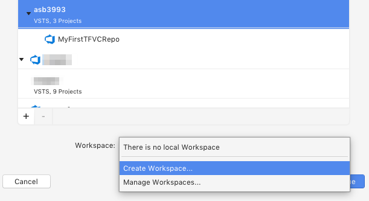
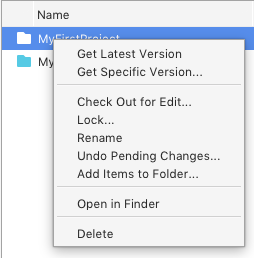
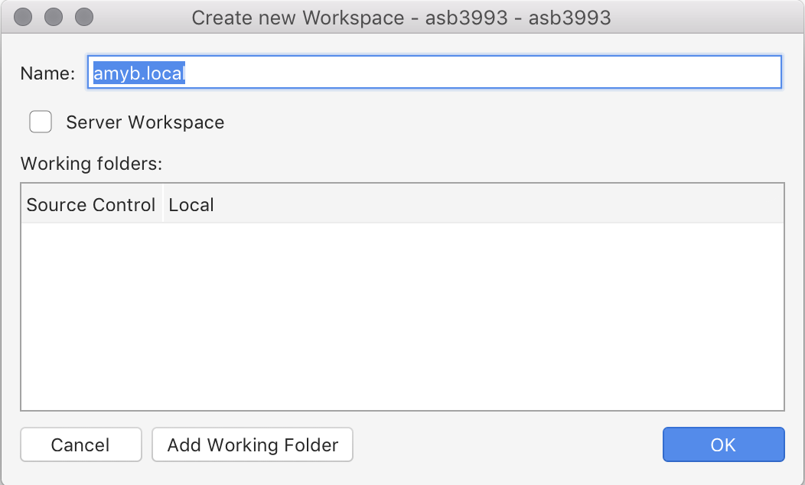
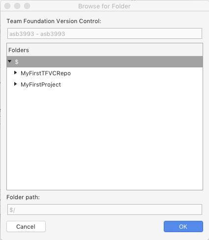
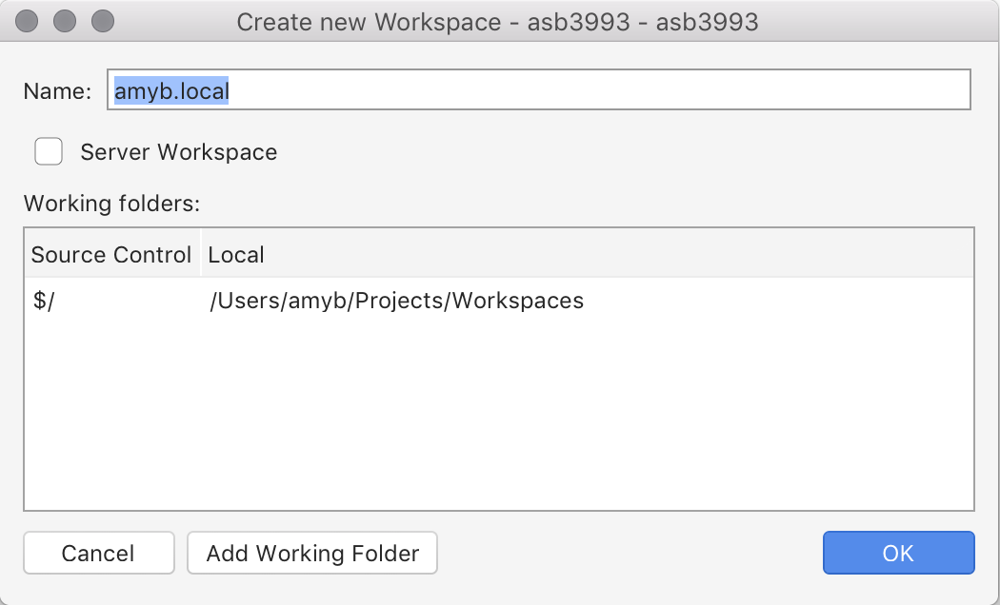

# Connecting to Team Foundation Version Control 

> [!NOTE]
> **Note**: Team Foundation Version Control support is currently in preview and some functionality is not yet fully working. We'd love feedback from you on any issues at [Developer Community](https://developercommunity.visualstudio.com/spaces/41/index.html). More changes are still to come!

Azure DevOps provides two models of version control: Git, which is distributed version control, and Team Foundation Version Control (TFVC), which is centralized version control. This article provides an overview and a starting point for using TFVC with Visual Studio for Mac.

## Requirements

* Visual Studio Community, Professional, or Enterprise for Mac version 7.5 or later.
* Azure DevOps Services, or Team Foundation Server 2013 and later.
* A project in Azure DevOps Services or Team Foundation Server, configured to use Team Foundation Version Control.

## Installation

In Visual Studio for Mac, choose **Visual Studio > Extensions...** from the menu. In the **Gallery** tab, select **Version Control > Team Foundation Version Control for Azure DevOps** and click **Install…**:

   

Follow the prompts to install the extension. Once it's installed, restart the IDE.

## Updating the extension

Updates to the TFVC extension are made periodically. To access updates, choose **Visual Studio > Extensions...** from the menu and select the **Updates** tab. Select the extension in the list and press the **Update** button:

   

Press **Install** on the next dialog to uninstall the old package and install the new one.

For information on what's new in each release, see the [Release Notes](https://docs.microsoft.com/visualstudio/releasenotes/vs2017-mac-preview-relnotes#team-foundation-version-control-extension--release-notes).

## Using the add-in

Once the extension is installed, select the **Version Control > TFS/VSTS > Open from Remote Repository** menu item. 

Choose either Azure DevOps Services or Team Foundation Server to get started and press **Continue**:

  

### Azure DevOps Services Authentication

When you select a project that is hosted on Azure DevOps Services, you're prompted to enter your Microsoft account details:

  

### TFS Authentication

To connect to TFS, enter the server details and your account credentials. Enter a domain to use NTLM authentication, otherwise leave blank to use basic authentication. Select **Add Server**: 

## Selecting a project

Once you've successfully authenticated, you can see a list of repositories that are associated with the account in the **Open from Source Control** dialog:

  

This dialog is organized with the following nodes:

- Azure DevOps organization or collection – This displays all organizations connected to the Microsoft account you logged in with.
- Projects - In each organization or collection, you can have a number of projects. A project is where source code, work items, and automated builds are hosted.

At this point, you can search and filter by the name of a project or account.

### Adding a new server

To add a new server to the list, press the **Add Host** button on the **Open from Source Control** dialog:

Select the provider from the list, and enter your credentials:

## Creating a new workspace

To start working with a project, you need to have a _workspace_. If you don't already have a workspace, you can create one from the **Workspace** combobox in the **Open from Source Control** dialog:

Set the name and local path for your new workspace and select **Create Workspace**:

## Using the Source Code Explorer

Once you've created a workspace and mapped your project, you can start working with the _Source Code Explorer_.

To open the Source Code Explorer, select the **Version Control > TFS/VSTS > Source Control Explorer**:

The Source Code Explorer enables you to navigate through all the mapped projects, their files, and  folders. It also allows you to perform all the basic source control actions such as:

- Get the latest version
- Get a specific version
- Check files in and out
- Lock and unlock files
- Add, delete, and rename files
- View history
- Compare changes.

Many of these actions are available through context actions on the project:

## Managing workspaces

If you haven't already create a workspace, as described in the [Creating a workspace](#creating-a-new-workspace) section, you'll notice that the Source Code Explorer is empty:

 

To set up your remote project with a local workspace, use the following steps:

1. Select the **Server** from the combobox.
1. Note that there are "no workspaces" and that the Local Path is "Not Mapped". Select the **Not Mapped** link to display the **Create new Workspace** dialog.
1. Provide a name for the workspace and then click **Add Working Folder** to map the project to a local folder on your computer:
    
     

1. Select the "$" folder to map all Team projects on your server to the same workspace, or select an individual project, and click **OK**:
    
     

1. Select the location on your local machine that you wish mp the project(s) to and click **Select Folder**.
1. Confirm the details of the new workspace by pressing **OK**
    
     

Once your workspace is set up, it can be changed or removed by clicking the **Manage Workspaces** button in the Source Code Explorer.

## Troubleshooting

### Problems using basic authentication

The following options can be used to authenticate with a server:

- Oauth
- Basic
- Ntlm

To use basic authentication it is necessary to enable **Alternative authentication credentials** in Azure DevOps Services, by following the steps below:

1. Sign in to your Azure DevOps Services organization as the owner (https://dev.azure.com/{organization}/{project}).
2. From your account toolbar, select the gear icon and select **Policy**:
    
     

3. Review your application connection settings. Change these settings, based on your security policies:
    
      

### I do not see anything in TFVC

To set up Team Foundation Version Control (TFVC) on your dev machine, you **must** create a workspace, as described in the [Managing workspaces](#managing-workspaces) section.

In Source Control Explorer, press the **Manage Workspaces** Button. Follow the steps to map the team project to a folder on your dev machine.

### I do not see any / all of my projects

After authenticating you should see the list of projects. By default, only TFS projects are shown. To see other types of projects, check the "See all projects" box.

Keep in mind that projects that are on the server will not appear if you don't have the correct privileges.

#### I am getting the error "Cannot create the workspace. Please, try again"

When trying to [create a new workspace](#creating-a-new-workspace), you should make sure the following conditions are met:

- No use of invalid characters in the workspace name.
- The name must be less than 64 characters.
- The local path cannot be used by any other workspaces.