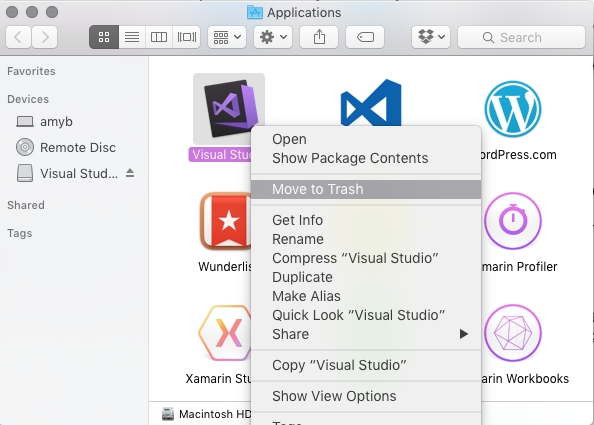

# Uninstalling Visual Studio for Mac

There are a number of Xamarin products that enable cross-platform application development,
including stand-alone apps like Visual Studio for Mac.

This guide can be used to uninstall each product individually by navigating to the relevant section. The entire Xamarin toolset can be uninstalled by following this guide all the way through.

If you have previously had Xamarin Studio installed on your machine, you may also need to follow the instructions in the [uninstall](https://developer.xamarin.com/guides/cross-platform/getting_started/installation/uninstalling_xamarin/) guide on developer.xamarin.com, in addition to the following steps.

## Uninstall Script

You can uninstall Visual Studio and its associated components in one go by using the [uninstall script](https://raw.githubusercontent.com/MicrosoftDocs/visualstudio-docs/master/mac/resources/uninstall-vsmac.sh).

This uninstall script contains most of the commands that you will find in the article. There are two main omissions from the script and are not included due to possible external dependencies:

- **Uninstalling Mono**
- **Uninstalling Android AVD**

To run the script, do the following steps:

1. Right-click on the script and select **Save As…** to save the file on your Mac.
2. Open Terminal and change the working directory to where the script was downloaded:

    ```bash
    $ cd /location/of/file
    ```
3. Make the script executable and the run it with **sudo**:

    ```bash
    $ chmod +x ./uninstall-vsmac.sh
    $ sudo ./uninstall-vsmac.sh
    ```
4. Finally, delete the uninstall script.

## Uninstall Visual Studio for Mac

The first step in uninstalling Visual Studio from a Mac is to locate **Visual Studio.app** in the **/Applications** directory and drag it to the **Trash Can**. Alternatively, right-click and select **Move to Trash** as illustrated in the following image:



Deleting this app bundle removes Visual Studio for Mac, even though there may be other files relating to Xamarin still on a file system.

To remove all traces of Visual Studio for Mac, the following commands should be run in Terminal:

```bash
sudo rm -rf "/Applications/Visual Studio.app"
rm -rf ~/Library/Caches/VisualStudio
rm -rf ~/Library/Preferences/VisualStudio
rm -rf ~/Library/Preferences/Visual\ Studio
rm -rf ~/Library/Logs/VisualStudio
rm -rf ~/Library/VisualStudio
rm -rf ~/Library/Preferences/Xamarin/
rm -rf ~/Library/Developer/Xamarin
rm -rf ~/Library/Application\ Support/VisualStudio
rm -rf ~/Library/Application\ Support/VisualStudio/7.0/LocalInstall/Addins/
```

## Uninstall Mono SDK (MDK)

Mono is an open-source implementation of Microsoft's .NET Framework and is used by all Xamarin Products—Xamarin.iOS, Xamarin.Android, and Xamarin.Mac to allow development of these platforms in C#.

> [!WARNING]
> There are other applications outside of Visual Studio for Mac that also use Mono, such as Unity.
> Be sure that there are no other dependencies on Mono before uninstalling it.

To remove the Mono Framework from a machine, run the following commands in Terminal:

```bash
sudo rm -rf /Library/Frameworks/Mono.framework
sudo pkgutil --forget com.xamarin.mono-MDK.pkg
sudo rm -rf /etc/paths.d/mono-commands
```

## Uninstall Xamarin.Android

There are a number of items required for the installation and use of Xamarin.Android,
such as the Android SDK and Java SDK.

Use the following commands to remove Xamarin.Android:

```bash
sudo rm -rf /Developer/MonoDroid
rm -rf ~/Library/MonoAndroid
sudo pkgutil --forget com.xamarin.android.pkg
sudo rm -rf /Library/Frameworks/Xamarin.Android.framework
```

### Uninstall Android SDK and Java SDK

The Android SDK is required for development of Android applications. To completely remove all parts of the Android SDK, locate the file at **~/Library/Developer/Xamarin/** and move it to **Trash**.

The Java SDK (JDK) does not need to be uninstalled, as it is already pre-packaged as part of Mac OS X / macOS.

### Uninstall Android AVD

> [!WARNING]
> There are other applications outside of Visual Studio for Mac that also use Android AVD and these additional android components, such as Android Studio.
> Removing this directory may cause projects to break in Android Studio. 

To remove any Android AVDs and additional Android components use the following command:

```bash
rm -rf ~/.android
```

To remove only the Android AVDs use the following command:

```bash
rm -rf ~/.android/avd
```

 

## Uninstall Xamarin.iOS

Xamarin.iOS allows iOS application development using C# or F# with Visual Studio for Mac.

Use the following commands in Terminal to remove all Xamarin.iOS files from a file system:

```bash
rm -rf ~/Library/MonoTouch
sudo rm -rf /Library/Frameworks/Xamarin.iOS.framework
sudo rm -rf /Developer/MonoTouch
sudo pkgutil --forget com.xamarin.monotouch.pkg
sudo pkgutil --forget com.xamarin.xamarin-ios-build-host.pkg
sudo pkgutil --forget com.xamarin.xamarin.ios.pkg
```

## Uninstall Xamarin.Mac

Xamarin.Mac can be removed from your machine using the following two commands to eradicate the product and license from your Mac respectively:

```bash
sudo rm -rf /Library/Frameworks/Xamarin.Mac.framework
rm -rf ~/Library/Xamarin.Mac
```

## Uninstall Workbooks and Inspector

Starting with 1.2.2, Xamarin Workbooks & Inspector can be uninstalled from a terminal by running:

```bash
sudo /Library/Frameworks/Xamarin.Interactive.framework/Versions/Current/uninstall
```

For older versions, you need to manually remove the following artifacts:

* Delete the Workbooks app at `"/Applications/Xamarin Workbooks.app"`
* Delete the Inspector app at `"Applications/Xamarin Inspector.app"`
* Delete the add-ins: `"~/Library/Application Support/XamarinStudio-6.0/LocalInstall/Addins/Xamarin.Interactive"` and `"~/Library/Application Support/XamarinStudio-6.0/LocalInstall/Addins/Xamarin.Inspector"`
* Delete Inspector and supporting files here: `/Library/Frameworks/Xamarin.Interactive.framework` and `/Library/Frameworks/Xamarin.Inspector.framework`

## Uninstall the Xamarin Profiler

```bash
sudo rm -rf "/Applications/Xamarin Profiler.app"
```

## Uninstall the Visual Studio Installer

Use the following commands to remove all traces of the Xamarin Universal Installer:

```bash
rm -rf ~/Library/Caches/XamarinInstaller/
rm -rf ~/Library/Caches/VisualStudioInstaller/
rm -rf ~/Library/Logs/XamarinInstaller/
rm -rf ~/Library/Logs/VisualStudioInstaller/
rm -rf ~/Library/Preferences/Xamarin/
rm -rf "~/Library/Preferences/Visual Studio/"
```
