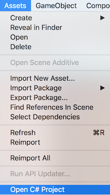
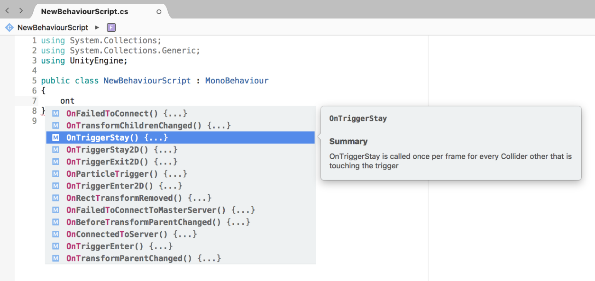
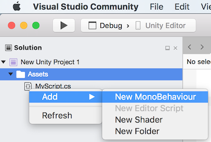

# Using Visual Studio for Mac Tools for Unity

In this section, you'll learn how to use Visual Studio for Mac Tools for Unity's integration and productivity features, and how to use the Visual Studio for Mac debugger for Unity development.

## Opening Unity scripts in Visual Studio for Mac

Once Visual Studio for Mac is [set as the external script editor for Unity](/visualstudio/mac/setup-vsmac-tools-unity#configure-unity-for-use-with-visual-studio-for-mac), opening any script from the Unity editor will automatically launch or switch to Visual Studio for Mac, with the chosen script open.

Alternatively, Visual Studio for Mac can be opened with no script open in the source editor by selecting **Open C# Project** from the **Assets** menu in Unity.

## Unity documentation access

Visual Studio for Mac Tools for Unity includes a shortcut for accessing the Unity API documentation. To access Unity API documentation from Visual Studio for Mac, place the cursor over the Unity API you want to learn about and press **⌘ command + ‘**.

## IntelliSense for Unity messages
The Unity engine broadcasts messages to MonoBehaviour scripts, allowing developers to write code that reacts to messages such as OnMouseDown, OnTriggerEnter, etc. Because these are not virtual methods in the base MonoBehaviour class, some IDEs such as MonoDevelop lack code completion functionality for Unity messages.

However, Visual Studio for Mac Tools for Unity extends its IntelliSense functionality to Unity messages. This makes it easy to implement Unity messages in MonoBehaviour scripts, and assists with learning the Unity API. To use IntelliSense for Unity messages:

1.	Place the cursor on a new line inside the body of a class that derives from MonoBehaviour.

2.	Begin typing the name of a Unity message, such as `OnTriggerEnter`.

3.	Once the letters "**ont**" have been typed, a list of IntelliSense suggestions appears.

  

4.	The selection on the list can be changed in three ways:

    * With the **Up** and **Down** arrow keys.

    * By clicking with the mouse on the desired item.

    * By continuing to type the name of the desired item.

5.	IntelliSense can insert the selected Unity message, including any necessary parameters:

    * By pressing **Tab**.

    * By pressing **Return**.

    * By double-clicking the selected item.

  

## Adding new Unity files and folders

While you can always add new files to a Unity project in the Unity editor, Visual Studio for Mac allows for easily creating new Unity scripts, shaders, and folders from within Visual Studio.

### Add a new C# MonoBehaviour script

To add a new C# MonoBehaviour script, **right-click on the Assets folder** or one of its subdirectories in the Solution pad and select **Add > New MonoBehaviour**.

### Add a new Unity shader

To add a new Unity shader, **right-click on the Assets folder** or a subdirectory in the Solution pad and select **Add -> New Shader**.

### Add a new folder

To add a new folder, **right-click on the Assets folder** or a subdirectory in the Solution pad and select **Add > New Folder**.

These additions are reflected in the Project window of the Unity editor.

### To rename a file or folder
**right-click** on the item to rename in the Solution pad and select **Rename...**.

> [!NOTE]
> If you have a new Unity project with no scripts and the Assets folder does not show up in the Solution pad in Visual Studio for Mac, add an initial C# script from within the Unity editor.

## Unity debugging

Unity projects can be debugged with Visual Studio for Mac.

### Start debugging

To start debugging:

1.	Connect Visual Studio to Unity by clicking the **Play** button, or type **Command + Return**, or **F5**.

  

2.	Switch to Unity and click the **Play** button to run the game in the editor.

  

3.	When the game is running in the Unity editor while connected to Visual Studio, any breakpoints encountered will pause execution of the game and bring up the line of code where the game hit the breakpoint in Visual Studio for Mac.

### Stop debugging

To stop debugging:

1.	Click the **Stop** button in Visual Studio for Mac, or press **Shift + Command + Return**.

  

To learn more about debugging in Visual Studio for Mac, see [Using the debugger](https://docs.microsoft.com/visualstudio/mac/debugging).
