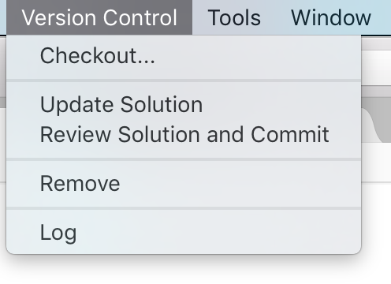
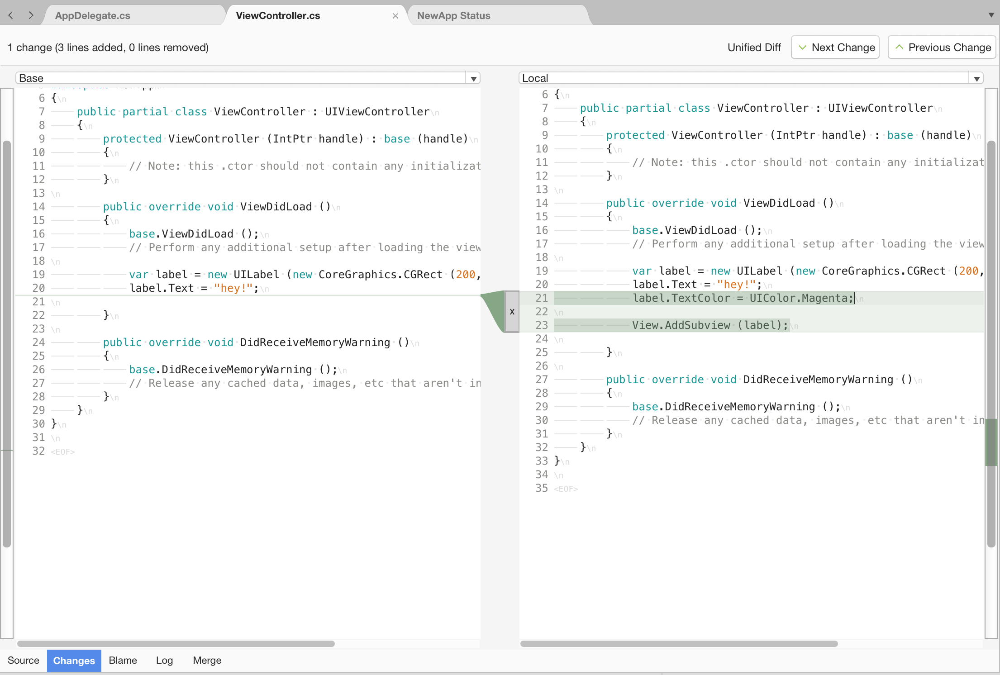
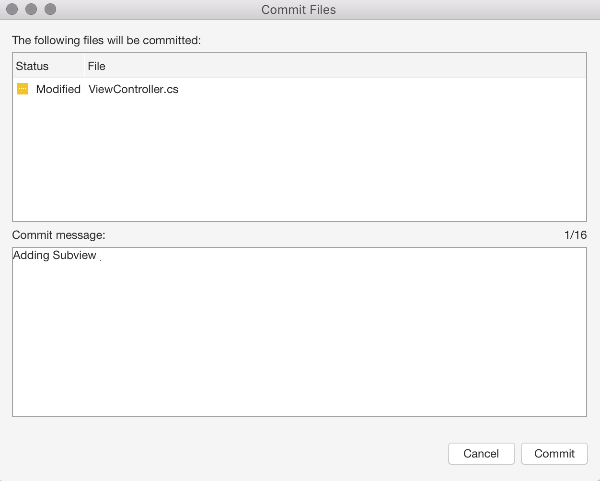

# Working with Subversion

As mentioned earlier in this article, Subversion is the centralized version control system that enables you to check out a single master copy of the centralized data. In contrast to Git, checking out a Subversion repository does not clone the entire repository, it only takes a snapshot at that point in time.

Subversion uses a copy-modify-merge model to allow users to work on the same repository simultaneously. This means that each user creates a local, or working, copy of the centralized data, which they can then work on independently. The changes to users working copies are merged in a chronological fashion.

For example, imagine that User A and User B both check out a copy from the remote repository and they each modify files. User A finishes the modifications and commits them remotely. Before User B commits their work, they will have to update their working copy with changes from the remote, thereby merging in User A's changes.

In the sections below we will explore how Subversion can be used for version control in Visual Studio for Mac.

The image below illustrates the options provided by Visual Studio for Mac by the Version Control menu item:

The sections below will explain each option in more detail.

## Checkout...

Before starting to use a remote Subversion repository, you will need to check out the repo to create a local, or working, copy of that directory on your local machine.

To find out about using the **Checkout** feature in Visual Studio for Mac, follow the steps in the [Setting up a Subversion repository](~/set-up-subversion-repository.md) section.

## Update solution

When using a remote repository, it is important to remember that other users may be modifying files, making your working copy outdated. In anticipation of this, it is always recommended to pull any changes from the repository into your solution before starting work, and before committing. To do this, select the *Version Control > Update Solution* menu item.

## Review solution and commit

To review changes in files, use the Changes, Blame, Log, and Merge tabs on each document, as illustrated below:

Review all changes in a project by browsing the **Version Control > Review Solution and Commit** menu item:

This allows viewing all the changes in each file of a project with the option to Revert, Create Patch, or Commit.

To commit a file to the remote repository, press Commit..., enter a commit message, and confirm with the Commit Button:

This will send the changes to the repository where they create the new revision of all your modifications.
