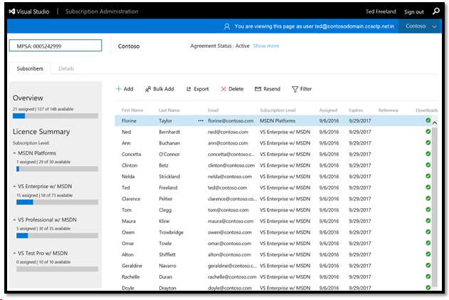
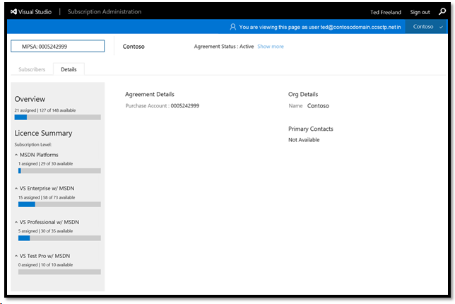

#  Using the Visual Studio subscriptions administrator portal

Keep this in mind when you use the Visual Studio Subscriptions Administration Portal:
 
- **Visual Studio subscriptions are licensed per user.** Each subscriber can use the software on as many computers as needed for development and testing. 
- **Assign only one subscription level for each subscriber**, corresponding to the Visual Studio subscription your organization purchased. If you have subscribers with more than one subscription level assigned to them, edit their settings so that they only have one. 
- **A subscriber’s subscription level will need to be updated** when the subscription is upgraded (after the purchase of a “step-up” license) or renewed at a lower level. 
- **Do not share subscriptions between subscribers.** You must assign a subscription to anyone who uses all or part of the subscription benefits (software for development and testing, Microsoft Azure, e-learning, etc.). 

## Adminstrator roles

There are two different roles that exist in the new Visual Studio Subscriptions Administration Portal for Volume Licensing customers. These roles are like the Primary/Notices Contact role and the Subscriptions Manager role in the VLSC today. 

**Super admins:** Upon first setting up an organization, the Primary or Notices Contact becomes a super admin by default. The Primary or Notices contact can choose to assign additional super admins or administrators. A super admin can add and remove other administrators as well as subscribers. If there are more than two super admins in the system, a super-admin can delete all but the last two for security. 

**Administrators:** An administrator can only be set up by a super admin. An administrator can manage subscribers in the agreements that the super admin assigns to them. 

## Getting started

In order to use the administrator portal to manage your organization's subscriptions, you must first onboard your organization to the portal.  Once you've completed onboarding, you'll want to become familiar with the Subscribers and Details pages, as those are where you'll find the tools and information you need to perform your subscription management tasks.  

### Onboarding

When your organization is ready to be onboarded to the Visual Studio Subscriptions Administration Portal an email will be sent to the Primary and Notices Contacts inviting them to complete the onboarding process. The below details are the steps that will need to be taken to onboard to the new portal. If you’d like a walkthrough of the process, check out this [administrator onboarding video](https://channel9.msdn.com/Series/Visual-Studio-Subscriptions-Administration/Onboarding-your-organization-to-the-new-Visual-Studio-Subscription-Administration-Portal-and-setting) or this [support article](https://support.microsoft.com/help/4013931/visual-studio-subscriptions-administrator-migration-process "Visual Studio Subscriptions Administrator Migration Process").   
1.	**Locating your PCN and signing in:**
    - In the email, the Primary and Notices Contacts are provided with a unique link and the last three digits of their Public Customer Number (PCN). * 
    - To obtain the entire PCN, the Primary Contact will need to sign in to the VLSC (instructions for locating the PCN can be found there). 
    - After obtaining the PCN, they’ll need to select their unique link which will prompt them to sign in. They will be able to sign in using either a work/school account (if your organization is on AAD) or a Microsoft Account (MSA) if your organization is not on AAD. 
    - Next, they will need to enter the PCN. 
2.	**Set up your administrators.** After entering the PCN, they will be registered as a super admin in the new system and will be able to add other super admins and administrators (previously known as Subscription Managers). To avoid losing access this should be completed prior to your organization’s migration date. 
3.	**Accessing the new subscription management portal.**  Once your organization is migrated, emails will be sent to the newly added super admins and administrators inviting them to access the new portal and begin managing subscriptions.  

> [!NOTE]
> If the Primary or Notices Contacts receive more than one email, this means that they have more than one PCN. They will need to complete the process using the unique link for the PCN referenced in each email.*

If you need to be added to the new Visual Studio Subscriptions Administration Portal and you aren’t sure who your Primary/Notices Contact is, you can find this information after signing in to the [VLSC](https://www.microsoft.com/Licensing/servicecenter/default.aspx). Take a look at the [Find Your Primary Contact](find-primary-contact.md) topic for steps to locate your Primary/Notices Contact in the VLSC.
If you have already been set up as an administrator, then you can go directly to the [Visual Studio Subscriptions Administration Portal](https://manage.visualstudio.com).

### Understanding the Subscribers page
Once you’ve assigned subscriptions, the Subscribers tab provides detailed information about your subscribers, including:
- The first and last name of each subscriber.
- The email address for this user.
- The subscription level that has been assigned to them.
- The date that their subscription was assigned to them. 
- The expiration date for their subscription.
- An optional text description.
- An indication of whether subscriber downloads has been enabled or disabled. 
- The country in which they are located.
- Their language preference for the assignment communication email from the administration portal.
- An optional field for a different email address used for communications than sign-in. 

On the left-hand side of this page you can see additional information about the number of subscription licenses purchased, assigned, and still available in your organization for each agreement.
    

### Understanding the Details page
For more information about the agreement you are viewing, select the Details tab. It shows the agreement status, purchase account, org details, primary contacts (VLSC), super-admins (if available) and other pertinent information.
    

